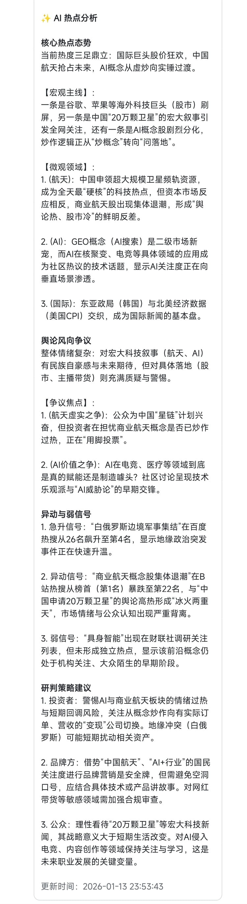

# TrendRadar (趋势雷达) 🎯

[](https://github.com/sansan0/TrendRadar/stargazers)
[](https://github.com/sansan0/TrendRadar/network)
[](https://hub.docker.com/r/sansan0/trendradar)
[](https://github.com/sansan0/TrendRadar/blob/main/LICENSE)
[](https://ntfy.sh)

⭐ **AI 驱动的舆情监控与趋势分析工具**。告别信息过载，你的 AI 舆情监控助手与热点筛选工具！

聚合多平台热点 + RSS 订阅，支持关键词精准筛选。AI 智能筛选新闻 + AI 翻译 + AI 分析简报直推手机，也支持接入 MCP 架构，赋能 AI 自然语言对话分析、情感洞察与趋势预测等。支持 Docker，数据本地/云端自持。集成微信/飞书/钉钉/Telegram/邮件/ntfy/bark/slack 等渠道智能推送。

[English](./README-EN.md) | [MCP FAQ](./README-MCP-FAQ.md) | [Cherry Studio 接入指南](./README-Cherry-Studio.md)

---

## 🌟 核心功能

- 🚀 **多平台聚合**：聚合微博、知乎、百度、头条、V2EX、GitHub 等主流平台热榜，支持自定义 RSS 订阅。
- 🤖 **AI 智能筛选**：利用 LLM (GPT-4, Claude, DeepSeek, Gemini 等) 自动过滤无关信息，提取核心价值，告别垃圾信息。
- 📝 **AI 摘要与翻译**：自动生成新闻摘要，支持多语言翻译，跨越语言障碍获取全球动态。
- 📊 **MCP 架构支持**：内置 MCP Server，可无缝接入 Claude Desktop、Cherry Studio 等支持 MCP 的 AI 客户端。
- 📱 **全渠道推送**：支持微信、飞书、钉钉、Telegram、邮件、ntfy、Bark、Slack、PushDeer 等多种推送方式。
- 🐳 **部署简单**：支持 Docker 一键部署，提供完整的管理脚本，数据存储在本地 SQLite。

## 🛠️ 快速开始

### 1. 环境准备
- Python 3.10+
- Docker & Docker Compose (推荐)
- AI API Key (可选，用于开启 AI 分析功能)

### 2. 使用 Docker 部署 (推荐)

```bash
# 克隆仓库
git clone https://github.com/sansan0/TrendRadar.git
cd TrendRadar

# 修改配置 (填入 API Key 和推送 Token)
# 配置文件位于 config/config.yaml

# 启动
docker-compose up -d
```

### 3. 本地安装

```bash
# 安装依赖
pip install -e .

# 运行爬虫
python -m trendradar
```

## ⚙️ 配置说明

主要配置文件位于 `config/config.yaml`：

- **AI 配置**: 在 `ai` 节点下配置 `provider`, `api_key`, `model` 等。
- **爬虫配置**: 在 `crawler` 节点下配置抓取频率和开启的平台。
- **推送配置**: 在 `push` 节点下配置各个渠道的 Token 或 Webhook。
- **关键词过滤**: 在 `keyword` 节点下配置感兴趣或排除的关键词。

## 🤖 MCP 服务接入

TrendRadar 提供了 MCP (Model Context Protocol) 服务器，让 AI 助手能直接查询你的热点数据库。

**Claude Desktop 配置示例：**

```json
{
  "mcpServers": {
    "trendradar": {
      "command": "python",
      "args": ["-m", "mcp_server.server"],
      "env": {
        "PROJECT_ROOT": "/你的项目绝对路径/TrendRadar"
      }
    }
  }
}
```

## 📸 效果展示

| AI 分析简报 | 飞书推送 | 移动端展示 |
| :---: | :---: | :---: |
|  |  |  |

## 🤝 贡献与支持

- **提交问题**: 欢迎通过 [Issues](https://github.com/sansan0/TrendRadar/issues) 反馈 Bug 或建议。
- **贡献代码**: 欢迎提交 Pull Request。
- **Star**: 如果这个项目对你有帮助，请点个 Star 🌟 鼓励一下！

## 📄 许可证

本项目采用 [MIT License](LICENSE)。
