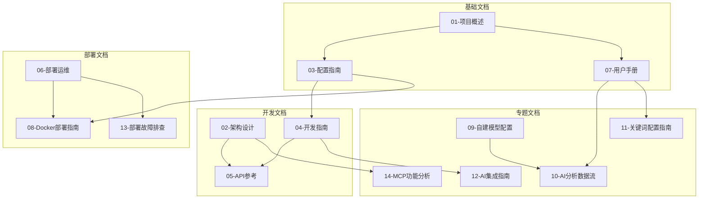

# TrendRadar 产品文档开发使用手册

> 本手册整合了 TrendRadar 项目的所有技术文档，提供完整的学习路径、使用场景和故障排查指南，是产品开发、部署和使用的完整指南。

## 📚 文档概览

### 文档列表

| 序号 | 文档名称 | 大小 | 页数估计 | 目标用户 | 关键词 |
|------|---------|------|---------|---------|------|
| 01 | [项目概述](01-overview.md) | 9.2K | ~30页 | 所有用户 | 项目简介、核心价值、技术架构 |
| 02 | [架构设计](02-architecture.md) | 18K | ~60页 | 开发者 | 系统架构、模块设计、数据流程 |
| 03 | [配置指南](03-configuration.md) | 16K | ~50页 | 运维人员 | config.yaml、环境变量、多账号 |
| 04 | [开发指南](04-development.md) | 17K | ~55页 | 开发者 | 环境搭建、代码规范、扩展开发 |
| 05 | [API参考](05-api-reference.md) | 15K | ~50页 | 开发者 | MCP工具API、核心类API、数据结构 |
| 06 | [部署运维](06-deployment.md) | 13K | ~40页 | 运维人员 | 部署方式、监控、故障排查 |
| 07 | [用户手册](07-user-manual.md) | 14K | ~45页 | 所有用户 | 快速开始、使用场景、FAQ |
| 08 | [Docker部署指南](08-docker-deployment-guide.md) | 41K | ~130页 | Docker用户 | 完整Docker部署步骤 |
| 09 | [自建模型配置](09-self-hosted-ai-model-guide.md) | 18K | ~60页 | AI用户 | Ollama/vLLM配置 |
| 10 | [AI分析数据流](10-ai-analysis-workflow.md) | 42K | ~140页 | 进阶用户 | AI分析完整流程 |
| 11 | [关键词配置指南](10-keyword-configuration-guide.md) | 22K | ~70页 | 所有用户 | 关键词配置详解 |
| 12 | [AI集成指南](11-ai-integration-guide.md) | 21K | ~70页 | 开发者 | AI模型集成 |
| 13 | [部署故障排查](12-deployment-troubleshooting-guide.md) | 15K | ~50页 | 运维人员 | 故障排查详解 |
| 14 | [MCP功能分析](13-mcp-function-analysis.md) | 35K | ~115页 | MCP用户 | MCP工具详解 |
| 15 | [README](README.md) | 4.8K | ~15页 | 所有用户 | 文档导航索引 |

**总计**: 15 份文档，约 **924 页**，超过 **15 万字**

### 文档关系图



---

## 🎯 按角色学习路径

### 路径一：最终用户（不想折腾，只想使用）

**目标**: 快速部署，日常使用，收到热点推送

**学习路径**:
1. [07-用户手册](07-user-manual.md) - 快速开始（10分钟）
2. [03-配置指南](03-configuration.md) - 配置关键词（5分钟）
3. [11-关键词配置指南](10-keyword-configuration-guide.md) - 优化关键词（可选）

**时间投入**: 约30分钟

**核心技能**:
- ✅ 基本命令行操作
- ✅ 配置文件编辑
- ✅ 选择通知渠道

### 路径二：DevOps工程师（负责部署和维护）

**目标**: 部署TrendRadar，监控运行状态，处理故障

**学习路径**:
1. [08-Docker部署指南](08-docker-deployment-guide.md) - Docker部署（1小时）
2. [06-部署运维](06-deployment.md) - 部署方式选择（30分钟）
3. [13-部署故障排查](12-deployment-troubleshooting-guide.md) - 故障排查（1小时）
4. [03-配置指南](03-configuration.md) - 高级配置（30分钟）

**时间投入**: 约3小时

**核心技能**:
- ✅ Docker/Docker Compose
- ✅ Linux 系统管理
- ✅ 日志分析和监控
- ✅ 自动化部署

### 路径三：开发者（扩展开发功能）

**目标**: 理解架构，添加新平台/通知渠道，开发新功能

**学习路径**:
1. [02-架构设计](02-architecture.md) - 系统架构理解（1小时）
2. [04-开发指南](04-development.md) - 开发环境搭建（30分钟）
3. [05-API参考](05-api-reference.md) - API接口学习（1小时）
4. [12-AI集成指南](11-ai-integration-guide.md) - AI模型集成（30分钟）

**时间投入**: 约3小时

**核心技能**:
- ✅ Python 3.10+
- ✅ 面向对象编程
- ✅ RESTful API
- ✅ 数据库（SQLite）

### 路径四：MCP用户（使用AI助手查询数据）

**目标**: 配置MCP服务器，使用21个工具查询和分析数据

**学习路径**:
1. [14-MCP功能分析](13-mcp-function-analysis.md) - MCP工具详解（1小时）
2. [05-API参考](05-api-reference.md) - MCP工具API（30分钟）
3. [10-AI分析数据流](10-ai-analysis-workflow.md) - 理解数据结构（30分钟）

**时间投入**: 约2小时

**核心技能**:
- ✅ Claude Desktop / Cursor
- ✅ MCP协议
- ✅ 数据查询和分析

### 路径五：AI用户（配置自建模型）

**目标**: 使用Ollama/vLLM等本地模型替代云端API

**学习路径**:
1. [09-自建模型配置](09-self-hosted-ai-model-guide.md) - 模型部署（1小时）
2. [10-AI分析数据流](10-ai-analysis-workflow.md) - 理解AI流程（30分钟）
3. [12-AI集成指南](11-ai-integration-guide.md) - 集成配置（30分钟）

**时间投入**: 约2小时

**核心技能**:
- ✅ Ollama / vLLM
- ✅ 模型量化
- ✅ GPU管理
- ✅ API兼容性

---

## 🚀 快速开始指南

### 场景一：5分钟GitHub Actions部署（零服务器）

**适用**: 个人使用，不想维护服务器

**步骤**:
1. Fork 项目仓库
2. 配置 GitHub Secrets
3. 编辑关键词配置
4. 启用 Actions

**详细指南**: [07-用户手册 → GitHub Actions部署](07-user-manual.md#github-actions-部署)

**所需配置**:
- `AI_API_KEY`: DeepSeek API Key
- `FEISHU_WEBHOOK_URL`（或其他通知渠道）

### 场景二：10分钟Docker本地部署

**适用**: 个人服务器，完全控制

**步骤**:
1. 安装 Docker 和 Docker Compose
2. 创建工作目录
3. 配置 `.env` 文件
4. 启动容器
5. 验证运行

**详细指南**: [08-Docker部署指南](08-docker-deployment-guide.md)

### 场景三：30分钟本地Python运行

**适用**: 开发测试，灵活调试

**步骤**:
1. 克隆项目
2. 安装 Python 依赖
3. 配置文件
4. 运行程序

**详细指南**: [04-开发指南 → 环境搭建](04-development.md#环境搭建)

---

## 📖 按功能学习路径

### 路径一：关键词配置优化

**文档**: [11-关键词配置指南](10-keyword-configuration-guide.md)

**学习内容**:
- 基础语法和分组
- 正则表达式高级用法
- 多语言关键词配置
- 全局过滤词设置
- 配置优化技巧

**时间投入**: 1小时

**实践项目**:
- 配置3个以上关键词组
- 测试正则表达式匹配
- 优化过滤效果

### 路径二：AI模型集成

**文档**: [12-AI集成指南](11-ai-integration-guide.md)

**学习内容**:
- LiteLLM统一接口
- 支持100+AI提供商
- 自定义API端点
- 模型切换和降级
- 成本控制策略

**时间投入**: 1.5小时

**实践项目**:
- 集成DeepSeek
- 配置备用模型
- 实现模型切换

### 路径三：Docker生产部署

**文档**: [08-Docker部署指南](08-docker-deployment-guide.md)

**学习内容**:
- Docker安装和配置
- docker-compose.yml编写
- 环境变量管理
- 数据持久化
- 监控和日志
- 安全加固

**时间投入**: 2小时

**实践项目**:
- 完整的Docker部署
- 配置云存储
- 设置自动备份

### 路径四：MCP数据查询

**文档**: [14-MCP功能分析](13-mcp-function-analysis.md)

**学习内容**:
- MCP服务器配置
- 21个MCP工具使用
- 数据查询和分析
- Claude/Cursor集成
- 性能优化

**时间投入**: 1.5小时

**实践项目**:
- 配置MCP服务器
- 使用Claude查询数据
- 创建自定义查询

### 路径五：本地AI模型部署

**文档**: [09-自建模型配置](09-self-hosted-ai-model-guide.md)

**学习内容**:
- Ollama安装和使用
- vLLM高性能部署
- LM Studio桌面应用
- Docker宿主机访问
- 模型量化优化

**时间投入**: 2小时

**实践项目**:
- 部署Ollama
- 运行本地大模型
- 集成到TrendRadar

---

## 💼 使用场景索引

### 场景1：个人热点追踪

**需求**: 追踪AI、科技、金融等关键词热点

**配置步骤**:
1. 编辑 [`config/frequency_words.txt`](../config/frequency_words.txt):
   ```text
   # AI技术
   ChatGPT|GPT-4|Claude
   大模型|LLM|AIGC

   # 科技公司
   华为|小米|百度|字节跳动
   ```

2. 配置推送渠道（飞书/Telegram/邮件）

3. 选择报告模式：`current`（当前榜单）

**相关文档**:
- [配置指南](03-configuration.md)
- [用户手册](07-user-manual.md)
- [关键词配置指南](10-keyword-configuration-guide.md)

### 场景2：企业团队监控

**需求**: 监控行业动态，推送日报给团队

**配置步骤**:
1. 配置企业微信群或邮件推送
2. 设置推送时间窗口（工作时间）
3. 启用 `daily` 模式
4. 配置行业关键词

**配置示例**:
```yaml
notification:
  push_window:
    enabled: true
    start: "09:00"
    end: "18:00"
    once_per_day: true

report:
  mode: "daily"
```

**相关文档**:
- [部署运维](06-deployment.md)
- [配置指南](03-configuration.md)
- [用户手册](07-user-manual.md)

### 场景3：开发环境搭建

**需求**: 本地运行，便于调试和开发

**配置步骤**:
1. 安装 Python 3.10+
2. 安装依赖：`pip install -r requirements.txt`
3. 配置本地数据库
4. 启用调试模式

**相关文档**:
- [开发指南](04-development.md)
- [架构设计](02-architecture.md)
- [API参考](05-api-reference.md)

### 场景4：AI分析优化

**需求**: 优化AI分析效果，控制成本

**配置步骤**:
1. 调整 `max_news_for_analysis`
2. 自定义AI提示词
3. 配置模型参数
4. 启用/禁用排名时间线

**相关文档**:
- [AI分析数据流](10-ai-analysis-workflow.md)
- [自建模型配置](09-self-hosted-ai-model-guide.md)
- [AI集成指南](11-ai-integration-guide.md)

### 场景5：MCP+AI助手数据分析

**需求**: 使用Claude Desktop查询和分析新闻数据

**配置步骤**:
1. 启动MCP服务器：`python -m mcp_server.server`
2. 配置Claude Desktop连接
3. 使用MCP工具查询数据
4. 让AI助手分析趋势

**相关文档**:
- [MCP功能分析](13-mcp-function-analysis.md)
- [API参考](05-api-reference.md)

---

## 🔧 故障排查索引

### 问题1：部署失败

**症状**: 无法启动或部署失败

**排查步骤**:
1. 检查系统要求（[Docker部署指南](08-docker-deployment-guide.md#1-部署前准备)）
2. 验证配置文件语法（[配置指南](03-configuration.md#验证配置)）
3. 查看详细错误日志（[部署故障排查](12-deployment-troubleshooting-guide.md)）

**相关文档**:
- [08-Docker部署指南](08-docker-deployment-guide.md)
- [13-部署故障排查](12-deployment-troubleshooting-guide.md)

### 问题2：没有收到推送

**症状**: 程序运行正常但收不到通知

**排查步骤**:
1. 验证通知渠道配置（[用户手册](07-user-manual.md#配置通知渠道)）
2. 检查webhook URL是否有效
3. 查看推送日志中的错误
4. 确认有关键词匹配的新闻

**相关文档**:
- [配置指南](03-configuration.md)
- [用户手册](07-user-manual.md)
- [AI分析数据流](10-ai-analysis-workflow.md#4-推送流程详解)

### 问题3：AI分析失败

**症状**: AI分析报错或无输出

**排查步骤**:
1. 检查API Key配置（[自建模型配置](09-self-hosted-ai-model-guide.md#4-验证配置)）
2. 测试API连接
3. 查看AI错误日志
4. 检查token消耗

**相关文档**:
- [自建模型配置](09-self-hosted-ai-model-guide.md)
- [AI集成指南](11-ai-integration-guide.md)
- [AI分析数据流](10-ai-analysis-workflow.md)

### 问题4：性能优化

**症状**: 运行缓慢或资源占用高

**排查步骤**:
1. 调整定时任务频率（[Docker部署指南](08-docker-deployment-guide.md#51-自定义定时任务)）
2. 减少AI分析数量（[AI分析数据流](10-ai-analysis-workflow.md#附录))
3. 配置数据保留策略
4. 优化关键词配置

**相关文档**:
- [AI分析数据流](10-ai-analysis-workflow.md)
- [部署运维](06-deployment.md)

### 问题5：数据丢失

**症状**: 之前的数据不见了

**排查步骤**:
1. 检查volume挂载（[Docker部署指南](08-docker-deployment-guide.md#54-数据持久化)）
2. 查看数据库文件
3. 恢复备份数据
4. 配置自动备份

**相关文档**:
- [部署运维](06-deployment.md)
- [13-部署故障排查](12-deployment-troubleshooting-guide.md)

### 问题6：Docker特定问题

**症状**: Docker容器相关问题

**排查步骤**:
1. 容器无法启动 → [Docker部署指南 → 问题1](08-docker-deployment-guide.md#71-常见问题)
2. 无法访问宿主机服务 → [自建模型配置 → Docker特别注意事项](09-self-hosted-ai-model-guide.md#docker-部署的特别注意事项)
3. 数据持久化问题 → [Docker部署指南 → 5.4数据持久化](08-docker-deployment-guide.md#54-数据持久化)

### 问题7：关键词不生效

**症状**: 配置的关键词没有匹配到新闻

**排查步骤**:
1. 检查关键词语法（[关键词配置指南](10-keyword-configuration-guide.md)）
2. 验证数据源是否有相关内容
3. 检查过滤词配置
4. 调整关键词配置

**相关文档**:
- [关键词配置指南](10-keyword-configuration-guide.md)
- [配置指南](03-configuration.md)
- [用户手册](07-user-manual.md)

### 问题8：扩展开发问题

**症状**: 添加新功能或修改代码遇到问题

**排查步骤**:
1. 查看架构设计（[架构设计](02-architecture.md)）
2. 参考开发指南（[开发指南](04-development.md)）
3. 查看API文档（[API参考](05-api-reference.md)）
4. 查看AI集成指南（[AI集成指南](11-ai-integration-guide.md)）

### 问题9：MCP使用问题

**症状**: MCP服务器无法连接或工具无法使用

**排查步骤**:
1. 检查MCP功能分析（[MCP功能分析](13-mcp-function-analysis.md)）
2. 验证服务器配置
3. 测试工具调用
4. 查看连接日志

**相关文档**:
- [MCP功能分析](13-mcp-function-analysis.md)
- [API参考](05-api-reference.md)

### 问题10：成本控制

**症状**: API费用过高或资源消耗大

**解决方案**:
1. 减少AI分析数量（[AI分析数据流](10-ai-analysis-workflow.md#b-性能优化建议)）
2. 使用本地模型（[自建模型配置](09-self-hosted-ai-model-guide.md)）
3. 优化报告频率
4. 清理历史数据

**相关文档**:
- [AI分析数据流](10-ai-analysis-workflow.md)
- [自建模型配置](09-self-hosted-ai-model-guide.md)
- [部署运维](06-deployment.md)

---

## 📋 最佳实践建议

### 1. 配置管理

✅ **推荐做法**:
- 使用环境变量存储敏感信息（API Key、webhook URL）
- 定期备份配置文件
- 使用版本控制管理配置变更
- 为不同环境创建不同配置文件

❌ **避免**:
- 在配置文件中硬编码敏感信息
- 将配置文件提交到公开仓库
- 忽略配置文件格式校验

**相关文档**: [配置指南](03-configuration.md)

### 2. 部署策略

✅ **推荐做法**:
- 生产环境使用Docker部署
- 配置自动备份和监控
- 使用云存储实现数据冗余
- 设置资源限制防止资源耗尽

❌ **避免**:
- 在单台服务器上单点部署
- 忽略数据备份策略
- 使用root用户运行容器
- 开放所有端口到公网

**相关文档**:
- [Docker部署指南](08-docker-deployment-guide.md)
- [部署运维](06-deployment.md)

### 3. 关键词优化

✅ **推荐做法**:
- 使用同义词和变体（`ChatGPT|GPT-4`）
- 分组管理相关关键词
- 定期清理无效关键词
- 使用正则表达式精确匹配

❌ **避免**:
- 过于宽泛的关键词（如"新闻"、"科技"）
- 过多的关键词组（建议<10组）
- 忽略全局过滤词配置

**相关文档**:
- [关键词配置指南](10-keyword-configuration-guide.md)
- [用户手册](07-user-manual.md)

### 4. AI成本控制

✅ **推荐做法**:
- 限制分析新闻数量（`max_news_for_analysis: 20-50`）
- 使用性价比高的模型（DeepSeek）
- 关闭不必要的排名时间线
- 本地部署Ollama

❌ **避免**:
- 分析所有新闻而不加限制
- 使用昂贵的商业模型（GPT-4）
- 在高频定时任务中启用AI
- 不监控API消耗

**相关文档**:
- [AI分析数据流](10-ai-analysis-workflow.md)
- [自建模型配置](09-self-hosted-ai-model-guide.md)
- [配置指南](03-configuration.md)

### 5. 通知推送

✅ **推荐做法**:
- 配置推送时间窗口（避免非工作时间打扰）
- 使用多渠道备份（飞书+邮件）
- 测试webhook URL有效性
- 关闭不必要区域的显示

❌ **避免**:
- 高频推送干扰（如每5分钟）
- 推送到不活跃的群组
- 包含过多冗余信息
- 忽略推送失败重试

**相关文档**:
- [用户手册](07-user-manual.md)
- [配置指南](03-configuration.md)

### 6. 数据安全

✅ **推荐做法**:
- 定期清理历史数据
- 使用HTTPS连接外部服务
- 限制数据库访问权限
- 不在日志中记录敏感信息

❌ **避免**:
- 永久保存所有历史数据
- 明文存储密码和密钥
- 公开暴露数据库文件
- 忽略日志脱敏

**相关文档**:
- [部署运维](06-deployment.md)
- [部署故障排查](12-deployment-troubleshooting-guide.md)

### 7. 开发规范

✅ **推荐做法**:
- 遵循PEP 8代码规范
- 编写完整的docstring
- 使用类型注解
- 编写单元测试

❌ **避免**:
- 硬编码配置值
- 忽略错误处理
- 提交调试代码
- 破坏向后兼容性

**相关文档**:
- [开发指南](04-development.md)
- [架构设计](02-architecture.md)

### 8. 监控告警

✅ **推荐做法**:
- 配置健康检查
- 监控磁盘空间使用
- 设置推送失败告警
- 定期检查更新

❌ **避免**:
- 只监控不告警
- 忽略日志分析
- 不监控资源消耗
- 缺少备份验证

**相关文档**:
- [部署运维](06-deployment.md)
- [Docker部署指南](08-docker-deployment-guide.md#82-监控和告警)

### 9. 性能优化

✅ **推荐做法**:
- 合理设置定时任务频率
- 使用缓存减少重复计算
- 定期清理历史数据
- 优化数据库查询

❌ **避免**:
- 过于频繁的定时任务
- 无限制的数据保留
- 复杂的SQL查询
- 内存泄漏

**相关文档**:
- [AI分析数据流](10-ai-analysis-workflow.md)
- [部署运维](06-deployment.md)

### 10. 文档维护

✅ **推荐做法**:
- 定期更新文档版本
- 记录API变更
- 提供实际使用案例
- 收集用户反馈

❌ **避免**:
- 文档与代码不同步
- 使用过时的示例
- 缺少必要的图表
- 忽略边缘场景

**相关文档**:
- [README](README.md)
- 各文档的版本信息

---

## 📚 完整文档导航

### 入门级文档

1. **[README](README.md)** - 文档导航索引
   - 快速导航指南
   - 所有文档的简要说明

2. **[01-项目概述](01-overview.md)** - 了解TrendRadar
   - 什么是TrendRadar
   - 核心功能和技术架构
   - 目录结构说明

3. **[07-用户手册](07-user-manual.md)** - 快速开始
   - 5分钟部署指南
   - 基本配置说明
   - 常见问题解答

### 进阶级文档

4. **[03-配置指南](03-configuration.md)** - 深入配置
   - config.yaml完整说明
   - 环境变量配置
   - 多账号配置

5. **[08-Docker部署指南](08-docker-deployment-guide.md)** - Docker部署
   - 详细部署步骤
   - 配置示例
   - 故障排查

6. **[10-关键词配置指南](10-keyword-configuration-guide.md)** - 关键词优化
   - 高级配置技巧
   - 实战案例

### 高级文档

7. **[02-架构设计](02-architecture.md)** - 系统架构
   - 模块设计详解
   - 数据流程分析
   - 设计模式应用

8. **[04-开发指南](04-development.md)** - 扩展开发
   - 开发环境搭建
   - 代码规范
   - 扩展开发指南

9. **[05-API参考](05-api-reference.md)** - API文档
   - MCP服务器工具API
   - 核心类接口
   - 数据结构定义

10. **[10-AI分析数据流](10-ai-analysis-workflow.md)** - AI深度理解
    - 完整执行流程
    - 数据存储详解
    - 推送流程详解

### 专题文档

11. **[09-自建模型配置](09-self-hosted-ai-model-guide.md)** - 本地AI
    - Ollama/vLLM部署
    - 模型选择建议
    - 成本优化

12. **[11-AI集成指南](11-ai-integration-guide.md)** - AI集成
    - LiteLLM使用
    - 自定义API端点
    - 模型切换策略

13. **[13-MCP功能分析](13-mcp-function-analysis.md)** - MCP详解
    - 21个MCP工具说明
    - Claude/Cursor集成
    - 实际使用案例

14. **[14-MCP功能分析](13-mcp-function-analysis.md)** - MCP功能
    - 数据查询工具
    - 分析统计工具
    - 最佳实践

### 运维文档

15. **[06-部署运维](06-deployment.md)** - 运维手册
    - 部署方式选择
    - 监控和告警
    - 备份策略

16. **[12-部署故障排查指南](12-deployment-troubleshooting-guide.md)** - 故障手册
    - 10个常见问题
    - 诊断流程
    - 解决方案

---

## 🎯 学习路线图

### 初学者路线（0-1天）

```
Day 1 上午: 快速部署
├─ 阅读: 07-用户手册（快速开始）
├─ 操作: Fork项目 + 配置Secrets
├─ 操作: 编辑关键词配置
└─ 结果: 收到第一条推送 ✓

Day 1 下午: 配置优化
├─ 阅读: 03-配置指南（基础部分）
├─ 阅读: 10-关键词配置指南（基础部分）
├─ 操作: 添加更多关键词
└─ 结果: 推送内容更精准 ✓
```

### 进阶用户路线（1-3天）

```
Day 2: 深入配置
├─ 上午: Docker部署或本地运行
│  ├─ 阅读: 08-Docker部署指南
│  └─ 操作: 完整部署到服务器
├─ 下午: 理解AI分析
│  ├─ 阅读: 10-AI分析数据流（流程部分）
│  └─ 操作: 启用并优化AI分析
└─ 晚上: 故障排查
   ├─ 阅读: 13-部署故障排查指南
   └─ 操作: 解决遇到的问题

Day 3: 高级功能
├─ 上午: 自建AI模型（可选）
│  ├─ 阅读: 09-自建模型配置
│  └─ 操作: 部署Ollama
├─ 下午: MCP数据查询
│  ├─ 阅读: 13-MCP功能分析
│  └─ 操作: 配置MCP服务器
└─ 晚上: 扩展功能（可选）
    ├─ 阅读: 02-架构设计
    └─ 操作: 添加新平台
```

### 开发者路线（3-7天）

```
Day 4-5: 架构理解
├─ 阅读: 02-架构设计（完整）
├─ 阅读: 04-开发指南（环境搭建）
├─ 阅读: 05-API参考（MCP部分）
└─ 操作: 搭建开发环境

Day 6: AI集成
├─ 阅读: 11-AI集成指南
├─ 阅读: 10-AI分析数据流
└─ 操作: 集成新AI模型

Day 7: 扩展开发
├─ 阅读: 04-开发指南（扩展开发）
├─ 阅读: 12-AI集成指南（进阶）
└─ 操作: 添加新功能

Day 8+: 持续优化
├─ 根据09-自建模型配置优化成本
├─ 根据10-AI分析数据流优化性能
└─ 根据13-部署故障排查指南修复问题
```

---

## 📞 获取帮助

### 在线资源

- **项目仓库**: [https://github.com/sansan0/TrendRadar](https://github.com/sansan0/TrendRadar)
- **Docker Hub**: [https://hub.docker.com/r/wantcat/trendradar](https://hub.docker.com/r/wantcat/trendradar)
- **LiteLLM文档**: [https://docs.litellm.ai/](https://docs.litellm.ai/)
- **DeepSeek**: [https://platform.deepseek.com/](https://platform.deepseek.com/)

### 问题反馈

1. 查看 [常见问题FAQ](07-user-manual.md)
2. 搜索 [GitHub Issues](https://github.com/sansan0/TrendRadar/issues)
3. 提交新的Issue

### 文档贡献

欢迎改进文档！
1. Fork项目仓库
2. 编辑文档
3. 提交Pull Request

---

## 📈 版本历史

### v1.0.0 (2025-01-22)
- 初始版本发布
- 包含15份核心文档
- 总计约924页，15万字
- 提供完整的学习路径和使用场景

---

**文档版本**: v1.0.0
**最后更新**: 2025-01-22
**适用版本**: TrendRadar v5.3.0+

**维护**: TrendRadar 开发团队
**反馈**: 请通过GitHub Issues提供反馈和建议
