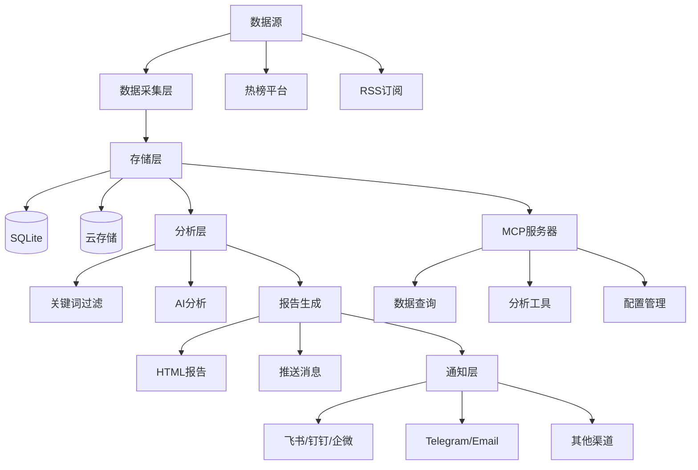
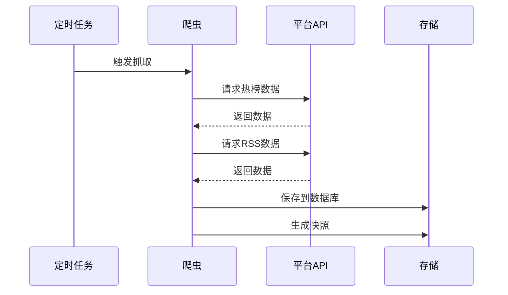
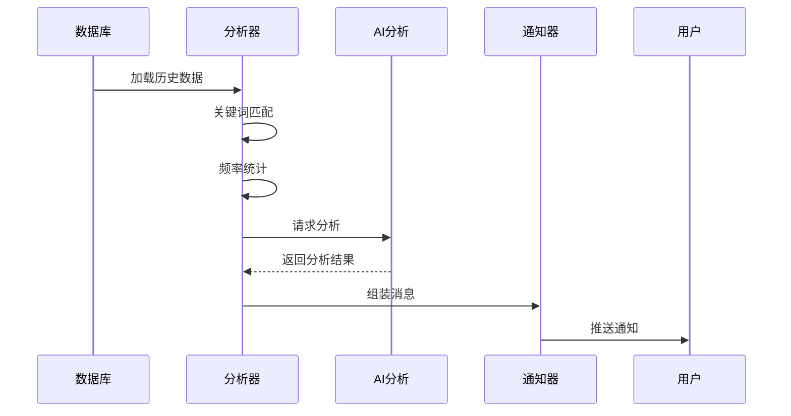

# TrendRadar 项目概述

## 项目简介

**TrendRadar** 是一个轻量级的热点新闻聚合与分析工具，旨在帮助用户从多个平台获取热点资讯，通过关键词过滤和AI智能分析，只推送真正关心的内容。

### 核心价值

- **告别无效刷屏**: 通过关键词过滤，只接收关注的新闻
- **多平台聚合**: 支持11个主流热榜平台 + RSS订阅源
- **AI智能分析**: 基于大模型的新闻趋势分析和总结
- **灵活推送**: 支持9种通知渠道，多种报告模式
- **零成本部署**: GitHub Actions 一键 Fork 即用

### 项目信息

| 项目 | 信息 |
|------|------|
| **版本** | v5.3.0 |
| **Python要求** | >= 3.10 |
| **开源协议** | GPL-3.0 |
| **项目地址** | [github.com/sansan0/TrendRadar](https://github.com/sansan0/TrendRadar) |

## 核心功能

### 1. 多源数据采集

#### 热榜平台支持
- 今日头条、百度热搜
- 华尔街见闻、财联社
- 澎湃新闻、凤凰网
- 微博、知乎、抖音
- B站、贴吧

#### RSS订阅支持
- 自定义RSS源
- 关键词过滤
- 新鲜度控制（避免旧文章重复推送）

### 2. 智能分析

#### 关键词过滤
- 分组管理（`config/frequency_words.txt`）
- 支持正则表达式
- 全局过滤词

#### AI分析（基于LiteLLM）
- 支持100+AI模型提供商
- 新闻趋势总结
- 多语言翻译
- 可配置分析范围和成本控制

### 3. 灵活的报告模式

| 模式 | 说明 | 适用场景 |
|------|------|----------|
| **Daily（当日汇总）** | 推送当天所有匹配新闻 | 日报总结、全面了解 |
| **Current（当前榜单）** | 只推送当前在榜新闻 | 实时追踪 |
| **Incremental（增量监控）** | 有新增才推送 | 避免重复干扰 |

### 4. 多渠道推送

支持9种通知方式：
- **国内**: 飞书、钉钉、企业微信、邮件
- **国际**: Telegram、Slack
- **通用**: ntfy、Bark、通用Webhook

### 5. MCP服务器

基于FastMCP 2.0实现，提供：
- 数据查询工具
- 分析统计工具
- 配置管理工具
- 存储同步工具

## 技术架构

### 技术栈

```
Python 3.10+
├── 数据采集
│   ├── requests (HTTP请求)
│   └── feedparser (RSS解析)
├── 存储层
│   ├── SQLite (本地数据库)
│   └── boto3 (S3兼容云存储)
├── AI层
│   └── litellm (统一AI接口)
├── 通知层
│   └── websockets (实时通信)
└── 配置
    ├── PyYAML (配置解析)
    └── pytz (时区处理)
```

### 系统架构图



## 数据流程

### 1. 数据采集流程



### 2. 分析推送流程



## 目录结构

```
TrendRadar/
├── trendradar/              # 主程序
│   ├── __main__.py          # 程序入口
│   ├── context.py           # 应用上下文
│   ├── ai/                  # AI分析模块
│   ├── core/                # 核心逻辑
│   ├── crawler/             # 数据爬虫
│   │   └── rss/             # RSS订阅
│   ├── notification/        # 通知推送
│   ├── report/              # 报告生成
│   ├── storage/             # 存储管理
│   └── utils/               # 工具函数
│
├── mcp_server/              # MCP服务器
│   ├── server.py            # 服务入口
│   ├── tools/               # MCP工具集
│   ├── services/            # 服务层
│   └── utils/               # 工具函数
│
├── config/                  # 配置文件
│   ├── config.yaml          # 主配置
│   ├── frequency_words.txt  # 关键词配置
│   ├── ai_analysis_prompt.txt
│   └── ai_translation_prompt.txt
│
├── output/                  # 输出目录
│   ├── news/                # SQLite数据库
│   └── html/                # HTML报告
│
├── docker/                  # Docker配置
├── docs/                    # 文档
├── pyproject.toml           # 项目配置
└── requirements.txt         # 依赖列表
```

## 主要模块说明

### 1. 主程序模块 ([trendradar/](trendradar/))

- **[__main__.py](trendradar/__main__.py)**: 程序入口，实现 `NewsAnalyzer` 主分析器
- **[context.py](trendradar/context.py)**: 应用上下文，统一管理配置和资源

### 2. AI模块 ([trendradar/ai/](trendradar/ai/))

- **[client.py](trendradar/ai/client.py)**: LiteLLM客户端封装
- **[analyzer.py](trendradar/ai/analyzer.py)**: 新闻分析器
- **[translator.py](trendradar/ai/translator.py)**: 多语言翻译
- **[formatter.py](trendradar/ai/formatter.py)**: AI输出格式化

### 3. 核心模块 ([trendradar/core/](trendradar/core/))

- **[config.py](trendradar/core/config.py)**: 配置解析和验证
- **[data.py](trendradar/core/data.py)**: 数据结构定义
- **[analyzer.py](trendradar/core/analyzer.py)**: 关键词频率统计
- **[loader.py](trendradar/core/loader.py)**: 数据加载器
- **[frequency.py](trendradar/core/frequency.py)**: 关键词匹配

### 4. 爬虫模块 ([trendradar/crawler/](trendradar/crawler/))

- **[fetcher.py](trendradar/crawler/fetcher.py)**: 热榜爬虫
- **[rss/](trendradar/crawler/rss/)**: RSS订阅模块

### 5. 存储模块 ([trendradar/storage/](trendradar/storage/))

- **[base.py](trendradar/storage/base.py)**: 存储抽象层
- **[local.py](trendradar/storage/local.py)**: 本地存储实现
- **[remote.py](trendradar/storage/remote.py)**: 云存储实现
- **[manager.py](trendradar/storage/manager.py)**: 存储管理器
- **[sqlite_mixin.py](trendradar/storage/sqlite_mixin.py)**: SQLite混入类

### 6. 通知模块 ([trendradar/notification/](trendradar/notification/))

- **[dispatcher.py](trendradar/notification/dispatcher.py)**: 通知分发器
- **[push_manager.py](trendradar/notification/push_manager.py)**: 推送窗口管理
- **[formatters.py](trendradar/notification/formatters.py)**: 消息格式化
- **[senders.py](trendradar/notification/senders.py)**: 各渠道发送实现
- **[batch.py](trendradar/notification/batch.py)**: 消息分批处理
- **[splitter.py](trendradar/notification/splitter.py)**: 消息分割
- **[renderer.py](trendradar/notification/renderer.py)**: Markdown渲染

### 7. 报告模块 ([trendradar/report/](trendradar/report/))

- **[generator.py](trendradar/report/generator.py)**: 报告生成器
- **[html.py](trendradar/report/html.py)**: HTML报告
- **[formatter.py](trendradar/report/formatter.py)**: 格式化工具

### 8. MCP服务器 ([mcp_server/](mcp_server/))

- **[server.py](mcp_server/server.py)**: FastMCP服务器实现
- **[tools/](mcp_server/tools/)**: 6类MCP工具
- **[services/](mcp_server/services/)**: 服务层实现
- **[utils/](mcp_server/utils/)**: 工具函数

## 特色功能

### 1. 多账号支持

所有通知渠道都支持多账号配置，使用分号分隔：
```yaml
notification:
  channels:
    telegram:
      bot_token: "token1;token2;token3"
      chat_id: "id1;id2;id3"
```

### 2. 推送时间窗口

可配置推送时间段，避免非工作时间打扰：
```yaml
notification:
  push_window:
    enabled: true
    start: "09:00"
    end: "18:00"
    once_per_day: true
```

### 3. AI成本控制

通过 `max_news_for_analysis` 控制分析数量：
```yaml
ai_analysis:
  max_news_for_analysis: 50  # 控制成本的关键参数
```

### 4. 数据新鲜度过滤

RSS源支持按天数过滤旧文章：
```yaml
rss:
  freshness_filter:
    enabled: true
    max_age_days: 3
```

## 适用场景

1. **个人资讯追踪**: 关注特定关键词的热点新闻
2. **行业监控**: 实时追踪行业动态
3. **技术资讯**: RSS订阅技术博客，AI辅助总结
4. **企业推送**: 企业内部新闻推送
5. **AI分析集成**: 通过MCP接入AI客户端

## 相关文档

- [架构设计文档](02-architecture.md)
- [配置指南](03-configuration.md)
- [开发指南](04-development.md)
- [API文档](05-api-reference.md)
- [部署运维](06-deployment.md)
- [用户手册](07-user-manual.md)
