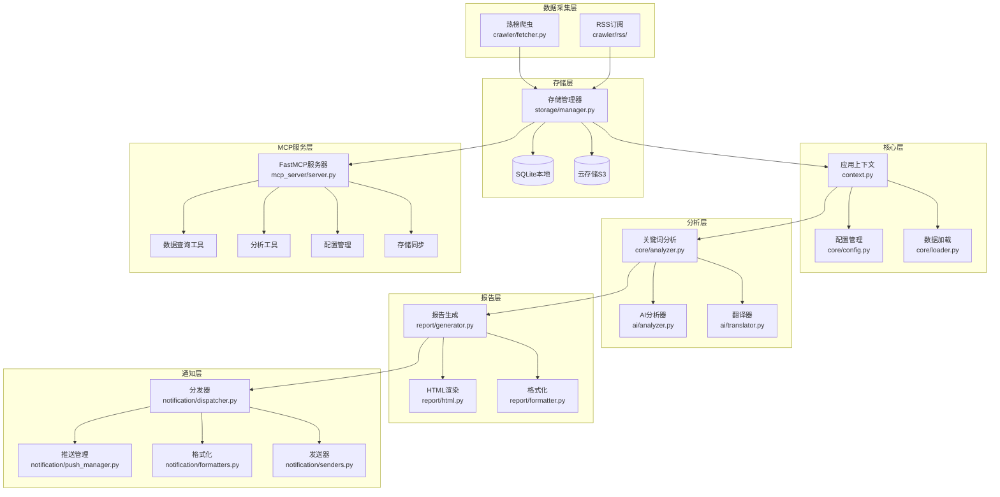
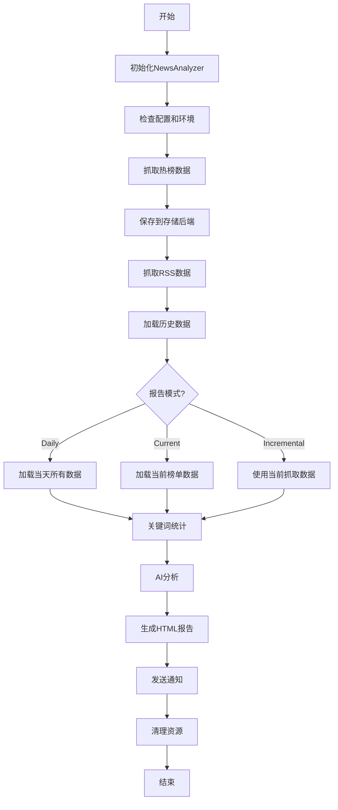
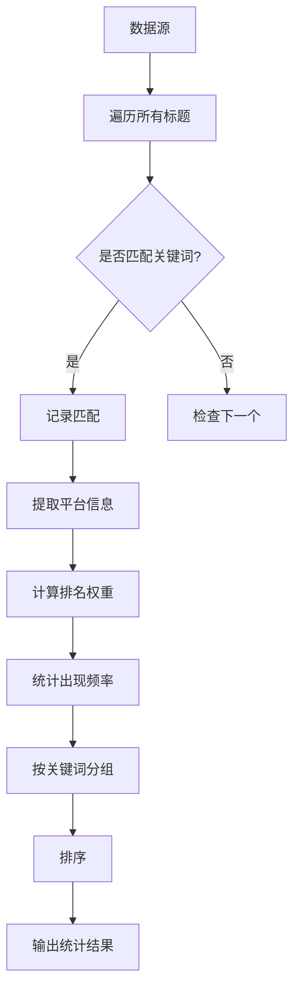
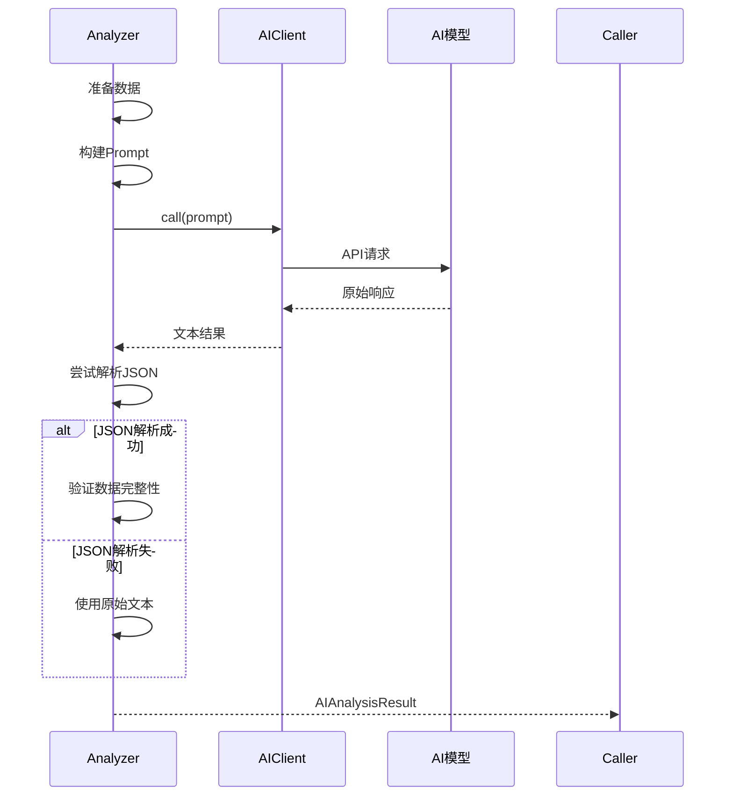
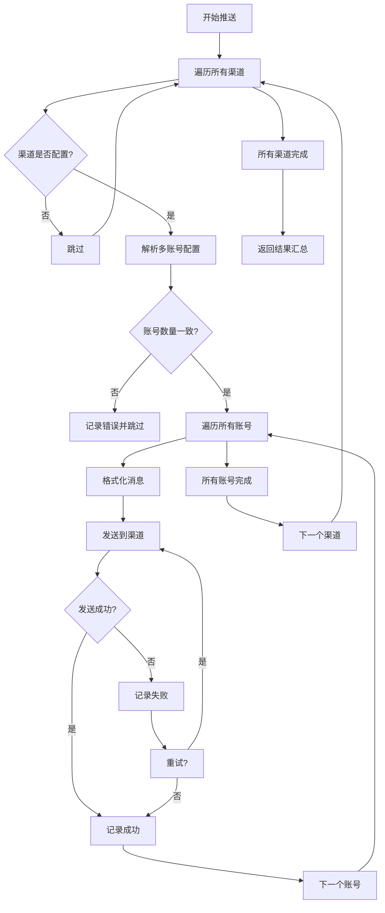

# TrendRadar 架构设计文档

## 系统架构

### 整体架构图



## 模块设计

### 1. 数据采集层

#### 热榜爬虫 ([trendradar/crawler/fetcher.py](trendradar/crawler/fetcher.py))

**职责**:
- 从多平台API获取热榜数据
- 处理请求间隔和错误重试
- 代理支持

**核心类**:

```python
class DataFetcher:
    """数据抓取器"""

    def crawl_websites(
        self,
        ids: List[Tuple[str, str]],
        request_interval: int
    ) -> Tuple[Dict, Dict, List]:
        """
        抓取所有配置的平台

        Returns:
            (results, id_to_name, failed_ids)
        """
```

**数据流程**:
```
newsnow API → 解析热榜 → 去重 → 返回结构化数据
```

#### RSS订阅 ([trendradar/crawler/rss/](trendradar/crawler/rss/))

**职责**:
- 抓取RSS源
- 解析RSS内容
- 新鲜度过滤
- 检测新增条目

**核心类**:

```python
class RSSFetcher:
    """RSS抓取器"""

    def fetch_all(self) -> RSSData:
        """抓取所有RSS源"""

class RSSFeedConfig:
    """RSS源配置"""
    id: str
    name: str
    url: str
    max_items: int
    enabled: bool
    max_age_days: Optional[int]  # 新鲜度控制
```

### 2. 存储层

#### 存储抽象 ([trendradar/storage/base.py](trendradar/storage/base.py))

**设计模式**: 策略模式

**抽象基类**:

```python
class StorageBackend(ABC):
    """存储后端抽象接口"""

    @abstractmethod
    def save_news_data(self, data: NewsData) -> bool:
        """保存新闻数据"""

    @abstractmethod
    def load_news_data(self, date: str) -> Optional[NewsData]:
        """加载新闻数据"""
```

#### 本地存储 ([trendradar/storage/local.py](trendradar/storage/local.py))

**职责**:
- SQLite数据库存储
- TXT/HTML快照生成
- 数据清理

**核心方法**:

```python
class LocalStorage(StorageBackend):
    def save_news_data(self, data: NewsData) -> bool:
        """保存到SQLite"""

    def save_txt_snapshot(self, data: NewsData) -> str:
        """生成TXT快照"""
```

#### 云存储 ([trendradar/storage/remote.py](trendradar/storage/remote.py))

**职责**:
- S3兼容协议存储
- 支持R2/OSS/COS等

**核心方法**:

```python
class RemoteStorage(StorageBackend):
    def __init__(self, config: Dict):
        self.s3_client = boto3.client(
            's3',
            endpoint_url=config['endpoint_url'],
            aws_access_key_id=config['access_key_id'],
            aws_secret_access_key=config['secret_access_key']
        )
```

#### 存储管理器 ([trendradar/storage/manager.py](trendradar/storage/manager.py))

**职责**:
- 统一存储接口
- 自动选择存储后端
- 数据同步

**核心类**:

```python
class StorageManager:
    """存储管理器"""

    def __init__(self, config: Dict):
        backend_type = config.get('backend', 'auto')
        if backend_type == 'auto':
            backend_type = self._detect_backend()

        self.backend = self._create_backend(backend_type)

    def save_news_data(self, data: NewsData) -> bool:
        """保存数据（自动路由到具体后端）"""
```

### 3. 核心层

#### 应用上下文 ([trendradar/context.py](trendradar/context.py))

**设计模式**: 上下文模式（单例 + 工厂）

**职责**:
- 全局配置管理
- 资源生命周期管理
- 组件工厂

**核心类**:

```python
class AppContext:
    """应用上下文"""

    def __init__(self, config: Dict):
        self.config = config
        self._storage_manager = None
        self._timezone = None

    @property
    def storage_manager(self) -> StorageManager:
        """获取存储管理器（懒加载）"""
        if not self._storage_manager:
            self._storage_manager = StorageManager(self.config)
        return self._storage_manager

    def get_time(self) -> datetime:
        """获取当前时间（带时区）"""

    def cleanup(self):
        """清理资源"""
```

#### 配置管理 ([trendradar/core/config.py](trendradar/core/config.py))

**职责**:
- YAML配置解析
- 多账号配置验证
- 环境变量覆盖

**核心函数**:

```python
def load_config(config_path: str = "config/config.yaml") -> Dict:
    """加载配置文件"""

def parse_multi_account_config(
    config_value: str,
    separator: str = ";"
) -> List[str]:
    """解析多账号配置"""

def validate_paired_configs(
    configs: Dict[str, List[str]],
    channel_name: str
) -> Tuple[bool, int]:
    """验证配对配置（如Telegram的token和chat_id）"""
```

#### 数据加载 ([trendradar/core/loader.py](trendradar/core/loader.py))

**职责**:
- 从存储加载历史数据
- 按平台过滤
- 合并多次抓取结果

**核心函数**:

```python
def load_data_by_date(
    date: str,
    platform_ids: List[str]
) -> Tuple[Dict, Dict, Dict]:
    """
    加载指定日期的数据

    Returns:
        (results, id_to_name, title_info)
    """
```

### 4. 分析层

#### 关键词分析 ([trendradar/core/analyzer.py](trendradar/core/analyzer.py))

**职责**:
- 关键词匹配统计
- 频率计算
- 排名权重计算

**核心函数**:

```python
def count_frequency(
    data_source: Dict,
    word_groups: List[Dict],
    filter_words: List[str],
    id_to_name: Dict,
    title_info: Dict,
    new_titles: Dict,
    mode: str
) -> Tuple[List[Dict], int]:
    """
    统计关键词频率

    Returns:
        (stats, total_titles)
        stats: [{
            "word": "关键词",
            "count": 5,
            "platforms": ["知乎", "微博"],
            "titles": [...]
        }]
    """
```

#### AI分析器 ([trendradar/ai/analyzer.py](trendradar/ai/analyzer.py))

**职责**:
- 调用AI模型分析新闻
- 结果解析和验证
- 错误处理和降级

**核心类**:

```python
class AIAnalyzer:
    """AI分析器"""

    def __init__(self, ai_config: Dict, analysis_config: Dict):
        self.client = AIClient(ai_config)
        self.prompt = self._load_prompt(analysis_config)

    def analyze(
        self,
        stats: List[Dict],
        rss_stats: List[Dict],
        report_mode: str,
        platforms: List[str],
        keywords: List[str]
    ) -> AIAnalysisResult:
        """
        执行AI分析

        Returns:
            AIAnalysisResult(success, content, error)
        """
```

**分析流程**:
```
数据准备 → 构建Prompt → 调用AI → 解析JSON → 验证结果
```

#### AI客户端 ([trendradar/ai/client.py](trendradar/ai/client.py))

**职责**:
- LiteLLM统一接口封装
- 模型切换和降级
- 错误重试

**核心类**:

```python
class AIClient:
    """AI客户端"""

    def __init__(self, config: Dict):
        self.model = config['model']
        self.api_key = config['api_key']
        self.temperature = config.get('temperature', 1.0)

    def call(
        self,
        prompt: str,
        max_tokens: int = 5000
    ) -> str:
        """调用AI模型"""
```

### 5. 通知层

#### 分发器 ([trendradar/notification/dispatcher.py](trendradar/notification/dispatcher.py))

**职责**:
- 多渠道消息分发
- 多账号推送
- 结果汇总

**核心类**:

```python
class NotificationDispatcher:
    """通知分发器"""

    def __init__(self, config: Dict):
        self.senders = self._init_senders()

    def dispatch_all(
        self,
        report_data: Dict,
        report_type: str,
        html_file_path: str,
        rss_items: List[Dict],
        ai_analysis: AIAnalysisResult
    ) -> Dict[str, bool]:
        """
        分发到所有渠道

        Returns:
            {channel_name: success}
        """
```

#### 发送器 ([trendradar/notification/senders.py](trendradar/notification/senders.py))

**职责**:
- 各平台的具体发送实现
- 消息格式适配
- 错误处理

**核心类**:

```python
class FeishuSender(NotificationSender):
    """飞书推送"""

    def send(self, message: str) -> bool:
        webhook_url = self.config['webhook_url']
        # 发送逻辑

class TelegramSender(NotificationSender):
    """Telegram推送"""

    def send(self, message: str) -> bool:
        bot_token = self.config['bot_token']
        chat_id = self.config['chat_id']
        # 发送逻辑
```

**支持的平台**:
- FeishuSender
- DingTalkSender
- WeworkSender
- TelegramSender
- EmailSender
- NtfySender
- BarkSender
- SlackSender
- GenericWebhookSender

#### 格式化器 ([trendradar/notification/formatters.py](trendradar/notification/formatters.py))

**职责**:
- 统一消息格式化
- 多区域组装
- Markdown渲染

**核心类**:

```python
class NotificationFormatter:
    """通知格式化器"""

    def format_notification(
        self,
        report_data: Dict,
        report_type: str,
        update_info: Dict,
        mode: str,
        rss_items: List[Dict],
        ai_analysis: AIAnalysisResult,
        standalone_data: Dict
    ) -> str:
        """
        格式化通知消息

        按config.display.region_order顺序组装各区域
        """
```

**消息区域**:
- 新增热点区域 (new_items)
- 热榜区域 (hotlist)
- RSS区域 (rss)
- 独立展示区 (standalone)
- AI分析区域 (ai_analysis)

### 6. MCP服务层

#### FastMCP服务器 ([mcp_server/server.py](mcp_server/server.py))

**职责**:
- FastMCP 2.0应用实现
- 工具注册
- 资源暴露

**核心结构**:

```python
from fastmcp import FastMCP

mcp = FastMCP('trendradar-news')

@mcp.tool()
async def query_news_by_date(
    date: str,
    keyword: Optional[str] = None
) -> str:
    """查询指定日期的新闻"""

@mcp.resource("config://platforms")
async def get_platforms_resource() -> str:
    """获取平台列表"""
```

#### 工具集架构

```
mcp_server/tools/
├── data_query.py       # 数据查询工具
│   ├── query_news_by_date
│   ├── query_rss_by_date
│   └── get_latest_data
├── analytics.py        # 分析工具
│   ├── analyze_keywords
│   ├── get_statistics
│   └── compare_dates
├── search_tools.py     # 搜索工具
│   ├── search_news
│   └── search_by_platform
├── config_mgmt.py      # 配置管理
│   ├── get_config
│   ├── update_keywords
│   └── list_platforms
├── system.py           # 系统管理
│   ├── get_status
│   └── cleanup_data
└── storage_sync.py     # 存储同步
    ├── pull_from_remote
    └── push_to_remote
```

## 数据结构

### 核心数据类

```python
@dataclass
class NewsData:
    """新闻数据"""
    date: str                    # 日期 YYYY-MM-DD
    time: str                    # 时间 HH:MM:SS
    results: Dict[str, Dict]     # {platform_id: {title: data}}
    id_to_name: Dict[str, str]   # {platform_id: platform_name}
    failed_ids: List[str]        # 失败的平台ID

@dataclass
class TitleInfo:
    """标题元信息"""
    first_time: str              # 首次出现时间
    last_time: str               # 最后出现时间
    count: int                   # 出现次数
    ranks: List[int]             # 排名历史
    url: str                     # 链接
    mobileUrl: str               # 移动端链接

@dataclass
class RSSData:
    """RSS数据"""
    date: str
    time: str
    id_to_name: Dict[str, str]
    items: Dict[str, List[RSSItem]]  # {feed_id: [items]}

@dataclass
class RSSItem:
    """RSS条目"""
    title: str
    url: str
    published_at: Optional[str]
    summary: Optional[str]
    author: Optional[str]

@dataclass
class AIAnalysisResult:
    """AI分析结果"""
    success: bool
    content: Optional[str]       # 分析内容
    error: Optional[str]         # 错误信息
```

## 关键流程

### 1. 主分析流程 ([trendradar/__main__.py:1314-1340](trendradar/__main__.py#L1314-L1340))



### 2. 关键词统计流程 ([trendradar/core/analyzer.py](trendradar/core/analyzer.py))



### 3. AI分析流程 ([trendradar/ai/analyzer.py](trendradar/ai/analyzer.py))



### 4. 多账号推送流程 ([trendradar/notification/dispatcher.py](trendradar/notification/dispatcher.py))



## 设计模式应用

### 1. 策略模式
- **存储后端**: `StorageBackend` 抽象，`LocalStorage`/`RemoteStorage` 实现
- **发送器**: `NotificationSender` 抽象，各平台具体实现

### 2. 工厂模式
- **存储管理器**: 根据配置自动创建存储后端
- **发送器工厂**: 根据配置创建各平台发送器

### 3. 单例模式
- **应用上下文**: `AppContext` 全局唯一实例
- **MCP工具实例**: 工具类单例复用

### 4. 构建器模式
- **通知消息**: `NotificationFormatter` 分步构建复杂消息
- **AI Prompt**: 分步构建分析请求

### 5. 适配器模式
- **AI客户端**: `AIClient` 统一LiteLLM接口
- **存储接口**: 统一本地和云存储接口

## 扩展点

### 1. 添加新的热榜平台

在 [trendradar/crawler/fetcher.py](trendradar/crawler/fetcher.py) 中添加平台ID和API配置。

### 2. 添加新的通知渠道

1. 在 [trendradar/notification/senders.py](trendradar/notification/senders.py) 继承 `NotificationSender`
2. 在配置文件添加渠道配置
3. 在 `NotificationDispatcher` 中注册

### 3. 添加新的MCP工具

在 [mcp_server/tools/](mcp_server/tools/) 创建新的工具类并注册到 [server.py](mcp_server/server.py)。

## 性能优化

1. **并发抓取**: 热榜和RSS抓取独立进行
2. **懒加载**: 存储管理器等资源按需创建
3. **连接池**: 数据库连接复用
4. **缓存**: MCP服务层内置缓存
5. **批量操作**: 数据库批量插入

## 安全考虑

1. **配置隔离**: 敏感信息支持环境变量
2. **Webhook保护**: 文档警告webhook泄露风险
3. **代理支持**: 本地开发可使用代理
4. **数据验证**: 多账号配置数量验证
5. **错误处理**: AI调用失败降级处理
