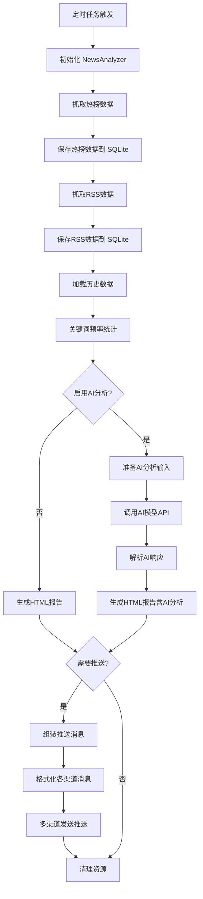

# TrendRadar AI 分析数据存储与推送详细流程

> 本文档详细说明 TrendRadar 中 AI 分析的完整执行流程，包括数据存储、分析触发、推送发送等各个环节，并提供一个完整的执行案例。

## 目录

1. [完整执行流程](#1-完整执行流程)
2. [数据存储详解](#2-数据存储详解)
3. [AI分析详解](#3-ai分析详解)
4. [推送流程详解](#4-推送流程详解)
5. [完整执行案例](#5-完整执行案例)

---

## 1. 完整执行流程

### 1.1 流程图



### 1.2 执行顺序

**文件位置**: [`trendradar/__main__.py:1314-1340`](../trendradar/__main__.py#L1314-L1340)

```python
def run(self) -> None:
    """执行分析流程"""
    try:
        # 1. 初始化和检查
        self._initialize_and_check_config()

        # 2. 抓取热榜数据
        results, id_to_name, failed_ids = self._crawl_data()

        # 3. 抓取RSS数据
        rss_items, rss_new_items, raw_rss_items = self._crawl_rss_data()

        # 4. 执行模式策略（包含存储、分析、推送）
        self._execute_mode_strategy(
            mode_strategy, results, id_to_name, failed_ids,
            rss_items=rss_items, rss_new_items=rss_new_items,
            raw_rss_items=raw_rss_items
        )

    except Exception as e:
        print(f"分析流程执行出错: {e}")
    finally:
        # 5. 清理资源
        self.ctx.cleanup()
```

### 1.3 关键时间节点

| 阶段 | 说明 | 耗时（估算） |
|------|------|-------------|
| 数据抓取 | 11个平台热榜 + RSS源 | 10-30秒 |
| 数据存储 | 写入SQLite + TXT快照 | 1-2秒 |
| 数据加载 | 加载历史数据 | 1-2秒 |
| 关键词统计 | 频率计算和排序 | 0.5-1秒 |
| AI分析 | 调用LLM API（如果启用） | 10-60秒 |
| HTML生成 | 生成报告文件 | 1-2秒 |
| 推送发送 | 多渠道发送 | 2-5秒 |

**总计**（启用AI）: 约 30-100秒
**总计**（不启用AI）: 约 15-40秒

---

## 2. 数据存储详解

### 2.1 数据抓取和存储

#### 热榜数据存储

**文件位置**: [`trendradar/__main__.py:734-753`](../trendradar/__main__.py#L734-L753)

```python
# 转换为 NewsData 格式
from trendradar.storage import convert_crawl_results_to_news_data

crawl_time = self.ctx.format_time()  # "10:30:00"
crawl_date = self.ctx.format_date()  # "2025-01-21"

news_data = convert_crawl_results_to_news_data(
    results=results,           # {platform_id: {title: title_data}}
    id_to_name=id_to_name,     # {platform_id: platform_name}
    failed_ids=failed_ids,     # [failed_platform_ids]
    crawl_time=crawl_time,
    crawl_date=crawl_date
)

# 保存到存储后端（SQLite）
if self.storage_manager.save_news_data(news_data):
    print(f"数据已保存到存储后端: {self.storage_manager.backend_name}")

# 保存 TXT 快照（如果启用）
if self.ctx.config["STORAGE"]["FORMATS"]["TXT"]:
    txt_file = self.storage_manager.save_txt_snapshot(news_data)
    print(f"TXT 快照已保存: {txt_file}")
```

**存储位置**:
```
output/
├── news/
│   └── 2025-01-21.db              # SQLite 数据库
└── txt/
    └── 2025-01-21/
        └── 10-30.txt              # TXT 快照
```

#### RSS 数据存储

**文件位置**: [`trendradar/__main__.py:837-845`](../trendradar/__main__.py#L837-L845)

```python
# 保存 RSS 数据到存储后端
if self.storage_manager.save_rss_data(rss_data):
    print(f"[RSS] 数据已保存到存储后端")

# 处理 RSS 数据（按模式过滤）并返回用于合并推送
return self._process_rss_data_by_mode(rss_data)
```

**存储位置**:
```
output/
├── rss/
│   └── 2025-01-21.db              # RSS SQLite 数据库
```

### 2.2 SQLite 数据库结构

#### news_data 表（热榜数据）

```sql
CREATE TABLE news_data (
    id INTEGER PRIMARY KEY AUTOINCREMENT,
    date TEXT NOT NULL,                    -- 日期 YYYY-MM-DD
    time TEXT NOT NULL,                    -- 时间 HH:MM:SS
    platform_id TEXT NOT NULL,             -- 平台ID
    title TEXT NOT NULL,                   -- 标题
    url TEXT,                              -- 链接
    mobile_url TEXT,                       -- 移动端链接
    rank INTEGER,                          -- 当前排名
    is_new INTEGER DEFAULT 0,              -- 是否新增
    created_at TIMESTAMP DEFAULT CURRENT_TIMESTAMP
);

CREATE INDEX idx_date ON news_data(date);
CREATE INDEX idx_platform ON news_data(platform_id);
CREATE INDEX idx_title ON news_data(title);
```

**示例数据**:
```sql
INSERT INTO news_data VALUES (
    NULL,                    -- id
    '2025-01-21',           -- date
    '10:30:00',             -- time
    'zhihu',                -- platform_id
    '如何看待AI发展趋势？',  -- title
    'https://zhihu.com/...',-- url
    'https://m.zhihu.com/...', -- mobile_url
    1,                      -- rank
    1,                      -- is_new
    '2025-01-21 10:30:00'  -- created_at
);
```

#### rss_data 表（RSS数据）

```sql
CREATE TABLE rss_data (
    id INTEGER PRIMARY KEY AUTOINCREMENT,
    date TEXT NOT NULL,                    -- 日期
    time TEXT NOT NULL,                    -- 时间
    feed_id TEXT NOT NULL,                 -- RSS源ID
    title TEXT NOT NULL,                   -- 标题
    url TEXT NOT NULL,                    -- 链接
    published_at TEXT,                    -- 发布时间
    author TEXT,                           -- 作者
    summary TEXT,                          -- 摘要
    is_new INTEGER DEFAULT 0,              -- 是否新增
    created_at TIMESTAMP DEFAULT CURRENT_TIMESTAMP
);
```

### 2.3 数据读取和加载

**文件位置**: [`trendradar/__main__.py:288-325`](../trendradar/__main__.py#L288-L325)

```python
def _load_analysis_data(self, quiet: bool = False):
    """统一的数据加载和预处理"""
    try:
        # 获取当前配置的监控平台ID列表
        current_platform_ids = self.ctx.platform_ids

        # 读取当天的所有标题
        all_results, id_to_name, title_info = self.ctx.read_today_titles(
            current_platform_ids, quiet=quiet
        )

        if not all_results:
            print("没有找到当天的数据")
            return None

        # 检测新增标题
        new_titles = self.ctx.detect_new_titles(
            current_platform_ids, quiet=quiet
        )

        # 加载关键词配置
        word_groups, filter_words, global_filters = self.ctx.load_frequency_words()

        return (
            all_results,      # 所有抓取结果
            id_to_name,       # 平台ID到名称映射
            title_info,       # 标题元信息
            new_titles,       # 新增标题
            word_groups,      # 关键词分组
            filter_words,     # 过滤词
            global_filters,   # 全局过滤词
        )
    except Exception as e:
        print(f"数据加载失败: {e}")
        return None
```

---

## 3. AI分析详解

### 3.1 AI分析触发时机

#### 触发位置

**文件位置**: [`trendradar/__main__.py:534-542`](../trendradar/__main__.py#L534-L542)

```python
# 在 _run_analysis_pipeline 方法中
ai_config = self.ctx.config.get("AI_ANALYSIS", {})
if ai_config.get("ENABLED", False) and stats:
    # 获取模式策略来确定报告类型
    mode_strategy = self._get_mode_strategy()
    report_type = mode_strategy["report_type"]

    # 执行AI分析
    ai_result = self._run_ai_analysis(
        stats,           # 热榜统计数据
        rss_items,       # RSS统计条目
        mode,            # 报告模式
        report_type,     # 报告类型
        id_to_name       # 平台名称映射
    )
```

### 3.2 AI分析输入准备

**文件位置**: [`trendradar/ai/analyzer.py:97-179`](../trendradar/ai/analyzer.py#L97-L179)

```python
def _prepare_news_content(
    self,
    stats: List[Dict],
    rss_stats: Optional[List[Dict]],
    max_news: int
) -> Tuple[str, str, int, int, int]:
    """准备AI分析的新闻内容"""
    news_items = []
    rss_items_content = []

    # 1. 处理热榜新闻
    for stat in stats[:max_news]:
        word = stat.get("word", "")
        count = stat.get("count", 0)
        platforms = stat.get("platforms", [])
        titles = stat.get("titles", [])

        if not titles:
            continue

        # 格式化新闻条目
        for title_info in titles:
            title = title_info.get("title", "")
            platform = title_info.get("platform", "")
            rank = title_info.get("rank", 0)
            is_new = title_info.get("is_new", False)

            new_mark = "🆕" if is_new else ""
            news_items.append(
                f"- [{new_mark}{platform} #{rank}] {title}"
            )

    # 2. 处理RSS新闻（如果启用）
    if self.analysis_config.get("INCLUDE_RSS", False) and rss_stats:
        for stat in rss_stats[:max_news]:
            word = stat.get("word", "")
            titles = stat.get("titles", [])

            for title_info in titles:
                title = title_info.get("title", "")
                feed_name = title_info.get("feed_name", "")
                published_at = title_info.get("published_at", "")

                time_str = published_at.split("T")[1][:5] if published_at else ""
                rss_items_content.append(
                    f"- [{feed_name} {time_str}] {title}"
                )

    # 3. 组装内容
    hotlist_total = len(news_items)
    rss_total = len(rss_items_content)
    analyzed_count = hotlist_total + rss_total

    news_content = "\n".join(news_items)
    rss_content = "\n".join(rss_items_content)

    return news_content, rss_content, hotlist_total, rss_total, analyzed_count
```

### 3.3 AI Prompt构建

**文件位置**: [`trendradar/ai/analyzer.py:181-203`](../trendradar/ai/analyzer.py#L181-L203)

```python
def _build_prompt(
    self,
    news_content: str,
    rss_content: str,
    report_mode: str,
    report_type: str,
    platforms: List[str],
    keywords: List[str]
) -> str:
    """构建AI分析Prompt"""

    # 填充用户提示词模板
    user_prompt = self.user_prompt_template.format(
        news_data=news_content,
        rss_data=rss_content,
        hotlist_total=hotlist_total,
        rss_total=rss_total,
        report_mode=report_mode,
        report_type=report_type,
        platforms=", ".join(platforms),
        keywords=", ".join(keywords),
        total_analyzed=analyzed_count
    )

    return user_prompt
```

**提示词模板示例**（`config/ai_analysis_prompt.txt`）:

```
你是一个新闻分析助手。请分析以下热点新闻，并提供：

1. **趋势总结**（3-5条）
   - 提取最重要的趋势和事件
   - 简洁明了，每条不超过20字

2. **重要事件**（3-5条）
   - 值得关注的具体事件
   - 包含必要的背景信息

3. **相关性分析**
   - 分析事件之间的关联
   - 识别潜在的发展方向

---

**报告类型**: {report_type}
**报告模式**: {report_mode}
**监控平台**: {platforms}
**关注关键词**: {keywords}
**分析总数**: {total_analyzed} 条（热榜 {hotlist_total} + RSS {rss_total}）

---

**热榜数据**:
{news_data}

**RSS数据**:
{rss_data}

---

请使用**中文**输出，格式清晰，重点突出。
```

### 3.4 AI API调用

**文件位置**: [`trendradar/ai/analyzer.py:205-244`](../trendradar/ai/analyzer.py#L205-L244)

```python
def _call_ai(self, prompt: str) -> str:
    """调用AI模型API"""
    try:
        # 使用 AIClient 调用 LiteLLM
        response = self.client.call(
            prompt=prompt,
            max_tokens=self.ai_config.get("MAX_TOKENS", 5000)
        )

        return response

    except Exception as e:
        error_type = type(e).__name__
        error_msg = str(e)

        # 截断过长的错误消息
        if len(error_msg) > 200:
            error_msg = error_msg[:200] + "..."

        raise Exception(f"{error_type}: {error_msg}")
```

**AI客户端实现**（`trendradar/ai/client.py:42-95`）:

```python
def call(self, prompt: str, max_tokens: int = 5000) -> str:
    """调用AI模型"""
    messages = [
        {"role": "system", "content": self.system_prompt},
        {"role": "user", "content": prompt}
    ]

    try:
        # 使用 LiteLLM 统一接口
        response = completion(
            model=self.model,
            messages=messages,
            api_key=self.api_key,
            api_base=self.api_base,
            temperature=self.temperature,
            max_tokens=max_tokens,
            timeout=self.timeout
        )

        # 提取响应内容
        content = response.choices[0].message.content
        return content

    except Exception as e:
        # 重试机制
        for attempt in range(self.num_retries):
            try:
                # 尝试备用模型
                if self.fallback_models:
                    fallback_model = self.fallback_models[attempt]
                    response = completion(
                        model=fallback_model,
                        messages=messages,
                        temperature=self.temperature
                    )
                    return response.choices[0].message.content
            except Exception:
                continue

        raise e
```

### 3.5 AI响应解析

**文件位置**: [`trendradar/ai/analyzer.py:246-286`](../trendradar/ai/analyzer.py#L246-L286)

```python
def _parse_response(self, response: str) -> AIAnalysisResult:
    """解析AI响应"""
    try:
        # 1. 尝试提取JSON（如果AI返回了JSON格式）
        import json
        import re

        # 查找JSON代码块
        json_match = re.search(r'```json\s*(.*?)\s*```', response, re.DOTALL)
        if json_match:
            json_str = json_match.group(1)
        else:
            # 尝试直接解析整个响应
            json_str = response

        try:
            parsed_data = json.loads(json_str)

            # 验证数据完整性
            if isinstance(parsed_data, dict):
                return AIAnalysisResult(
                    success=True,
                    content=json.dumps(parsed_data, ensure_ascii=False),
                    raw_content=response
                )

        except json.JSONDecodeError:
            # JSON解析失败，使用原始文本
            pass

        # 2. 使用原始文本
        return AIAnalysisResult(
            success=True,
            content=response,
            raw_content=response
        )

    except Exception as e:
        return AIAnalysisResult(
            success=False,
            error=f"解析失败: {str(e)}"
        )
```

---

## 4. 推送流程详解

### 4.1 推送消息组装

**文件位置**: [`trendradar/__main__.py:633-634`](../trendradar/__main__.py#L633-L634)

```python
# 准备报告数据（不含AI分析）
report_data = self.ctx.prepare_report(
    stats,           # 关键词统计
    failed_ids,      # 失败的平台
    new_titles,       # 新增标题
    id_to_name,       # 平台名称
    mode             # 报告模式
)
```

**报告数据结构**（`trendradar/context.py:prepare_report`）:

```python
def prepare_report(
    self,
    stats: List[Dict],
    failed_ids: List[str],
    new_titles: Dict,
    id_to_name: Dict,
    mode: str
) -> Dict:
    """准备推送报告数据"""

    report_time = self.get_time().strftime("%Y-%m-%d %H:%M:%S")
    report_date = self.format_date()

    return {
        "report_time": report_time,
        "report_date": report_date,
        "mode": mode,
        "stats": stats,              # 关键词统计
        "failed_ids": failed_ids,    # 失败平台
        "new_titles": new_titles,    # 新增标题
        "total_count": sum(s.get("count", 0) for s in stats),
        "platform_count": len(id_to_name)
    }
```

### 4.2 AI分析结果加入推送

**文件位置**: [`trendradar/__main__.py:639-652`](../trendradar/__main__.py#L639-L652)

```python
# 使用 NotificationDispatcher 发送到所有渠道（合并热榜+RSS+AI分析+独立展示区）
dispatcher = self.ctx.create_notification_dispatcher()
results = dispatcher.dispatch_all(
    report_data=report_data,          # 基础报告数据
    report_type=report_type,          # 报告类型
    update_info=update_info_to_send,  # 版本更新信息
    proxy_url=self.proxy_url,         # 代理设置
    mode=mode,                        # 报告模式
    html_file_path=html_file_path,    # HTML报告路径
    rss_items=rss_items,              # RSS统计条目
    rss_new_items=rss_new_items,      # RSS新增条目
    ai_analysis=ai_result,            # AI分析结果 ⭐
    standalone_data=standalone_data    # 独立展示区数据
)
```

### 4.3 多渠道消息格式化

**文件位置**: [`trendradar/notification/formatters.py`](../trendradar/notification/formatters.py)

```python
def format_notification(
    self,
    report_data: Dict,
    report_type: str,
    update_info: Optional[Dict],
    mode: str,
    rss_items: Optional[List[Dict]],
    ai_analysis: Optional[AIAnalysisResult],  # ⭐ AI分析
    standalone_data: Optional[Dict]
) -> str:
    """格式化通知消息"""

    # 1. 构建标题
    title = f"📊 {report_type} - {report_data['report_time']}"

    # 2. 按区域顺序组装内容
    sections = []

    # 新增热点区域
    if config["DISPLAY"]["REGIONS"]["NEW_ITEMS"]:
        new_items_section = self._format_new_items(...)
        sections.append(new_items_section)

    # 热榜区域（关键词匹配）
    if config["DISPLAY"]["REGIONS"]["HOTLIST"]:
        hotlist_section = self._format_hotlist(...)
        sections.append(hotlist_section)

    # RSS区域
    if config["DISPLAY"]["REGIONS"]["RSS"] and rss_items:
        rss_section = self._format_rss(...)
        sections.append(rss_section)

    # 独立展示区
    if config["DISPLAY"]["REGIONS"]["STANDALONE"] and standalone_data:
        standalone_section = self._format_standalone(...)
        sections.append(standalone_section)

    # AI分析区域 ⭐
    if config["DISPLAY"]["REGIONS"]["AI_ANALYSIS"] and ai_analysis:
        if ai_analysis.success:
            ai_section = self._format_ai_analysis(ai_analysis.content)
            sections.append(ai_section)
        elif ai_analysis.error:
            # AI分析失败时显示错误信息（可选）
            pass

    # 3. 组装完整消息
    content = "\n\n".join([title] + sections)

    return content
```

### 4.4 AI分析区域格式化

**文件位置**: [`trendradar/notification/formatters.py:_format_ai_analysis`](../trendradar/notification/formatters.py)

```python
def _format_ai_analysis(self, ai_content: str) -> str:
    """格式化AI分析内容"""

    # 解析AI分析内容（JSON或文本）
    try:
        import json
        data = json.loads(ai_content)

        # 提取结构化数据
        summary = data.get("summary", [])
        events = data.get("events", [])
        analysis = data.get("analysis", "")

        # 格式化为Markdown
        sections = []

        if summary:
            sections.append("### 🤖 AI趋势总结")
            for item in summary:
                sections.append(f"- {item}")
            sections.append("")

        if events:
            sections.append("### 🔥 重要事件")
            for event in events:
                sections.append(f"- {event}")
            sections.append("")

        if analysis:
            sections.append("### 📈 相关性分析")
            sections.append(analysis)
            sections.append("")

        return "\n".join(sections).strip()

    except json.JSONDecodeError:
        # 文本格式，直接返回
        return f"### 🤖 AI分析\n\n{ai_content}"
```

### 4.5 多渠道发送

**文件位置**: [`trendradar/notification/dispatcher.py:162-267`](../trendradar/notification/dispatcher.py#L162-L267)

```python
def dispatch_all(
    self,
    report_data: Dict,
    report_type: str,
    update_info: Optional[Dict],
    proxy_url: Optional[str],
    mode: str,
    html_file_path: Optional[str],
    rss_items: Optional[List[Dict]],
    rss_new_items: Optional[List[Dict]],
    ai_analysis: Optional[AIAnalysisResult],  # ⭐
    standalone_data: Optional[Dict]
) -> Dict[str, bool]:
    """分发到所有渠道"""

    results = {}

    # 1. 格式化消息（Markdown格式）
    message = self.formatter.format_notification(
        report_data, report_type, update_info, mode,
        rss_items, ai_analysis, standalone_data  # ⭐ 传入AI分析
    )

    # 2. 执行翻译（如果启用）
    if self.translation_enabled:
        message, rss_items, rss_new_items = self._translate_content(
            message, rss_items, rss_new_items
        )

    # 3. 按渠道发送
    if self.config.get("FEISHU_WEBHOOK_URL"):
        results["feishu"] = self._send_feishu(message, html_file_path)

    if self.config.get("TELEGRAM_BOT_TOKEN"):
        results["telegram"] = self._send_telegram(message, html_file_path)

    if self.config.get("EMAIL_FROM") and self.config.get("EMAIL_PASSWORD"):
        results["email"] = self._send_email(message, html_file_path)

    # ... 其他渠道

    return results
```

### 4.6 各渠道格式转换

**飞书**（Markdown格式）:
```python
def _send_feishu(self, message: str, html_file_path: str) -> bool:
    """发送到飞书"""
    webhook_url = self.config["FEISHU_WEBHOOK_URL"]

    payload = {
        "msg_type": "interactive",
        "card": {
            "header": {
                "title": {
                    "tag": "plain_text",
                    "content": "📊 TrendRadar 热点报告"
                }
            },
            "elements": [
                {
                    "tag": "div",
                    "text": {
                        "tag": "lark_md",
                        "content": message  # Markdown内容
                    }
                }
            ]
        }
    }

    response = requests.post(webhook_url, json=payload, timeout=10)
    return response.status_code == 200
```

**Telegram**（Markdown格式）:
```python
def _send_telegram(self, message: str, html_file_path: str) -> bool:
    """发送到Telegram"""
    bot_token = self.config["TELEGRAM_BOT_TOKEN"]
    chat_id = self.config["TELEGRAM_CHAT_ID"]

    url = f"https://api.telegram.org/bot{bot_token}/sendMessage"

    payload = {
        "chat_id": chat_id,
        "text": message,          # Markdown内容
        "parse_mode": "Markdown",
        "disable_web_page_preview": True
    }

    response = requests.post(url, json=payload, timeout=10)
    return response.status_code == 200
```

**邮件**（HTML格式）:
```python
def _send_email(self, message: str, html_file_path: str) -> bool:
    """发送邮件"""
    # 将Markdown转换为HTML
    html_content = self._markdown_to_html(message, html_file_path)

    # 读取HTML报告
    if html_file_path and os.path.exists(html_file_path):
        with open(html_file_path, 'r', encoding='utf-8') as f:
            html_report = f.read()
    else:
        html_report = ""

    # 组装完整HTML
    full_html = f"""
    <html>
    <body>
        {html_content}
        <hr>
        {html_report}
    </body>
    </html>
    """

    # 发送邮件
    # ...
```

---

## 5. 完整执行案例

### 5.1 案例场景

**用户配置**:
- 监控平台：知乎、微博、B站（3个平台）
- 关键词：`AI技术`（ChatGPT|GPT-4|Claude|大模型|LLM）
- 报告模式：`current`（当前榜单）
- AI分析：已启用 DeepSeek
- 推送渠道：飞书 + Telegram

**执行时间**: 2025-01-21 10:30:00

### 5.2 执行步骤详解

#### 步骤1：初始化（0-1秒）

```
[2025-01-21 10:30:00] 正在加载配置...
[2025-01-21 10:30:00] TrendRadar v5.3.0 配置加载完成
[2025-01-21 10:30:00] 监控平台数量: 3
[2025-01-21 10:30:00] 时区: Asia/Shanghai
[2025-01-21 10:30:00] 存储后端: local
[2025-01-21 10:30:00] 通知功能已启用，将发送通知
```

**内部状态**:
```python
{
    "config": {...},
    "platform_ids": ["zhihu", "weibo", "bilibili-hot-search"],
    "storage_manager": <LocalStorage object>,
    "proxy_url": None
}
```

#### 步骤2：抓取热榜数据（1-20秒）

```python
# 执行抓取
results, id_to_name, failed_ids = self._crawl_data([
    ("zhihu", "知乎"),
    ("weibo", "微博"),
    ("bilibili-hot-search", "B站")
], request_interval=2000)
```

**日志输出**:
```
[2025-01-21 10:30:01] 配置的监控平台: ['知乎', '微博', 'B站']
[2025-01-21 10:30:01] 开始爬取数据，请求间隔 2000 毫秒
[2025-01-21 10:30:03] 知乎: 50条
[2025-01-21 10:30:05] 微博: 50条
[2025-01-21 10:30:07] B站: 100条
[2025-01-21 10:30:07] 抓取完成，成功 3/3 个平台
```

**抓取结果**（`results`）:
```python
{
    "zhihu": {
        "如何看待GPT-4的发布？": {
            "ranks": [1],
            "url": "https://zhihu.com/question/xxx",
            "mobileUrl": "https://m.zhihu.com/xxx"
        },
        "AI大模型哪家强？": {
            "ranks": [5],
            "url": "https://zhihu.com/question/yyy",
            "mobileUrl": "https://m.zhihu.com/yyy"
        },
        # ... 更多标题
    },
    "weibo": {
        "GPT-4发布引发热议": {
            "ranks": [3],
            "url": "https://weibo.com/xxx",
            "mobileUrl": ""
        },
        # ... 更多标题
    },
    "bilibili-hot-search": {
        # ... 更多标题
    }
}
```

#### 步骤3：保存热榜数据（20-22秒）

```python
# 转换为NewsData格式
news_data = NewsData(
    date="2025-01-21",
    time="10:30:07",
    results=results,
    id_to_name=id_to_name,
    failed_ids=[]
)

# 保存到SQLite
success = self.storage_manager.save_news_data(news_data)
```

**数据库存储结果**:

**news_data 表**:
```sql
-- 知乎数据
INSERT INTO news_data VALUES (1, '2025-01-21', '10:30:07', 'zhihu', '如何看待GPT-4的发布？', 'https://zhihu.com/xxx', 'https://m.zhihu.com/xxx', 1, 1, '2025-01-21 10:30:07');
INSERT INTO news_data VALUES (2, '2025-01-21', '10:30:07', 'zhihu', 'AI大模型哪家强？', 'https://zhihu.com/yyy', 'https://m.zhihu.com/yyy', 5, 1, '2025-01-21 10:30:07');

-- 微博数据
INSERT INTO news_data VALUES (3, '2025-01-21', '10:30:07', 'weibo', 'GPT-4发布引发热议', 'https://weibo.com/xxx', '', 3, 1, '2025-01-21 10:30:07');
```

**日志输出**:
```
[2025-01-21 10:30:08] 数据已保存到存储后端: local
[2025-01-21 10:30:08] TXT 快照已保存: output/txt/2025-01-21/10-30-07.txt
```

#### 步骤4：抓取RSS数据（22-25秒）

```python
# 假设未配置RSS源
rss_items, rss_new_items, raw_rss_items = self._crawl_rss_data()
```

**日志输出**:
```
[2025-01-21 10:30:22] [RSS] 未配置任何 RSS 源
```

#### 步骤5：加载历史数据（25-26秒）

```python
# current模式需要加载当天所有数据
analysis_data = self._load_analysis_data()

all_results, historical_id_to_name, historical_title_info,
historical_new_titles, word_groups, filter_words, global_filters = analysis_data
```

**日志输出**:
```
[2025-01-21 10:30:25] 当前监控平台: ['zhihu', 'weibo', 'bilibili-hot-search']
[2025-01-21 10:30:25] 读取到 200 个标题（已按当前监控平台过滤）
[2025-01-21 10:30:25] 检测到 50 条新增标题
```

#### 步骤6：关键词频率统计（26-27秒）

```python
stats, total_titles = self.ctx.count_frequency(
    data_source=all_results,
    word_groups=word_groups,
    filter_words=filter_words,
    id_to_name=historical_id_to_name,
    title_info=historical_title_info,
    new_titles=historical_new_titles,
    mode="current"
)
```

**统计结果**（`stats`）:
```python
[
    {
        "word": "ChatGPT",
        "count": 15,
        "platforms": ["知乎", "微博"],
        "titles": [
            {
                "title": "如何看待GPT-4的发布？",
                "platform": "知乎",
                "rank": 1,
                "url": "https://zhihu.com/xxx",
                "is_new": True
            },
            {
                "title": "GPT-4发布引发热议",
                "platform": "微博",
                "rank": 3,
                "url": "https://weibo.com/xxx",
                "is_new": True
            },
            # ... 更多标题
        ]
    },
    {
        "word": "大模型",
        "count": 8,
        "platforms": ["知乎", "B站"],
        "titles": [...]
    },
    {
        "word": "LLM",
        "count": 5,
        "platforms": ["知乎"],
        "titles": [...]
    }
]
```

**日志输出**:
```
[2025-01-21 10:30:26] 关键词统计完成
[2025-01-21 10:30:26] 匹配关键词: 3 个
[2025-01-21 10:30:26] 匹配新闻: 28 条
```

#### 步骤7：AI分析（27-60秒）

```python
# 执行AI分析
ai_result = self._run_ai_analysis(
    stats=stats,                # 上一步的统计结果
    rss_items=None,              # 无RSS
    mode="current",
    report_type="当前榜单",
    id_to_name=historical_id_to_name
)
```

**7.1 准备AI输入**:

```python
# 提取平台列表
platforms = ["知乎", "微博", "B站"]

# 提取关键词列表
keywords = ["ChatGPT", "大模型", "LLM"]

# 准备新闻内容（限制max_news_for_analysis=50）
news_content = """- [🆕知乎 #1] 如何看待GPT-4的发布？
- [🆕微博 #3] GPT-4发布引发热议
- [知乎 #5] AI大模型哪家强？
- [B站 #12] 大模型应用场景分析
... (共28条)
"""

# 构建Prompt
user_prompt = """你是一个新闻分析助手。请分析以下热点新闻：

1. **趋势总结**（3-5条）
2. **重要事件**（3-5条）
3. **相关性分析**

---

**报告类型**: 当前榜单
**报告模式**: current
**监控平台**: 知乎, 微博, B站
**关注关键词**: ChatGPT, 大模型, LLM
**分析总数**: 28 条

---

**热榜数据**:
{news_content}

---

请使用**中文**输出，格式清晰，重点突出。"""
```

**7.2 调用AI API**:

```python
# 使用LiteLLM调用DeepSeek
response = completion(
    model="deepseek/deepseek-chat",
    messages=[
        {"role": "system", "content": "你是一个专业的新闻分析助手。"},
        {"role": "user", "content": user_prompt}
    ],
    api_key="sk-xxx",
    temperature=1.0,
    max_tokens=5000,
    timeout=120
)
```

**7.3 AI响应**:

```json
{
  "summary": [
    "GPT-4发布成为今日最大热点",
    "国内大模型竞争加剧",
    "AI应用场景持续扩展"
  ],
  "events": [
    "OpenAI发布GPT-4，性能大幅提升",
    "百度文心一言更新版本",
    "阿里云推出AI开发者平台"
  ],
  "analysis": "从整体趋势来看，AI领域正处于快速发展期。GPT-4的发布引发了广泛讨论，国内各大厂商也在加速布局大模型领域。值得关注的是，应用层面的创新正在加速，从对话机器人到内容创作，AI工具正在渗透到各行各业。"
}
```

**日志输出**:
```
[2025-01-21 10:30:27] [AI] 正在进行 AI 分析...
[2025-01-21 10:30:27] [AI] 准备新闻内容: 28条
[2025-01-21 10:30:28] [AI] 调用AI模型: deepseek/deepseek-chat
[2025-01-21 10:30:55] [AI] 分析完成
```

**AI分析结果**（`ai_result`）:
```python
AIAnalysisResult(
    success=True,
    content='{"summary":[...],"events":[...],"analysis":"..."}',
    raw_content='AI分析的原始文本...'
)
```

#### 步骤8：生成HTML报告（60-62秒）

```python
html_file = self.ctx.generate_html(
    stats=stats,
    total_titles=total_titles,
    failed_ids=failed_ids,
    new_titles=historical_new_titles,
    id_to_name=historical_id_to_name,
    mode="current",
    rss_items=None,
    rss_new_items=None,
    ai_analysis=ai_result  # ⭐ 包含AI分析
)
```

**HTML报告结构**:

```html
<!DOCTYPE html>
<html>
<head>
    <title>TrendRadar 热点报告</title>
</head>
<body>
    <h1>📊 当前榜单 - 2025-01-21 10:30</h1>

    <!-- 新增热点区域 -->
    <section id="new-items">
        <h2>🆕 新增热点 (50条)</h2>
        <ul>
            <li>[知乎 #1] 如何看待GPT-4的发布？</li>
            <li>[微博 #3] GPT-4发布引发热议</li>
            <!-- ... -->
        </ul>
    </section>

    <!-- 关键词统计区域 -->
    <section id="hotlist">
        <h2>🔥 关键词统计</h2>
        <div class="keyword-group">
            <h3>ChatGPT (15条)</h3>
            <ul>
                <li>[知乎 #1] 如何看待GPT-4的发布？</li>
                <!-- ... -->
            </ul>
        </div>
    </section>

    <!-- AI分析区域 ⭐ -->
    <section id="ai-analysis">
        <h2>🤖 AI分析</h2>
        <div class="ai-summary">
            <h3>趋势总结</h3>
            <ul>
                <li>GPT-4发布成为今日最大热点</li>
                <li>国内大模型竞争加剧</li>
                <li>AI应用场景持续扩展</li>
            </ul>
        </div>
        <div class="ai-events">
            <h3>重要事件</h3>
            <ul>
                <li>OpenAI发布GPT-4，性能大幅提升</li>
                <li>百度文心一言更新版本</li>
                <li>阿里云推出AI开发者平台</li>
            </ul>
        </div>
        <div class="ai-analysis-text">
            <h3>相关性分析</h3>
            <p>从整体趋势来看，AI领域正处于快速发展期...</p>
        </div>
    </section>
</body>
</html>
```

**日志输出**:
```
[2025-01-21 10:30:60] HTML报告已生成: output/html/2025-01-21/10-30-00.html
[2025-01-21 10:30:60] 最新报告已更新: output/html/latest/current.html
```

#### 步骤9：发送推送（62-67秒）

```python
# 准备报告数据
report_data = {
    "report_time": "2025-01-21 10:30:00",
    "report_date": "2025-01-21",
    "mode": "current",
    "stats": stats,
    "failed_ids": [],
    "new_titles": historical_new_titles,
    "total_count": 28,
    "platform_count": 3
}

# 发送到所有渠道
dispatcher = self.ctx.create_notification_dispatcher()
results = dispatcher.dispatch_all(
    report_data=report_data,
    report_type="当前榜单",
    update_info=None,
    proxy_url=None,
    mode="current",
    html_file_path="output/html/2025-01-21/10-30-00.html",
    rss_items=None,
    rss_new_items=None,
    ai_analysis=ai_result,  # ⭐ 传入AI分析
    standalone_data=None
)
```

**9.1 格式化消息**:

```python
message = """📊 当前榜单 - 2025-01-21 10:30:00

### 🆕 新增热点 (50条)
...

### 🔥 关键词统计

#### ChatGPT (15条)
- [🆕知乎 #1] 如何看待GPT-4的发布？
- [🆕微博 #3] GPT-4发布引发热议
...

#### 大模型 (8条)
...

#### LLM (5条)
...

### 🤖 AI分析

#### 趋势总结
- GPT-4发布成为今日最大热点
- 国内大模型竞争加剧
- AI应用场景持续扩展

#### 重要事件
- OpenAI发布GPT-4，性能大幅提升
- 百度文心一言更新版本
- 阿里云推出AI开发者平台

#### 相关性分析
从整体趋势来看，AI领域正处于快速发展期。GPT-4的发布引发了广泛讨论，国内各大厂商也在加速布局大模型领域。值得关注的是，应用层面的创新正在加速，从对话机器人到内容创作，AI工具正在渗透到各行各业。

---
📊 [查看完整报告](file://output/html/latest/current.html)"""
```

**9.2 发送到飞书**:

```python
def _send_feishu(message, html_file_path):
    webhook_url = "https://open.feishu.cn/open-apis/bot/v2/hook/xxx"

    payload = {
        "msg_type": "post",
        "content": {
            "post": {
                "zh_cn": {
                    "title": "📊 TrendRadar 热点报告",
                    "content": [
                        [{
                            "tag": "text",
                            "text": message
                        }]
                    ]
                }
            }
        }
    }

    response = requests.post(webhook_url, json=payload)
    return response.status_code == 200
```

**飞书收到的消息**:
```
┌─────────────────────────────────┐
│ 📊 TrendRadar 热点报告         │
├─────────────────────────────────┤
│ 📊 当前榜单 - 2025-01-21 10:30 │
│                                 │
│ [完整消息内容...]              │
│                                 │
│ 包含AI分析的完整推送           │
└─────────────────────────────────┘
```

**9.3 发送到Telegram**:

```python
def _send_telegram(message, html_file_path):
    bot_token = "xxx"
    chat_id = "yyy"

    url = f"https://api.telegram.org/bot{bot_token}/sendMessage"

    payload = {
        "chat_id": chat_id,
        "text": message,
        "parse_mode": "Markdown",
        "disable_web_page_preview": True
    }

    response = requests.post(url, json=payload)
    return response.status_code == 200
```

**Telegram收到的消息**:
```
📊 当前榜单 - 2025-01-21 10:30:00

### 🆕 新增热点 (50条)
...

### 🔥 关键词统计
...

### 🤖 AI分析
...

---
📊 查看完整报告
```

**日志输出**:
```
[2025-01-21 10:31:02] [推送] 准备发送：热榜 28 条
[2025-01-21 10:31:03] 飞书推送: 成功
[2025-01-21 10:31:04] Telegram推送: 成功
[2025-01-21 10:31:05] 推送完成
```

#### 步骤10：清理资源（67秒）

```python
# 清理数据库连接等资源
self.ctx.cleanup()
```

**日志输出**:
```
[2025-01-21 10:31:07] 清理资源完成
[2025-01-21 10:31:07] ✅ 执行完成
```

### 5.3 数据流转总结

| 阶段 | 时间 | 输入 | 输出 | 存储位置 |
|------|------|------|------|---------|
| 1. 抓取热榜 | 1-20秒 | 平台API | `results`字典 | - |
| 2. 保存热榜 | 20-22秒 | `results` | `NewsData` | SQLite + TXT |
| 3. 抓取RSS | 22-25秒 | RSS源 | `rss_data` | SQLite |
| 4. 加载历史 | 25-26秒 | SQLite | `all_results` | 内存 |
| 5. 统计分析 | 26-27秒 | `all_results` | `stats`列表 | 内存 |
| 6. AI分析 | 27-60秒 | `stats` | `ai_result` | - |
| 7. 生成HTML | 60-62秒 | `stats`+`ai_result` | HTML文件 | `output/html/` |
| 8. 发送推送 | 62-67秒 | `stats`+`ai_result` | - | 飞书/Telegram |

### 5.4 关键数据结构

#### 抓取结果（results）
```python
{
    "platform_id": {
        "title": {
            "ranks": [1, 2, 3],      # 排名历史
            "url": "https://...",
            "mobileUrl": "https://m..."
        }
    }
}
```

#### 统计结果（stats）
```python
[
    {
        "word": "ChatGPT",
        "count": 15,
        "platforms": ["知乎", "微博"],
        "titles": [
            {
                "title": "标题文本",
                "platform": "知乎",
                "rank": 1,
                "url": "https://...",
                "is_new": True
            }
        ]
    }
]
```

#### AI分析结果（ai_result）
```python
AIAnalysisResult(
    success=True,
    content='{"summary":[...],"events":[...],"analysis":"..."}',
    raw_content='原始AI响应文本'
)
```

### 5.5 存储位置总览

**执行完成后**（2025-01-21 10:30执行）:

```
output/
├── news/
│   └── 2025-01-21.db                    # SQLite: 热榜数据
│       ├── news_data 表                 # 200条记录
│       └── (新增)
│
├── rss/
│   └── (空，未配置RSS)
│
├── txt/
│   └── 2025-01-21/
│       └── 10-30-07.txt                # TXT快照: 完整数据
│
└── html/
    ├── 2025-01-21/
    │   └── 10-30-00.html              # 时间戳报告
    └── latest/
        └── current.html               # 最新报告（符号链接）
```

---

## 附录

### A. 配置项影响

| 配置项 | 影响阶段 | 说明 |
|-------|---------|------|
| `PLATFORMS` | 抓取 | 决定抓取哪些平台 |
| `RSS.FEEDS` | 抓取 | 决定抓取哪些RSS源 |
| `STORAGE.FORMATS` | 存储 | 决定生成哪些格式（TXT/HTML） |
| `FREQUENCY_WORDS.TXT` | 统计 | 决定匹配哪些关键词 |
| `AI_ANALYSIS.ENABLED` | 分析 | 是否启用AI分析 |
| `AI_ANALYSIS.MAX_NEWS_FOR_ANALYSIS` | 分析 | 传给AI的最大新闻数 |
| `ENABLE_NOTIFICATION` | 推送 | 是否发送推送 |
| `DISPLAY.REGIONS` | 推送 | 推送消息包含哪些区域 |

### B. 性能优化建议

1. **减少AI分析时间**:
   ```yaml
   ai_analysis:
     max_news_for_analysis: 20  # 减少分析数量
   ```

2. **提高抓取速度**:
   ```yaml
   advanced:
     crawler:
       request_interval: 1000  # 减少请求间隔（注意被封）
   ```

3. **减少存储空间**:
   ```yaml
   storage:
     local:
       retention_days: 7  # 自动清理旧数据
   ```

### C. 故障排查

**问题**: AI分析失败但推送正常

**原因**: AI分析失败不会阻止推送

**检查**:
```bash
# 查看AI错误日志
docker logs trendradar | grep "\[AI\]"

# 检查API Key
docker exec trendradad env | grep AI_API_KEY
```

**问题**: 推送包含旧的AI分析

**原因**: HTML报告和推送使用不同的ai_result

**检查**:
```bash
# 查看最新HTML报告的时间戳
ls -la output/html/latest/current.html
```

---

**文档版本**: v1.0
**最后更新**: 2025-01-21
**适用版本**: TrendRadar v5.3.0+
