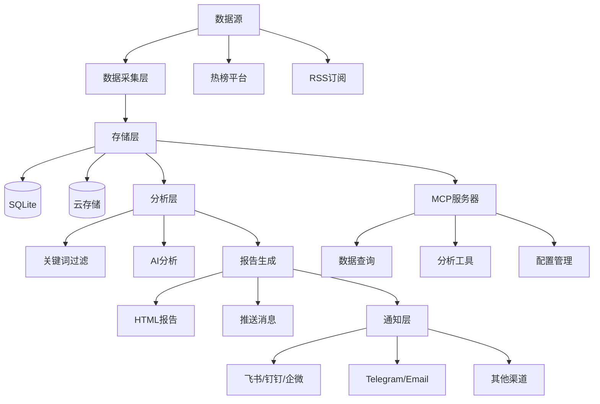
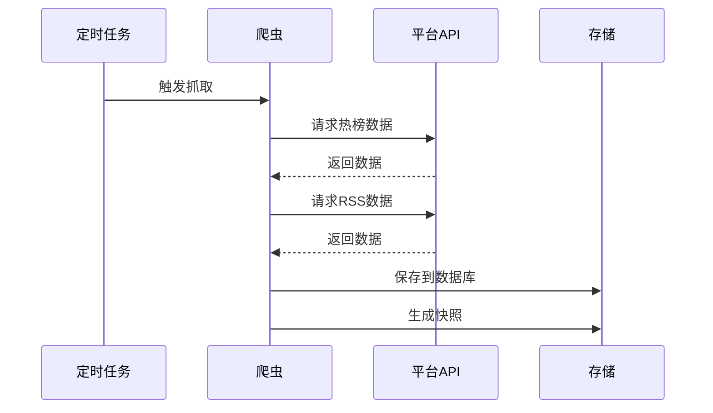
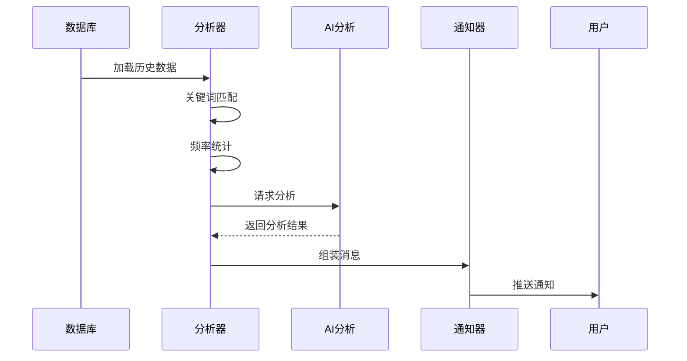
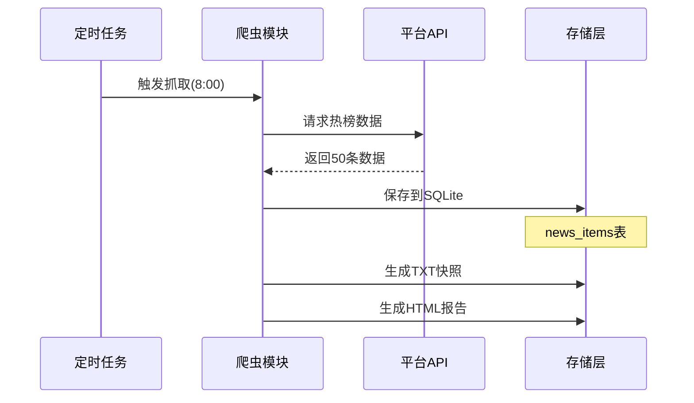
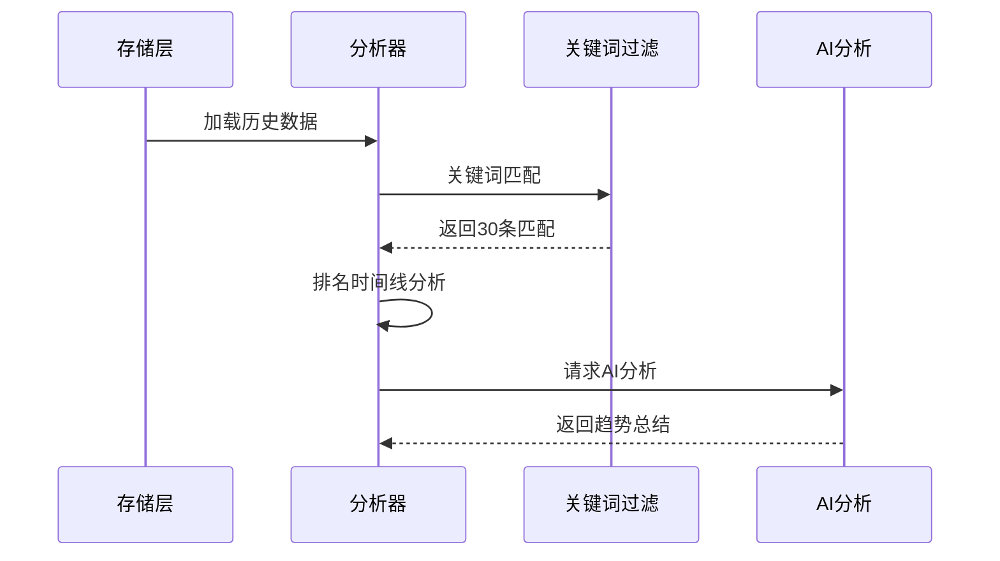
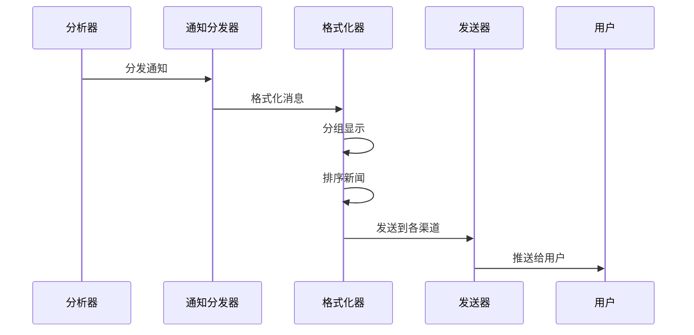

# TrendRadar 完整产品文档与使用手册

**版本**: v5.3.0
**更新日期**: 2025-01-22
**本文档整合了所有TrendRadar项目文档,提供一站式参考指南**

---

## 目录

### 第一部分: 项目概览
1. [项目简介](#1-项目简介)
2. [核心功能](#2-核心功能)
3. [技术架构](#3-技术架构)
4. [目录结构](#4-目录结构)

### 第二部分: 快速开始
5. [5分钟快速部署](#5-5分钟快速部署)
6. [基础配置](#6-基础配置)
7. [首次运行](#7-首次运行)

### 第三部分: 配置详解
8. [config.yaml完整说明](#8-configyaml完整说明)
9. [关键词配置](#9-关键词配置)
10. [环境变量配置](#10-环境变量配置)
11. [多账号配置](#11-多账号配置)

### 第四部分: 功能详解
12. [数据采集](#12-数据采集)
13. [报告模式](#13-报告模式)
14. [AI分析](#14-ai分析)
15. [通知推送](#15-通知推送)
16. [MCP服务器](#16-mcp服务器)

### 第五部分: Docker部署
17. [Docker快速部署](#17-docker快速部署)
18. [Docker详细配置](#18-docker详细配置)
19. [Docker管理命令](#19-docker管理命令)
20. [Docker故障排查](#20-docker故障排查)

### 第六部分: 高级配置
21. [自建AI模型](#21-自建ai模型)
22. [云存储配置](#22-云存储配置)
23. [AI分析数据流](#23-ai分析数据流)
24. [性能优化](#24-性能优化)

### 第七部分: 开发指南
25. [开发环境搭建](#25-开发环境搭建)
26. [代码结构](#26-代码结构)
27. [扩展开发](#27-扩展开发)

### 第八部分: API参考
28. [MCP工具API](#28-mcp工具api)
29. [核心类API](#29-核心类api)
30. [数据结构](#30-数据结构)

### 第九部分: 运维管理
31. [部署方式对比](#31-部署方式对比)
32. [监控和日志](#32-监控和日志)
33. [备份和恢复](#33-备份和恢复)
34. [升级和维护](#34-升级和维护)

### 第十部分: 常见问题
35. [快速故障排查](#35-快速故障排查)
36. [FAQ常见问题](#36-faq常见问题)
37. [最佳实践](#37-最佳实践)

---

# 第一部分: 项目概览

## 1. 项目简介

**TrendRadar** 是一个轻量级的热点新闻聚合与分析工具,旨在帮助用户从多个平台获取热点资讯,通过关键词过滤和AI智能分析,只推送真正关心的内容。

### 1.1 核心价值

- **告别无效刷屏**: 通过关键词过滤,只接收关注的新闻
- **多平台聚合**: 支持11个主流热榜平台 + RSS订阅源
- **AI智能分析**: 基于大模型的新闻趋势分析和总结
- **灵活推送**: 支持9种通知渠道,多种报告模式
- **零成本部署**: GitHub Actions 一键 Fork 即用

### 1.2 项目信息

| 项目 | 信息 |
|------|------|
| **版本** | v5.3.0 |
| **Python要求** | >= 3.10 |
| **开源协议** | GPL-3.0 |
| **项目地址** | [github.com/sansan0/TrendRadar](https://github.com/sansan0/TrendRadar) |

## 2. 核心功能

### 2.1 多源数据采集

#### 热榜平台支持
- 今日头条、百度热搜
- 华尔街见闻、财联社
- 澎湃新闻、凤凰网
- 微博、知乎、抖音
- B站、贴吧

#### RSS订阅支持
- 自定义RSS源
- 关键词过滤
- 新鲜度控制(避免旧文章重复推送)

### 2.2 智能分析

#### 关键词过滤
- 分组管理(`config/frequency_words.txt`)
- 支持正则表达式
- 全局过滤词

#### AI分析(基于LiteLLM)
- 支持100+AI模型提供商
- 新闻趋势总结
- 多语言翻译
- 可配置分析范围和成本控制

### 2.3 灵活的报告模式

| 模式 | 说明 | 适用场景 |
|------|------|----------|
| **Daily(当日汇总)** | 推送当天所有匹配新闻 | 日报总结、全面了解 |
| **Current(当前榜单)** | 只推送当前在榜新闻 | 实时追踪 |
| **Incremental(增量监控)** | 有新增才推送 | 避免重复干扰 |

### 2.4 多渠道推送

支持9种通知方式:
- **国内**: 飞书、钉钉、企业微信、邮件
- **国际**: Telegram、Slack
- **通用**: ntfy、Bark、通用Webhook

### 2.5 MCP服务器

基于FastMCP 2.0实现,提供:
- 数据查询工具
- 分析统计工具
- 配置管理工具
- 存储同步工具

## 3. 技术架构

### 3.1 技术栈

```
Python 3.10+
├── 数据采集
│   ├── requests (HTTP请求)
│   └── feedparser (RSS解析)
├── 存储层
│   ├── SQLite (本地数据库)
│   └── boto3 (S3兼容云存储)
├── AI层
│   └── litellm (统一AI接口)
├── 通知层
│   └── websockets (实时通信)
└── 配置
    ├── PyYAML (配置解析)
    └── pytz (时区处理)
```

### 3.2 系统架构图



### 3.3 数据流程

#### 数据采集流程



#### 分析推送流程



## 4. 目录结构

```
TrendRadar/
├── trendradar/              # 主程序
│   ├── __main__.py          # 程序入口
│   ├── context.py           # 应用上下文
│   ├── ai/                  # AI分析模块
│   ├── core/                # 核心逻辑
│   ├── crawler/             # 数据爬虫
│   │   └── rss/             # RSS订阅
│   ├── notification/        # 通知推送
│   ├── report/              # 报告生成
│   ├── storage/             # 存储管理
│   └── utils/               # 工具函数
│
├── mcp_server/              # MCP服务器
│   ├── server.py            # 服务入口
│   ├── tools/               # MCP工具集
│   ├── services/            # 服务层
│   └── utils/               # 工具函数
│
├── config/                  # 配置文件
│   ├── config.yaml          # 主配置
│   ├── frequency_words.txt  # 关键词配置
│   ├── ai_analysis_prompt.txt
│   └── ai_translation_prompt.txt
│
├── output/                  # 输出目录
│   ├── news/                # SQLite数据库
│   └── html/                # HTML报告
│
├── docker/                  # Docker配置
├── docs/                    # 文档
├── pyproject.toml           # 项目配置
└── requirements.txt         # 依赖列表
```

### 4.1 主要模块说明

#### 1. 主程序模块 (trendradar/)

- **__main__.py**: 程序入口,实现 `NewsAnalyzer` 主分析器
- **context.py**: 应用上下文,统一管理配置和资源

#### 2. AI模块 (trendradar/ai/)

- **client.py**: LiteLLM客户端封装
- **analyzer.py**: 新闻分析器
- **translator.py**: 多语言翻译
- **formatter.py**: AI输出格式化

#### 3. 核心模块 (trendradar/core/)

- **config.py**: 配置解析和验证
- **data.py**: 数据结构定义
- **analyzer.py**: 关键词频率统计
- **loader.py**: 数据加载器
- **frequency.py**: 关键词匹配

#### 4. 爬虫模块 (trendradar/crawler/)

- **fetcher.py**: 热榜爬虫
- **rss/**: RSS订阅模块

#### 5. 存储模块 (trendradar/storage/)

- **base.py**: 存储抽象层
- **local.py**: 本地存储实现
- **remote.py**: 云存储实现
- **manager.py**: 存储管理器
- **sqlite_mixin.py**: SQLite混入类

#### 6. 通知模块 (trendradar/notification/)

- **dispatcher.py**: 通知分发器
- **push_manager.py**: 推送窗口管理
- **formatters.py**: 消息格式化
- **senders.py**: 各渠道发送实现
- **batch.py**: 消息分批处理
- **splitter.py**: 消息分割
- **renderer.py**: Markdown渲染

#### 7. 报告模块 (trendradar/report/)

- **generator.py**: 报告生成器
- **html.py**: HTML报告
- **formatter.py**: 格式化工具

#### 8. MCP服务器 (mcp_server/)

- **server.py**: FastMCP服务器实现
- **tools/**: 6类MCP工具
- **services/**: 服务层实现
- **utils/**: 工具函数

---

# 第二部分: 快速开始

## 5. 5分钟快速部署

### 5.1 GitHub Actions部署(推荐,零成本)

#### 步骤1: Fork项目

1. 访问 [https://github.com/sansan0/TrendRadar](https://github.com/sansan0/TrendRadar)
2. 点击右上角 `Fork` 按钮
3. 等待Fork完成(约10秒)

#### 步骤2: 配置Secrets

1. 进入你的Fork仓库
2. 点击 `Settings` → `Secrets and variables` → `Actions`
3. 点击 `New repository secret` 添加以下Secrets:

**必需配置**:
- Name: `AI_API_KEY`
  - Value: 你的AI API密钥(如DeepSeek API Key)

**可选配置**(至少配置一个通知渠道):
- Name: `FEISHU_WEBHOOK_URL`
  - Value: 飞书机器人webhook地址
- Name: `TELEGRAM_BOT_TOKEN`
  - Value: Telegram Bot Token
- Name: `TELEGRAM_CHAT_ID`
  - Value: Telegram Chat ID
- Name: `EMAIL_FROM` / `EMAIL_PASSWORD` / `EMAIL_TO`
  - Value: 邮箱配置

#### 步骤3: 启用Actions

1. 点击 `Actions` 标签
2. 点击左侧 `TrendRadar Scheduled Task`
3. 点击 `Enable workflow`
4. 点击 `Run workflow` → `Run workflow` 立即测试

#### 步骤4: 查看结果

1. 等待1-2分钟
2. 查看配置的通知渠道是否收到推送
3. 进入 `Actions` 查看执行日志

### 5.2 Docker部署

#### 前置要求

- 已安装Docker和Docker Compose
- 确保Docker服务正在运行

#### 部署步骤

```bash
# 1. 创建工作目录
mkdir trendradar && cd trendradar

# 2. 创建配置文件
cat > .env << 'EOF'
# Web服务器配置
ENABLE_WEBSERVER=true
WEBSERVER_PORT=9800

# 通知配置(选择一个)
FEISHU_WEBHOOK_URL=https://open.feishu.cn/open-apis/bot/v2/hook/xxx

# AI配置
AI_ANALYSIS_ENABLED=true
AI_API_KEY=your-api-key-here
AI_MODEL=deepseek/deepseek-chat

# 运行配置
CRON_SCHEDULE=*/30 * * * *
RUN_MODE=cron
IMMEDIATE_RUN=true
EOF

# 3. 创建关键词配置
cat > config/frequency_words.txt << 'EOF'
# AI技术
ChatGPT|GPT-4|Claude
人工智能|机器学习

# 科技
科技|互联网|5G
EOF

# 4. 启动容器
docker run -d \
  --name trendradar \
  -v $(pwd)/config:/app/config \
  -v $(pwd)/output:/app/output \
  -v $(pwd)/.env:/app/.env \
  -p 9800:9800 \
  wantcat/trendradar:latest

# 5. 查看日志
docker logs -f trendradar
```

### 5.3 本地Python部署

#### 前置要求

- Python 3.10或更高版本
- pip包管理器

#### 部署步骤

```bash
# 1. 克隆项目
git clone https://github.com/sansan0/TrendRadar.git
cd TrendRadar

# 2. 安装依赖
pip install -r requirements.txt

# 3. 配置AI API Key
export AI_API_KEY="your-api-key-here"

# 4. 配置通知渠道(编辑config/config.yaml)
vim config/config.yaml

# 5. 运行
python -m trendradar
```

## 6. 基础配置

### 6.1 配置文件概览

```
config/
├── config.yaml              # 主配置文件
├── frequency_words.txt      # 关键词配置
├── ai_analysis_prompt.txt   # AI分析提示词
└── ai_translation_prompt.txt # AI翻译提示词
```

### 6.2 最小化配置

#### 必需配置项

1. **AI API Key**

```yaml
# config.yaml
ai:
  api_key: "sk-xxx"  # 或使用环境变量 AI_API_KEY
  model: "deepseek/deepseek-chat"
```

2. **通知渠道**(至少配置一个)

```yaml
# 示例: 飞书
notification:
  channels:
    feishu:
      webhook_url: "https://open.feishu.cn/open-apis/bot/v2/hook/xxx"

# 或: Telegram
notification:
  channels:
    telegram:
      bot_token: "your-bot-token"
      chat_id: "your-chat-id"

# 或: 邮件
notification:
  channels:
    email:
      from: "sender@example.com"
      password: "password"
      to: "recipient@example.com"
```

3. **关键词配置**

```text
# config/frequency_words.txt
# 科技新闻
人工智能|AI|机器学习
ChatGPT|GPT-4|Claude

# 金融
股票|基金|债券
```

### 6.3 推荐初始配置

```yaml
# config.yaml
app:
  timezone: "Asia/Shanghai"

platforms:
  enabled: true

rss:
  enabled: true
  freshness_filter:
    enabled: true
    max_age_days: 3

report:
  mode: "current"  # 推荐使用current模式
  display_mode: "keyword"

ai_analysis:
  enabled: true
  max_news_for_analysis: 30  # 控制成本

notification:
  enabled: true
  # 配置你的通知渠道
```

## 7. 首次运行

### 7.1 验证配置

```bash
# 检查配置是否正确
python -m trendradar --check-config

# Docker环境
docker run --rm wantcat/trendradar --check-config
```

### 7.2 手动执行一次

```bash
# 本地环境
python -m trendradar --mode once

# Docker环境
docker exec trendradar python manage.py run
```

### 7.3 查看输出

#### 数据输出位置

```
output/
├── news/                    # SQLite数据库
│   └── trendradar.db
├── html/                    # HTML报告
│   └── 2025-01-22.html
└── logs/                    # 日志文件
    └── trendradar.log
```

#### 查看数据库

```bash
# 使用SQLite命令行
sqlite3 output/news/trendradar.db

# 查看表结构
.tables

# 查看数据
SELECT * FROM news_items LIMIT 10;
```

---

# 第三部分: 配置详解

## 8. config.yaml完整说明

### 8.1 基础设置 (app)

```yaml
app:
  timezone: "Asia/Shanghai"    # 时区配置
  show_version_update: true    # 是否显示版本更新提示
```

**支持的时区**(常用):
- `Asia/Shanghai` - 北京时间 (UTC+8)
- `America/New_York` - 美东时间 (UTC-5/-4)
- `Europe/London` - 伦敦时间 (UTC+0/+1)
- `Asia/Tokyo` - 东京时间 (UTC+9)

完整时区列表: https://en.wikipedia.org/wiki/List_of_tz_database_time_zones

### 8.2 数据源配置

#### 热榜平台 (platforms)

```yaml
platforms:
  enabled: true               # 是否启用热榜抓取
  sources:
    - id: "toutiao"           # 平台唯一标识(勿修改)
      name: "今日头条"        # 显示名称(可自定义)
    - id: "baidu"
      name: "百度热搜"
    - id: "weibo"
      name: "微博"
    # ... 更多平台
```

**支持的平台ID**:
- `toutiao` - 今日头条
- `baidu` - 百度热搜
- `wallstreetcn-hot` - 华尔街见闻
- `thepaper` - 澎湃新闻
- `bilibili-hot-search` - B站
- `cls-hot` - 财联社
- `ifeng` - 凤凰网
- `tieba` - 贴吧
- `weibo` - 微博
- `douyin` - 抖音
- `zhihu` - 知乎

#### RSS订阅 (rss)

```yaml
rss:
  enabled: true                                    # 是否启用RSS

  # 文章新鲜度过滤(全局)
  freshness_filter:
    enabled: true                                  # 是否启用过滤
    max_age_days: 3                                # 最大文章年龄(天)
                                                    # 0 = 禁用过滤

  feeds:
    - id: "hacker-news"                            # 唯一标识
      name: "Hacker News"                          # 显示名称
      url: "https://hnrss.org/frontpage"           # RSS地址
      enabled: true                                # 是否启用
      max_age_days: 1                              # 覆盖全局设置

    - id: "ruanyifeng"
      name: "阮一峰的网络日志"
      url: "http://www.ruanyifeng.com/blog/atom.xml"
      # max_age_days: 7                            # 可选: 单独设置
```

**新鲜度过滤说明**:
- 过滤时机: 在推送阶段过滤
- 所有文章都会存入数据库(MCP Server仍可访问)
- 只有新鲜的文章会被推送到通知渠道

### 8.3 报告模式 (report)

```yaml
report:
  # 报告模式
  mode: "current"           # 可选: daily | current | incremental

  # 分组维度
  display_mode: "keyword"   # keyword | platform

  # 关键词组排序
  sort_by_position_first: false  # true=按配置顺序, false=按匹配数

  rank_threshold: 5         # 排名高亮阈值

  max_news_per_keyword: 0   # 每个关键词最大显示数量(0=不限制)
```

**三种模式对比**:

| 模式 | 推送时机 | 显示内容 | 适用场景 |
|------|----------|----------|----------|
| `daily` | 按时推送 | 当日所有匹配新闻 | 日报总结 |
| `current` | 按时推送 | 当前榜单匹配新闻 | 实时追踪 |
| `incremental` | 有新增才推送 | 新出现的匹配新闻 | 避免干扰 |

### 8.4 推送内容控制 (display)

```yaml
display:
  # 区域显示顺序(从上到下)
  region_order:
    - new_items         # 1️⃣ 新增热点区域
    - hotlist           # 2️⃣ 热榜区域(关键词匹配)
    - rss               # 3️⃣ RSS订阅区域
    - standalone        # 4️⃣ 独立展示区
    - ai_analysis       # 5️⃣ AI分析区域

  # 区域开关
  regions:
    hotlist: true           # 热榜区域
    new_items: true         # 新增热点区域
    rss: true               # RSS订阅区域
    standalone: false       # 独立展示区
    ai_analysis: true       # AI分析区域

  # 独立展示区配置
  standalone:
    platforms: []           # 热榜平台ID列表
    rss_feeds: []           # RSS源ID列表
    max_items: 20           # 每个源最多展示条数(0=不限制)
```

**独立展示区用途**:
- 完整查看某个平台的热榜排名
- RSS源内容较少,希望全部展示
- 不受关键词过滤影响

### 8.5 推送通知 (notification)

```yaml
notification:
  enabled: true                           # 是否启用通知

  # 推送时间窗口
  push_window:
    enabled: false                        # 是否启用时间窗口控制
    start: "20:00"                        # 开始时间
    end: "22:00"                          # 结束时间
    once_per_day: true                    # 窗口内只推送一次

  channels:
    # 飞书
    feishu:
      webhook_url: ""                     # 飞书机器人webhook

    # 钉钉
    dingtalk:
      webhook_url: ""                     # 钉钉机器人webhook

    # 企业微信
    wework:
      webhook_url: ""                     # 企业微信webhook
      msg_type: "markdown"                # markdown(群) | text(个人)

    # Telegram
    telegram:
      bot_token: ""                       # Bot Token
      chat_id: ""                         # Chat ID

    # 邮件
    email:
      from: ""                            # 发件人邮箱
      password: ""                        # 邮箱密码或授权码
      to: ""                              # 收件人(逗号分隔多个)
      smtp_server: ""                     # SMTP服务器(可选)
      smtp_port: ""                       # SMTP端口(可选)

    # ntfy
    ntfy:
      server_url: "https://ntfy.sh"
      topic: ""                           # 主题名称
      token: ""                           # 访问令牌(可选)

    # Bark
    bark:
      url: ""                             # Bark推送URL

    # Slack
    slack:
      webhook_url: ""                     # Slack Incoming Webhook

    # 通用Webhook
    generic_webhook:
      webhook_url: ""                     # Webhook URL
      payload_template: ""                # JSON模板
                                          # 留空使用默认格式
```

**安全警告**:
⚠️ **请妥善保管webhooks,不要公开!**
⚠️ **Fork部署时,请将webhooks填入GitHub Secrets**

### 8.6 存储配置 (storage)

```yaml
storage:
  # 存储后端选择
  backend: "auto"           # auto | local | remote

  # 数据格式
  formats:
    sqlite: true            # 主存储(必须启用)
    txt: false              # TXT快照
    html: true              # HTML报告(邮件推送必需)

  # 本地存储
  local:
    data_dir: "output"      # 数据目录
    retention_days: 0       # 保留天数(0=永久)

  # 远程存储(S3兼容)
  remote:
    retention_days: 0
    endpoint_url: ""        # 服务端点
                            # Cloudflare R2: https://<account_id>.r2.cloudflarestorage.com
                            # 阿里云OSS: https://oss-cn-hangzhou.aliyuncs.com
                            # 腾讯云COS: https://cos.ap-guangzhou.myqcloud.com
    bucket_name: ""         # 存储桶名称
    access_key_id: ""       # 访问密钥ID
    secret_access_key: ""   # 访问密钥
    region: ""              # 区域(可选)

  # 数据拉取
  pull:
    enabled: false          # 启动时自动拉取
    days: 7                 # 拉取最近N天
```

### 8.7 AI模型配置 (ai)

```yaml
ai:
  # LiteLLM模型格式: provider/model_name
  model: "deepseek/deepseek-chat"
                                  # 其他示例:
                                  # - openai/gpt-4o
                                  # - gemini/gemini-2.5-flash
                                  # - anthropic/claude-3-5-sonnet
                                  # - ollama/llama3

  api_key: ""                # API Key(建议使用环境变量AI_API_KEY)
  api_base: ""               # 自定义API端点(可选)

  timeout: 120               # 请求超时(秒)

  temperature: 1.0           # 采样温度
  max_tokens: 5000           # 最大token数

  num_retries: 1             # 失败重试次数
  fallback_models: []        # 备用模型列表
                              # ["openai/gpt-4o-mini", "..."]

  # 额外参数(高级选项,一般无需修改)
  # extra_params:
  #   top_p: 1.0
  #   presence_penalty: 0.0
  #   stop: ["END"]
```

**支持100+AI提供商**: https://docs.litellm.ai/docs/providers

**自定义API端点**:
```yaml
ai:
  api_base: "https://api.example.com/v1"
  model: "openai/custom-model-name"
```

### 8.8 AI分析功能 (ai_analysis)

```yaml
ai_analysis:
  enabled: true                     # 是否启用AI分析

  language: "Chinese"               # 输出语言
                                      # English, Korean, 法语, etc.

  prompt_file: "ai_analysis_prompt.txt"

  max_news_for_analysis: 50         # 参与分析的新闻数量上限
                                    # 按默认推送频率和模型(deepseek)
                                    # GitHub Actions: ~0.1元/天
                                    # Docker: ~0.2元/天

  include_rss: false                # 是否包含RSS内容

  include_rank_timeline: true       # 是否传递完整排名时间线
                                    # false: 简化格式(排名范围+时间范围+出现次数)
                                    # true: 完整轨迹(如 1(09:30)→2(10:00)→0(11:00))
                                    # 启用后额外增加0.5-1倍token消耗
```

### 8.9 AI翻译功能 (ai_translation)

```yaml
ai_translation:
  enabled: false                    # 是否启用翻译

  language: "English"               # 翻译目标语言

  prompt_file: "ai_translation_prompt.txt"
```

### 8.10 高级设置 (advanced)

```yaml
advanced:
  debug: false                      # 调试模式

  # 版本检查
  version_check_url: "https://raw.githubusercontent.com/sansan0/TrendRadar/refs/heads/master/version"
  mcp_version_check_url: "https://raw.githubusercontent.com/sansan0/TrendRadar/refs/heads/master/version_mcp"

  # 热榜爬虫
  crawler:
    request_interval: 2000           # 请求间隔(毫秒)
    use_proxy: false                 # 是否启用代理
    default_proxy: "http://127.0.0.1:10801"

  # RSS设置
  rss:
    request_interval: 1000           # 请求间隔(毫秒)
    timeout: 15                      # 请求超时(秒)
    use_proxy: false
    proxy_url: ""                    # RSS专属代理

  # 排序权重(合起来=1)
  weight:
    rank: 0.6                        # 排名权重
    frequency: 0.3                   # 频次权重
    hotness: 0.1                     # 热度权重

  max_accounts_per_channel: 3        # 每个渠道最大账号数

  # 消息分批(内部配置)
  batch_size:
    default: 4000
    dingtalk: 20000
    feishu: 30000
    bark: 4000
    slack: 4000
  batch_send_interval: 3             # 批次间隔(秒)
```

## 9. 关键词配置

### 9.1 基本语法

```text
# 分组1名称
关键词1|关键词2|关键词3

# 分组2名称
关键词4
关键词5
关键词6

# 全局过滤词(不匹配任何新闻)
!过滤词1
!过滤词2
```

### 9.2 示例

```text
# AI技术
ChatGPT|GPT-4|Claude|文心一言
大模型|LLM|AIGC
人工智能|机器学习|深度学习

# 金融
股票|基金|债券|期货
牛市|熊市|涨停|跌停

# 全局过滤
广告
游戏
!娱乐八卦
```

### 9.3 配置说明

1. **分组**: 每个分组以 `#分组名` 开头
2. **关键词**:
   - 同行多个关键词用 `|` 分隔(OR关系)
   - 每行一个关键词
   - 支持正则表达式
3. **全局过滤**: 以 `!` 开头,匹配后排除该新闻

### 9.4 高级配置示例

```text
# 使用正则表达式
AI模型
GPT-\d+|Claude\s*\d+|Qwen
DeepSeek|文心.*|通义千问

# 时间敏感新闻
今日.*新闻|刚刚.*发布|实时.*
突发|快讯

# 排除特定内容
!.*广告.*
!.*抽奖.*
```

## 10. 环境变量配置

敏感信息可以通过环境变量配置,优先级高于配置文件。

### 10.1 支持的环境变量

| 环境变量 | 说明 | 对应配置项 |
|----------|------|------------|
| `AI_API_KEY` | AI API密钥 | `ai.api_key` |
| `AI_API_BASE` | AI API端点 | `ai.api_base` |
| `AI_MODEL` | AI模型名称 | `ai.model` |
| `STORAGE_RETENTION_DAYS` | 数据保留天数 | `storage.retention_days` |
| `FEISHU_WEBHOOK_URL` | 飞书webhook | `notification.channels.feishu.webhook_url` |
| `DINGTALK_WEBHOOK_URL` | 钉钉webhook | `notification.channels.dingtalk.webhook_url` |
| `WEWORK_WEBHOOK_URL` | 企业微信webhook | `notification.channels.wework.webhook_url` |
| `TELEGRAM_BOT_TOKEN` | Telegram Bot Token | `notification.channels.telegram.bot_token` |
| `TELEGRAM_CHAT_ID` | Telegram Chat ID | `notification.channels.telegram.chat_id` |
| `EMAIL_FROM` | 发件人邮箱 | `notification.channels.email.from` |
| `EMAIL_PASSWORD` | 邮箱密码 | `notification.channels.email.password` |
| `EMAIL_TO` | 收件人邮箱 | `notification.channels.email.to` |
| `EMAIL_SMTP_SERVER` | SMTP服务器 | `notification.channels.email.smtp_server` |
| `EMAIL_SMTP_PORT` | SMTP端口 | `notification.channels.email.smtp_port` |

### 10.2 GitHub Actions配置示例

在仓库的 `Settings → Secrets and variables → Actions` 中添加:

1. 创建New repository secret
2. Name: `AI_API_KEY`
3. Value: `your-api-key-here`

### 10.3 Docker环境变量

Docker环境使用 `.env` 文件:

```bash
# .env
AI_API_KEY=sk-xxx
FEISHU_WEBHOOK_URL=https://open.feishu.cn/open-apis/bot/v2/hook/xxx
TELEGRAM_BOT_TOKEN=your-bot-token
TELEGRAM_CHAT_ID=your-chat-id
```

## 11. 多账号配置

所有通知渠道都支持多账号,使用分号(`;`)分隔。

### 11.1 示例

```yaml
notification:
  channels:
    # Telegram多账号
    telegram:
      bot_token: "token1;token2;token3"
      chat_id: "id1;id2;id3"

    # 邮件多收件人(逗号分隔)
    email:
      from: "sender@example.com"
      password: "password"
      to: "user1@example.com,user2@example.com,user3@example.com"
```

### 11.2 Docker环境多账号配置

```bash
# .env
TELEGRAM_BOT_TOKEN=token1;token2;token3
TELEGRAM_CHAT_ID=id1;id2;id3
```

### 11.3 注意事项

- 配对项(如Telegram的token和chat_id)数量必须一致
- 每个渠道最多支持3个账号
- 空字符串可用于占位

---

# 第四部分: 功能详解

## 12. 数据采集

### 12.1 热榜平台抓取

#### 支持的平台

| 平台ID | 平台名称 | 数据特点 |
|--------|----------|----------|
| `toutiao` | 今日头条 | 综合热点 |
| `baidu` | 百度热搜 | 搜索热度 |
| `wallstreetcn-hot` | 华尔街见闻 | 金融财经 |
| `thepaper` | 澎湃新闻 | 新闻资讯 |
| `bilibili-hot-search` | B站 | 视频热点 |
| `cls-hot` | 财联社 | 股市快讯 |
| `ifeng` | 凤凰网 | 综合新闻 |
| `tieba` | 贴吧 | 社区热点 |
| `weibo` | 微博 | 社交媒体 |
| `douyin` | 抖音 | 短视频 |
| `zhihu` | 知乎 | 问答社区 |

#### 数据结构

每条热榜数据包含:
- `title`: 标题
- `url`: 链接
- `rank`: 排名
- `hot`: 热度值(部分平台)
- `platform`: 平台ID
- `timestamp`: 抓取时间戳

### 12.2 RSS订阅

#### RSS配置详解

```yaml
rss:
  enabled: true
  freshness_filter:
    enabled: true
    max_age_days: 3

  feeds:
    - id: "tech-crunch"
      name: "TechCrunch"
      url: "https://techcrunch.com/feed/"
      enabled: true
      max_age_days: 1  # 覆盖全局设置
```

#### 新鲜度过滤工作原理

1. **抓取阶段**: 所有RSS文章都存入数据库
2. **推送阶段**: 根据发布时间过滤旧文章
3. **MCP访问**: 所有文章仍可通过MCP访问

#### 推荐RSS源

**技术类**:
- Hacker News: `https://hnrss.org/frontpage`
- TechCrunch: `https://techcrunch.com/feed/`
- 阮一峰: `http://www.ruanyifeng.com/blog/atom.xml`

**新闻类**:
- BBC News: `http://feeds.bbci.co.uk/news/rss.xml`
- 联合早报: `https://www.zaobao.com.sg/news/realtime/rss.xml`

**金融类**:
- 华尔街见闻: `https://api.wallstreetcn.com/apiv1/rss/articles`
- 财联社: `https://www.cls.cn/telegraph`

### 12.3 数据存储

#### 本地存储结构

```
output/
├── news/
│   └── trendradar.db           # SQLite主数据库
├── html/
│   └── 2025-01-22.html         # HTML报告
├── txt/
│   └── 2025-01-22_08-00.txt    # TXT快照
└── logs/
    └── trendradar.log          # 运行日志
```

#### SQLite数据库表结构

**news_items表**: 存储所有新闻条目
- `id`: 主键
- `title`: 标题
- `url`: 链接
- `platform`: 平台/来源
- `rank`: 排名
- `hot`: 热度
- `timestamp`: 时间戳
- `date`: 日期
- `is_rss`: 是否RSS来源

## 13. 报告模式

### 13.1 Daily模式(当日汇总)

#### 特点
- 推送当天所有匹配关键词的新闻
- 不论是否仍在榜单
- 适合日报总结

#### 配置
```yaml
report:
  mode: "daily"
```

#### 输出示例
```
📅 2025-01-22 新闻汇总

【AI技术】
- GPT-5即将发布 (知乎 #1, 微博 #3)
- Claude 4性能提升 (今日头条 #5)
...
```

### 13.2 Current模式(当前榜单)

#### 特点
- 只推送当前仍在榜单的新闻
- 实时性最强
- 适合实时追踪

#### 配置
```yaml
report:
  mode: "current"
```

#### 输出示例
```
🔥 当前热点

【AI技术】
- ChatGPT更新功能 (百度热搜 #2)
- 大模型应用落地 (知乎 #1)
...
```

### 13.3 Incremental模式(增量监控)

#### 特点
- 只有新出现的匹配新闻才推送
- 避免重复打扰
- 适合长期监控

#### 配置
```yaml
report:
  mode: "incremental"
```

#### 工作原理
1. 第一次运行: 建立基准数据
2. 后续运行: 对比上次结果
3. 只推送新增项

## 14. AI分析

### 14.1 AI分析功能

#### 启用配置

```yaml
ai_analysis:
  enabled: true
  language: "Chinese"
  max_news_for_analysis: 50
```

#### 分析内容

AI会对收集的新闻进行:
1. **趋势总结**: 提取主要趋势
2. **重要事件**: 识别关键事件
3. **相关性分析**: 分析事件关联
4. **时间线**: 追踪热点演变

#### 成本控制

| 配置 | 日成本(DeepSeek) | 说明 |
|------|------------------|------|
| `max_news_for_analysis: 30` | ~0.1元 | 推荐配置 |
| `max_news_for_analysis: 50` | ~0.2元 | 标准配置 |
| `max_news_for_analysis: 100` | ~0.4元 | 高级配置 |

### 14.2 AI翻译功能

#### 启用配置

```yaml
ai_translation:
  enabled: true
  language: "English"
```

#### 翻译内容

- 热榜标题翻译
- RSS文章摘要翻译
- AI分析结果翻译

### 14.3 自定义AI模型

#### 使用Ollama本地模型

```yaml
ai:
  model: "ollama/llama3"
  api_base: "http://localhost:11434"
```

#### 使用vLLM本地模型

```yaml
ai:
  model: "openai/my-model"
  api_base: "http://localhost:8000/v1"
  api_key: "not-needed"
```

#### 使用其他AI提供商

```yaml
# OpenAI
ai:
  model: "openai/gpt-4o"
  api_key: "sk-..."

# Google Gemini
ai:
  model: "gemini/gemini-2.5-flash"
  api_key: "..."

# Anthropic Claude
ai:
  model: "anthropic/claude-3-5-sonnet"
  api_key: "sk-ant-..."
```

## 15. 通知推送

### 15.1 通知渠道配置

#### 飞书

**获取Webhook**:
1. 打开飞书群
2. 群设置 → 群机器人 → 添加机器人
3. 自定义机器人 → 获取Webhook URL

**配置**:
```yaml
notification:
  channels:
    feishu:
      webhook_url: "https://open.feishu.cn/open-apis/bot/v2/hook/xxx"
```

#### 钉钉

**获取Webhook**:
1. 打开钉钉群
2. 群设置 → 智能群助手 → 添加机器人
3. 自定义机器人 → 安全设置选择"加签"
4. 获取Webhook URL和密钥

**配置**:
```yaml
notification:
  channels:
    dingtalk:
      webhook_url: "https://oapi.dingtalk.com/robot/send?access_token=xxx"
      secret: "SEC..."  # 可选,加签密钥
```

#### 企业微信

**获取Webhook**:
1. 企业微信群 → 群机器人 → 添加机器人
2. 获取Webhook URL

**配置**:
```yaml
notification:
  channels:
    wework:
      webhook_url: "https://qyapi.weixin.qq.com/cgi-bin/webhook/send?key=xxx"
      msg_type: "markdown"  # 或 "text"
```

#### Telegram

**创建Bot**:
1. 在Telegram搜索 `@BotFather`
2. 发送 `/newbot` 创建机器人
3. 获取Bot Token

**获取Chat ID**:
1. 搜索 `@userinfobot`
2. 发送任意消息获取Chat ID

**配置**:
```yaml
notification:
  channels:
    telegram:
      bot_token: "123456:ABC-DEF"
      chat_id: "123456789"
```

#### 邮件

**配置**:
```yaml
notification:
  channels:
    email:
      from: "sender@example.com"
      password: "password_or_app_password"
      to: "recipient1@example.com,recipient2@example.com"
      smtp_server: "smtp.gmail.com"  # 可选
      smtp_port: "587"               # 可选
```

**常用SMTP服务器**:
- Gmail: `smtp.gmail.com:587`
- QQ邮箱: `smtp.qq.com:587`
- 163邮箱: `smtp.163.com:25`

**Gmail需要应用专用密码**:
1. 访问 https://myaccount.google.com/security
2. 启用两步验证
3. 生成应用专用密码

#### ntfy

**配置**:
```yaml
notification:
  channels:
    ntfy:
      server_url: "https://ntfy.sh"
      topic: "my-topic"
      token: ""  # 可选,私有主题需要
```

#### Bark

**获取URL**:
1. 下载Bark App
2. 打开获取推送URL

**配置**:
```yaml
notification:
  channels:
    bark:
      url: "https://api.day.app/your-key/"
```

### 15.2 推送时间窗口

#### 配置

```yaml
notification:
  push_window:
    enabled: true
    start: "09:00"
    end: "18:00"
    once_per_day: true
```

#### 行为说明

- `enabled: false`: 不限制,每次都推送
- `enabled: true, once_per_day: false`: 在时间窗口内每次都推送
- `enabled: true, once_per_day: true`: 在时间窗口内只推送一次

#### 使用场景

**朝九晚五推送**:
```yaml
push_window:
  enabled: true
  start: "09:00"
  end: "18:00"
  once_per_day: true
```

**晚间推送**:
```yaml
push_window:
  enabled: true
  start: "20:00"
  end: "22:00"
  once_per_day: true
```

## 16. MCP服务器

### 16.1 什么是MCP

MCP(Model Context Protocol)是一个开放协议,允许AI助手连接外部数据源。

TrendRadar提供MCP服务器,让Claude Desktop等AI客户端能够:
- 查询新闻数据
- 分析热点趋势
- 搜索关键词
- 管理配置

### 16.2 安装MCP服务器

#### 方法1: 使用npm全局安装

```bash
npm install -g trendradar-mcp
```

#### 方法2: 从源码安装

```bash
git clone https://github.com/sansan0/TrendRadar.git
cd TrendRadar/mcp_server
npm install
npm link
```

### 16.3 配置Claude Desktop

#### macOS配置文件位置

`~/Library/Application Support/Claude/claude_desktop_config.json`

#### Windows配置文件位置

`%APPDATA%\Claude\claude_desktop_config.json`

#### 配置内容

```json
{
  "mcpServers": {
    "trendradar": {
      "command": "python",
      "args": [
        "-m", "mcp_server.server",
        "--config-dir", "配置文件路径"
      ]
    }
  }
}
```

### 16.4 MCP工具列表

#### 数据查询工具
- `query_news`: 查询新闻数据
- `get_latest_snapshot`: 获取最新快照
- `get_historical_data`: 获取历史数据
- `search_by_keyword`: 关键词搜索

#### 分析工具
- `analyze_trends`: 趋势分析
- `get_rank_timeline`: 排名时间线
- `compare_snapshots`: 对比快照
- `get_statistics`: 统计信息

#### 配置管理工具
- `get_current_config`: 获取当前配置
- `update_config`: 更新配置
- `get_keyword_groups`: 获取关键词组
- `update_keywords`: 更新关键词

#### 系统工具
- `get_version`: 获取版本信息
- `get_system_status`: 获取系统状态

### 16.5 使用示例

#### 在Claude Desktop中使用

```
用户: 查询今天的AI相关新闻
Claude: [调用query_news工具]
用户: 分析ChatGPT的排名变化
Claude: [调用get_rank_timeline工具]
用户: 添加"区块链"到关键词监控
Claude: [调用update_keywords工具]
```

---

# 第五部分: Docker部署

## 17. Docker快速部署

### 17.1 前置要求

#### 系统要求
-操作系统: Linux/Windows/macOS
- CPU: 1核心以上
- 内存: 512MB以上
- 磁盘: 1GB以上可用空间

#### 软件要求
- Docker: 20.10+
- Docker Compose: 2.0+

### 17.2 三分钟快速部署

```bash
# 1. 创建工作目录
mkdir trendradar && cd trendradar

# 2. 创建 .env 配置文件
cat > .env << 'EOF'
# AI配置
AI_ANALYSIS_ENABLED=true
AI_API_KEY=your-deepseek-api-key
AI_MODEL=deepseek/deepseek-chat

# 通知配置(选择一个)
FEISHU_WEBHOOK_URL=https://open.feishu.cn/open-apis/bot/v2/hook/xxx

# 运行配置
CRON_SCHEDULE=*/30 * * * *
RUN_MODE=cron
IMMEDIATE_RUN=true
EOF

# 3. 创建关键词配置
mkdir -p config
cat > config/frequency_words.txt << 'EOF'
# AI技术
ChatGPT|GPT-4|Claude
人工智能|机器学习

# 科技
科技|互联网|5G
EOF

# 4. 启动容器
docker run -d \
  --name trendradar \
  -v $(pwd)/config:/app/config \
  -v $(pwd)/output:/app/output \
  -v $(pwd)/.env:/app/.env:ro \
  -p 9800:9800 \
  wantcat/trendradar:latest

# 5. 查看日志
docker logs -f trendradar
```

### 17.3 使用Docker Compose(推荐)

```bash
# 1. 创建目录结构
mkdir -p trendradar/{config,output}
cd trendradar

# 2. 创建 docker-compose.yml
cat > docker-compose.yml << 'EOF'
version: '3.8'

services:
  trendradar:
    image: wantcat/trendradar:latest
    container_name: trendradar
    restart: unless-stopped

    volumes:
      - ./config:/app/config
      - ./output:/app/output
      - ./.env:/app/.env:ro

    ports:
      - "9800:9800"

    environment:
      - TZ=Asia/Shanghai
EOF

# 3. 创建 .env 文件(参考上节)
# 4. 创建配置文件
# 5. 启动
docker-compose up -d
```

## 18. Docker详细配置

### 18.1 环境变量完整说明

创建 `.env` 文件:

```bash
# ============================================
# Web 服务器配置
# ============================================

# 是否自动启动 Web 服务器托管 output 目录 (true/false)
ENABLE_WEBSERVER=true

# Web 服务器端口
WEBSERVER_PORT=9800

# ============================================
# 通知渠道配置
# ============================================

# 飞书机器人 webhook URL
FEISHU_WEBHOOK_URL=

# Telegram Bot配置
TELEGRAM_BOT_TOKEN=
TELEGRAM_CHAT_ID=

# 钉钉机器人 webhook URL
DINGTALK_WEBHOOK_URL=

# 企业微信机器人 webhook URL
WEWORK_WEBHOOK_URL=
WEWORK_MSG_TYPE=markdown

# 邮件配置
EMAIL_FROM=
EMAIL_PASSWORD=
EMAIL_TO=
EMAIL_SMTP_SERVER=
EMAIL_SMTP_PORT=

# ntfy 推送配置
NTFY_SERVER_URL=https://ntfy.sh
NTFY_TOPIC=
NTFY_TOKEN=

# Bark 推送配置
BARK_URL=

# Slack 推送配置
SLACK_WEBHOOK_URL=

# 通用 Webhook 配置
GENERIC_WEBHOOK_URL=
GENERIC_WEBHOOK_TEMPLATE=

# ============================================
# AI 配置
# ============================================

# 是否启用 AI 分析
AI_ANALYSIS_ENABLED=false

# AI API Key
AI_API_KEY=

# 模型名称
AI_MODEL=deepseek/deepseek-chat

# 自定义 API 端点
AI_API_BASE=

# ============================================
# 远程存储配置
# ============================================

S3_ENDPOINT_URL=
S3_BUCKET_NAME=
S3_ACCESS_KEY_ID=
S3_SECRET_ACCESS_KEY=
S3_REGION=

# ============================================
# 运行配置
# ============================================

# 定时任务表达式
CRON_SCHEDULE=*/30 * * * *

# 运行模式: cron/once
RUN_MODE=cron

# 启动时立即执行一次
IMMEDIATE_RUN=true
```

### 18.2 数据持久化配置

#### 使用Docker Volume

```yaml
version: '3.8'

services:
  trendradar:
    image: wantcat/trendradar:latest
    volumes:
      - trendradar-config:/app/config
      - trendradar-output:/app/output
      - ./.env:/app/.env:ro

volumes:
  trendradar-config:
  trendradar-output:
```

#### 使用绑定挂载

```yaml
volumes:
  - ./config:/app/config
  - ./output:/app/output
```

### 18.3 网络配置

#### 自定义网络

```yaml
version: '3.8'

services:
  trendradar:
    image: wantcat/trendradar:latest
    networks:
      - trendradar-net

networks:
  trendradar-net:
    driver: bridge
```

#### 访问宿主机服务(Ollama)

```yaml
services:
  trendradar:
    image: wantcat/trendradar:latest
    environment:
      - AI_API_BASE=http://host.docker.internal:11434
    extra_hosts:
      - "host.docker.internal:host-gateway"
```

### 18.4 资源限制

```yaml
services:
  trendradar:
    image: wantcat/trendradar:latest
    deploy:
      resources:
        limits:
          cpus: '1.0'
          memory: 512M
        reservations:
          cpus: '0.5'
          memory: 256M
```

## 19. Docker管理命令

### 19.1 容器管理

#### 启动和停止

```bash
# 启动
docker start trendradar

# 停止
docker stop trendradar

# 重启
docker restart trendradar

# 查看状态
docker ps | grep trendradar
```

#### 查看日志

```bash
# 实时日志
docker logs -f trendradar

# 最近100行
docker logs --tail 100 trendradar

# 带时间戳
docker logs -f -t trendradar

# 使用管理工具
docker exec trendradar python manage.py logs
```

#### 进入容器

```bash
# 进入容器shell
docker exec -it trendradar sh

# 执行命令
docker exec trendradar python manage.py status
```

### 19.2 使用内置管理工具

容器内置 `manage.py` 管理工具:

```bash
# 查看状态
docker exec trendradar python manage.py status

# 手动运行
docker exec trendradar python manage.py run

# 查看配置
docker exec trendradar python manage.py show-config

# 查看环境变量
docker exec trendradar python manage.py show-env

# 查看日志
docker exec trendradar python manage.py logs

# 测试通知
docker exec trendradar python manage.py test-notification
```

### 19.3 更新镜像

```bash
# 拉取最新镜像
docker pull wantcat/trendradar:latest

# 停止并删除旧容器
docker stop trendradar
docker rm trendradar

# 使用相同命令启动新容器
docker run -d \
  --name trendradar \
  -v $(pwd)/config:/app/config \
  -v $(pwd)/output:/app/output \
  -v $(pwd)/.env:/app/.env:ro \
  -p 9800:9800 \
  wantcat/trendradar:latest
```

### 19.4 数据备份

#### 备份配置和数据

```bash
# 备份
tar -czf trendradar-backup-$(date +%Y%m%d).tar.gz \
  config/ output/ .env

# 恢复
tar -xzf trendradar-backup-20250122.tar.gz
```

#### 仅备份数据

```bash
# 备份数据库
docker exec trendradar \
  sqlite3 /app/output/news/trendradar.db \
  ".backup /tmp/backup.db"

docker cp trendradar:/tmp/backup.db ./trendradar.db
```

## 20. Docker故障排查

### 20.1 容器无法启动

#### 检查日志

```bash
docker logs trendradar
```

#### 常见问题

**问题1: 配置文件格式错误**

症状:
```
Error loading configuration
```

解决:
```bash
# 检查YAML格式
docker exec trendradar python -c "
import yaml
yaml.safe_load(open('/app/config/config.yaml'))
"

# 或在容器外
python -c "import yaml; yaml.safe_load(open('config/config.yaml'))"
```

**问题2: 端口冲突**

症状:
```
Error: port is already allocated
```

解决:
```bash
# 修改 .env 中的端口
WEBSERVER_PORT=9801

# 或使用其他端口映射
docker run -p 9801:9800 wantcat/trendradar:latest
```

**问题3: 权限问题**

症状:
```
Permission denied: /app/output
```

解决:
```bash
# 修改本地目录权限
chmod 755 output/

# 或使用当前用户运行
docker run -u $(id -u):$(id -g) ...
```

### 20.2 定时任务不执行

#### 检查定时任务

```bash
# 查看定时任务状态
docker exec trendradar ps aux | grep cron

# 查看cron日志
docker logs trendradar | grep -i cron
```

#### 测试定时配置

```bash
# 验证cron表达式
docker exec trendradar python -c "
from croniter import croniter
import datetime
base = datetime.datetime.now()
iter = croniter('*/30 * * * *', base)
print([iter.get_next(datetime.datetime) for _ in range(3)])
"
```

### 20.3 没有收到推送

#### 检查配置

```bash
# 查看当前配置
docker exec trendradar python manage.py show-config

# 查看环境变量
docker exec trendradar python manage.py show-env
```

#### 测试通知

```bash
# 发送测试通知
docker exec trendradar python manage.py test-notification

# 检查通知配置
docker exec trendradar python -c "
import os
print('Feishu:', os.getenv('FEISHU_WEBHOOK_URL'))
print('Telegram:', os.getenv('TELEGRAM_BOT_TOKEN'))
"
```

### 20.4 AI分析失败

#### 检查AI配置

```bash
# 查看AI配置
docker exec trendradar python -c "
import os
print('Model:', os.getenv('AI_MODEL'))
print('API Base:', os.getenv('AI_API_BASE'))
print('API Key:', 'Set' if os.getenv('AI_API_KEY') else 'Not Set')
"
```

#### 测试AI连接

```bash
# 测试API调用
docker exec -it trendradar sh

pip install litellm
python -c "
from litellm import completion
import os
response = completion(
    model=os.getenv('AI_MODEL'),
    messages=[{'role': 'user', 'content': 'Hi'}],
    api_key=os.getenv('AI_API_KEY')
)
print(response)
"
```

---

# 第六部分: 高级配置

## 21. 自建AI模型

### 21.1 使用Ollama

#### 安装Ollama

```bash
# Linux/macOS
curl -fsSL https://ollama.com/install.sh | sh

# Windows
# 下载安装程序: https://ollama.com/download
```

#### 运行Ollama服务器

```bash
# 启动服务
ollama serve

# 下载模型
ollama pull llama3
ollama pull qwen2
```

#### 配置TrendRadar

**本地Python环境**:
```yaml
# config/config.yaml
ai:
  model: "ollama/llama3"
  api_base: "http://localhost:11434"
  api_key: "ollama"  # Ollama不需要,但litellm要求
```

**Docker环境**:
```bash
# .env
AI_API_BASE=http://host.docker.internal:11434
AI_MODEL=ollama/llama3
AI_API_KEY=ollama
```

**docker-compose.yml**:
```yaml
services:
  trendradar:
    image: wantcat/trendradar:latest
    extra_hosts:
      - "host.docker.internal:host-gateway"
    environment:
      - AI_API_BASE=http://host.docker.internal:11434
      - AI_MODEL=ollama/llama3
      - AI_API_KEY=ollama
```

### 21.2 使用vLLM

#### 安装vLLM

```bash
pip install vllm
```

#### 启动vLLM服务器

```bash
python -m vllm.entrypoints.openai.api_server \
  --model Qwen/Qwen2-7B-Instruct \
  --host 0.0.0.0 \
  --port 8000
```

#### 配置TrendRadar

```yaml
ai:
  model: "openai/qwen2"
  api_base: "http://localhost:8000/v1"
  api_key: "not-needed"
```

### 21.3 使用LM Studio

#### 启动LM Studio服务器

1. 打开LM Studio
2. 选择模型
3. 启动服务器
4. 默认端口: `1234`

#### 配置TrendRadar

```yaml
ai:
  model: "openai/local-model"
  api_base: "http://localhost:1234/v1"
  api_key: "not-needed"
```

### 21.4 Docker中访问宿主机服务

#### 方法1: host.docker.internal(推荐)

```yaml
services:
  trendradar:
    environment:
      - AI_API_BASE=http://host.docker.internal:11434
    extra_hosts:
      - "host.docker.internal:host-gateway"
```

#### 方法2: 使用宿主机IP

```bash
# Linux
ip addr show docker0 | grep inet

# 配置
AI_API_BASE=http://172.17.0.1:11434
```

#### 方法3: 使用host网络(仅Linux)

```yaml
services:
  trendradar:
    network_mode: host
    environment:
      - AI_API_BASE=http://localhost:11434
```

## 22. 云存储配置

### 22.1 Cloudflare R2

#### 获取访问密钥

1. 登录Cloudflare Dashboard
2. R2 → 创建存储桶
3. 管理R2 API令牌 → 创建API令牌

#### 配置

```yaml
storage:
  remote:
    endpoint_url: "https://<account_id>.r2.cloudflarestorage.com"
    bucket_name: "trendradar"
    access_key_id: "your-access-key-id"
    secret_access_key: "your-secret-access-key"
    region: "auto"
```

### 22.2 阿里云OSS

#### 获取访问密钥

1. 登录阿里云控制台
2. OSS → 创建Bucket
3. AccessKey管理 → 创建AccessKey

#### 配置

```yaml
storage:
  remote:
    endpoint_url: "https://oss-cn-hangzhou.aliyuncs.com"
    bucket_name: "trendradar"
    access_key_id: "your-access-key-id"
    secret_access_key: "your-secret-access-key"
    region: "oss-cn-hangzhou"
```

### 22.3 腾讯云COS

#### 获取访问密钥

1. 登录腾讯云控制台
2. COS → 创建存储桶
3. 访问密钥 → API密钥管理

#### 配置

```yaml
storage:
  remote:
    endpoint_url: "https://cos.ap-guangzhou.myqcloud.com"
    bucket_name: "trendradar-1234567890"
    access_key_id: "your-secret-id"
    secret_access_key: "your-secret-key"
    region: "ap-guangzhou"
```

### 22.4 数据同步

#### 启用自动拉取

```yaml
storage:
  pull:
    enabled: true
    days: 7
```

#### 手动同步

```bash
# 上传到云端
python -m trendradar --sync-upload

# 从云端下载
python -m trendradar --sync-download
```

## 23. AI分析数据流

### 23.1 完整数据流程

#### 1. 数据采集阶段



#### 2. 数据分析阶段



#### 3. 推送阶段



### 23.2 数据结构示例

#### SQLite数据结构

```sql
-- news_items表
CREATE TABLE news_items (
    id INTEGER PRIMARY KEY AUTOINCREMENT,
    title TEXT NOT NULL,
    url TEXT,
    platform TEXT NOT NULL,
    rank INTEGER,
    hot INTEGER,
    timestamp INTEGER NOT NULL,
    date TEXT NOT NULL,
    is_rss BOOLEAN DEFAULT 0
);

-- 示例数据
INSERT INTO news_items VALUES
(1, 'GPT-5即将发布', 'https://...', 'zhihu', 1, 1000000, 1705900800, '2025-01-22', 0),
(2, 'ChatGPT更新功能', 'https://...', 'baidu', 2, 500000, 1705900800, '2025-01-22', 0);
```

#### 排名时间线数据

```python
{
    "title": "GPT-5即将发布",
    "url": "https://...",
    "platform": "zhihu",
    "timeline": [
        {"time": "08:00", "rank": 1},
        {"time": "08:30", "rank": 2},
        {"time": "09:00", "rank": 1},
        {"time": "09:30", "rank": 3}
    ],
    "rank_range": [1, 3],
    "frequency": 4,
    "keywords": ["GPT-5", "OpenAI"]
}
```

### 23.3 完整执行案例

#### 执行时间线

**08:00 - 定时任务触发**

```bash
2025-01-22 08:00:00 INFO Starting scheduled run
2025-01-22 08:00:01 INFO Fetching hotlist from zhihu...
2025-01-22 08:00:02 INFO Fetched 50 items from zhihu
2025-01-22 08:00:02 INFO Fetching hotlist from baidu...
2025-01-22 08:00:03 INFO Fetched 50 items from baidu
...
2025-01-22 08:00:30 INFO Total items fetched: 550
2025-01-22 08:00:30 INFO Saved to SQLite database
```

**08:01 - 数据分析**

```bash
2025-01-22 08:01:00 INFO Loading historical data
2025-01-22 08:01:00 INFO Loaded 1200 items from database
2025-01-22 08:01:01 INFO Matching keywords
2025-01-22 08:01:01 INFO Found 30 items matching keywords
2025-01-22 08:01:02 INFO Analyzing rank timeline
```

**08:02 - AI分析**

```bash
2025-01-22 08:02:00 INFO Calling AI analysis
2025-01-22 08:02:01 INFO Sending 30 items to AI
2025-01-22 08:02:15 INFO AI analysis completed (14s)
2025-01-22 08:02:15 INFO Analysis cost: 0.002 CNY
```

**08:03 - 推送通知**

```bash
2025-01-22 08:03:00 INFO Preparing notification
2025-01-22 08:03:00 INFO Formatting message
2025-01-22 08:03:01 INFO Sending to feishu...
2025-01-22 08:03:02 INFO Notification sent successfully
2025-01-22 08:03:02 INFO Run completed
```

#### 推送内容示例

```
🔥 TrendRadar 热点报告 2025-01-22 08:00

━━━━━━━━━━━━━━━━━━━━━━
📰 热榜区域 (关键词匹配)
━━━━━━━━━━━━━━━━━━━━━━

【AI技术】(6条)
1. GPT-5即将发布 🔥
   📍 知乎 #1 | 百度热搜 #2
   🔥 热度: 100万+

2. ChatGPT重大更新
   📍 今日头条 #3 | 微博 #5
   🔥 热度: 80万+

...

━━━━━━━━━━━━━━━━━━━━━━
📈 AI分析总结
━━━━━━━━━━━━━━━━━━━━━━

主要趋势:
1. AI领域持续火热,GPT-5相关话题占据多个平台榜首
2. 科技公司发布最新财报,市场关注AI业务增长
3. 大模型应用落地加速,教育、医疗领域成为重点

重要事件:
• OpenAI宣布GPT-5将于Q2发布
• 百度推出文心一言4.0
• 阿里云发布通义千问2.0

相关性分析:
• GPT-5相关话题热度持续上升,与AI模型竞争话题高度相关
• 科技财报与AI业务发展密切相关

━━━━━━━━━━━━━━━━━━━━━━
⏰ 2025-01-22 08:00 | 💡 TrendRadar v5.3.0
```

## 24. 性能优化

### 24.1 资源使用优化

#### 降低内存占用

```yaml
# 关闭不需要的功能
rss:
  enabled: false  # 不使用RSS可关闭

ai_analysis:
  max_news_for_analysis: 20  # 减少分析数量

storage:
  formats:
    html: false  # 不需要HTML报告可关闭
```

#### 降低CPU占用

```yaml
# 增加请求间隔
advanced:
  crawler:
    request_interval: 3000  # 3秒

  rss:
    request_interval: 2000  # 2秒
```

### 24.2 网络优化

#### 使用代理

```yaml
advanced:
  crawler:
    use_proxy: true
    default_proxy: "http://127.0.0.1:10801"
```

#### 超时设置

```yaml
advanced:
  rss:
    timeout: 10  # 10秒超时
```

### 24.3 存储优化

#### 数据保留策略

```yaml
storage:
  local:
    retention_days: 30  # 只保留30天数据
```

#### 定期清理

```bash
# 手动清理旧数据
sqlite3 output/news/trendradar.db "
DELETE FROM news_items
WHERE date < date('now', '-30 days');
VACUUM;
"
```

### 24.4 AI成本优化

#### 控制分析数量

```yaml
ai_analysis:
  max_news_for_analysis: 20  # 减少到20条
  include_rss: false  # 不包含RSS
```

#### 使用更便宜的模型

```yaml
ai:
  model: "deepseek/deepseek-chat"  # 性价比高
  # 或
  model: "openai/gpt-4o-mini"  # 便宜
```

#### 关闭详细时间线

```yaml
ai_analysis:
  include_rank_timeline: false  # 可节省30-50% token
```

---

# 第七部分: 开发指南

## 25. 开发环境搭建

### 25.1 克隆项目

```bash
git clone https://github.com/sansan0/TrendRadar.git
cd TrendRadar
```

### 25.2 创建虚拟环境

```bash
# 使用venv
python -m venv venv
source venv/bin/activate  # Linux/macOS
# 或
venv\Scripts\activate  # Windows

# 使用conda
conda create -n trendradar python=3.10
conda activate trendradar
```

### 25.3 安装依赖

```bash
# 安装主程序依赖
pip install -r requirements.txt

# 安装开发依赖
pip install pytest black flake8 mypy

# 安装MCP服务器依赖
cd mcp_server
npm install
cd ..
```

### 25.4 配置开发环境

```bash
# 复制配置文件
cp config/config.yaml.example config/config.yaml
cp config/frequency_words.txt.example config/frequency_words.txt

# 设置环境变量
export AI_API_KEY="your-test-key"
export FEISHU_WEBHOOK_URL="your-test-webhook"
```

### 25.5 运行测试

```bash
# 运行单元测试
pytest tests/

# 运行特定测试
pytest tests/test_crawler.py

# 查看覆盖率
pytest --cov=trendradar tests/
```

## 26. 代码结构

### 26.1 核心类

#### NewsAnalyzer (trendradar/__main__.py)

主分析器类,协调整个流程:

```python
class NewsAnalyzer:
    def __init__(self, config):
        """初始化分析器"""

    def run(self):
        """运行主流程"""

    def fetch_all_data(self):
        """抓取所有数据"""

    def analyze_data(self):
        """分析数据"""

    def send_notification(self):
        """发送通知"""
```

#### AIClient (trendradar/ai/client.py)

AI客户端封装:

```python
class AIClient:
    def __init__(self, config):
        """初始化AI客户端"""

    def call(self, messages, **kwargs):
        """调用AI API"""

    def call_with_retry(self, messages, **kwargs):
        """带重试的调用"""
```

#### ConfigManager (trendradar/core/config.py)

配置管理器:

```python
class ConfigManager:
    @staticmethod
    def load_config(config_path):
        """加载配置文件"""

    @staticmethod
    def validate_config(config):
        """验证配置"""

    def get_notification_config(self, channel):
        """获取通知渠道配置"""
```

### 26.2 数据结构

#### NewsItem (trendradar/core/data.py)

新闻条目数据结构:

```python
@dataclass
class NewsItem:
    title: str
    url: str
    platform: str
    rank: int = 0
    hot: int = 0
    timestamp: int = 0
    date: str = ""
    is_rss: bool = False
```

#### Snapshot (trendradar/core/data.py)

快照数据结构:

```python
@dataclass
class Snapshot:
    timestamp: int
    items: List[NewsItem]
    date: str
```

## 27. 扩展开发

### 27.1 添加新的热榜平台

#### 步骤1: 创建爬虫函数

在 `trendradar/crawler/fetcher.py` 中添加:

```python
def fetch_new_platform() -> List[NewsItem]:
    """抓取新平台数据"""
    url = "https://api.example.com/hot"
    response = requests.get(url)

    items = []
    for item in response.json()['data']:
        items.append(NewsItem(
            title=item['title'],
            url=item['url'],
            platform='new-platform',
            rank=item['rank'],
            hot=item['hot'],
            timestamp=int(time.time())
        ))

    return items
```

#### 步骤2: 注册平台

在 `config/config.yaml` 中添加:

```yaml
platforms:
  sources:
    - id: "new-platform"
      name: "新平台"
```

#### 步骤3: 添加到爬虫映射

在 `trendradar/crawler/fetcher.py` 的 `PLATFORM_FETCHERS` 字典中添加:

```python
PLATFORM_FETCHERS = {
    # ... 现有平台
    "new-platform": fetch_new_platform,
}
```

### 27.2 添加新的通知渠道

#### 步骤1: 实现发送函数

在 `trendradar/notification/senders.py` 中添加:

```python
def send_new_channel(message: str, config: dict) -> bool:
    """发送到新渠道"""
    try:
        webhook_url = config.get('webhook_url')
        if not webhook_url:
            return False

        payload = {
            'text': message
        }

        response = requests.post(webhook_url, json=payload)
        return response.status_code == 200

    except Exception as e:
        logger.error(f"Failed to send to new channel: {e}")
        return False
```

#### 步骤2: 注册发送器

在 `trendradar/notification/senders.py` 的 `CHANNEL_SENDERS` 字典中添加:

```python
CHANNEL_SENDERS = {
    # ... 现有渠道
    'new_channel': send_new_channel,
}
```

#### 步骤3: 添加配置

在 `config/config.yaml` 中添加:

```yaml
notification:
  channels:
    new_channel:
      webhook_url: ""
```

### 27.3 添加新的MCP工具

#### 步骤1: 创建工具文件

在 `mcp_server/tools/` 下创建新文件:

```python
# mcp_server/tools/my_tool.py
from mcp_server.server import mcp

@mcp.tool()
async def my_custom_tool(param1: str, param2: int) -> str:
    """
    自定义工具描述

    Args:
        param1: 参数1说明
        param2: 参数2说明

    Returns:
        返回值说明
    """
    # 实现逻辑
    result = f"Received {param1} and {param2}"
    return result
```

#### 步骤2: 在服务器中注册

在 `mcp_server/server.py` 中导入:

```python
from mcp_server.tools import my_tool
```

工具会自动注册到MCP服务器。

---

# 第八部分: API参考

## 28. MCP工具API

### 28.1 数据查询工具

#### query_news

查询新闻数据

```python
@param query: 查询条件
@param limit: 返回数量限制
@return: 新闻列表
```

**使用示例**:
```
查询今天的AI相关新闻,限制10条
```

#### get_latest_snapshot

获取最新快照

```python
@return: 最新快照数据
```

#### search_by_keyword

关键词搜索

```python
@param keyword: 关键词
@param days: 搜索天数
@return: 匹配的新闻列表
```

### 28.2 分析工具

#### analyze_trends

趋势分析

```python
@param days: 分析天数
@param keywords: 关键词列表
@return: 趋势分析结果
```

#### get_rank_timeline

获取排名时间线

```python
@param title: 新闻标题
@param platform: 平台名称
@return: 排名时间线
```

### 28.3 配置管理工具

#### get_current_config

获取当前配置

```python
@return: 当前配置字典
```

#### update_keywords

更新关键词

```python
@param group: 分组名称
@param keywords: 关键词列表
@return: 更新结果
```

## 29. 核心类API

### 29.1 NewsAnalyzer

主分析器类

```python
class NewsAnalyzer:
    def __init__(self, config_path: str = None):
        """初始化分析器"""

    def run(self, mode: str = "cron"):
        """运行分析
        Args:
            mode: 运行模式 (cron/once)
        """

    def fetch_all_data(self) -> None:
        """抓取所有数据"""

    def analyze_data(self) -> dict:
        """分析数据
        Returns:
            分析结果字典
        """
```

### 29.2 AIClient

AI客户端

```python
class AIClient:
    def __init__(self, config: dict):
        """初始化AI客户端"""

    def call(self, messages: List[dict], **kwargs) -> dict:
        """调用AI API
        Args:
            messages: 消息列表
            **kwargs: 额外参数
        Returns:
            AI响应
        """

    def call_with_retry(self, messages: List[dict], **kwargs) -> dict:
        """带重试的调用"""
```

## 30. 数据结构

### 30.1 NewsItem

```python
@dataclass
class NewsItem:
    title: str           # 标题
    url: str             # 链接
    platform: str        # 平台
    rank: int = 0        # 排名
    hot: int = 0         # 热度
    timestamp: int = 0   # 时间戳
    date: str = ""       # 日期
    is_rss: bool = False # 是否RSS
```

### 30.2 Snapshot

```python
@dataclass
class Snapshot:
    timestamp: int              # 时间戳
    items: List[NewsItem]       # 新闻列表
    date: str                   # 日期
```

---

# 第九部分: 运维管理

## 31. 部署方式对比

### 31.1 GitHub Actions

**优点**:
- ✅ 完全免费
- ✅ 无需服务器
- ✅ 自动运行
- ✅ 配置简单

**缺点**:
- ❌ 最长运行时间限制(6小时)
- ❌ 不支持实时监控
- ❌ 数据存储在GitHub

**适用场景**:
- 个人使用
- 低频次运行(每天<20次)
- 不需要自定义配置

### 31.2 Docker

**优点**:
- ✅ 环境隔离
- ✅ 易于部署
- ✅ 数据本地保存
- ✅ 支持所有功能

**缺点**:
- ❌ 需要服务器
- ❌ 需要一定运维知识

**适用场景**:
- 个人服务器
- 需要高频运行
- 需要数据持久化

### 31.3 本地Python

**优点**:
- ✅ 最大灵活性
- ✅ 易于调试
- ✅ 无额外开销

**缺点**:
- ❌ 需要配置环境
- ❌ 依赖管理复杂

**适用场景**:
- 开发测试
- 深度定制
- 学习使用

## 32. 监控和日志

### 32.1 日志配置

```yaml
advanced:
  debug: false  # 启用调试模式
```

### 32.2 查看日志

```bash
# 查看实时日志
tail -f output/logs/trendradar.log

# 查看错误日志
grep ERROR output/logs/trendradar.log

# Docker环境
docker logs -f trendradar
```

### 32.3 监控指标

**关键指标**:
- 抓取成功率
- 推送成功率
- AI分析耗时
- 数据库大小

### 32.4 告警配置

```yaml
# 在推送失败时发送告警
notification:
  on_error:
    enabled: true
    channels: ["telegram"]
```

## 33. 备份和恢复

### 33.1 数据备份

#### 备份脚本

```bash
#!/bin/bash
# backup.sh

BACKUP_DIR="/backup/trendradar"
DATE=$(date +%Y%m%d)

mkdir -p $BACKUP_DIR

# 备份配置
tar -czf $BACKUP_DIR/config-$DATE.tar.gz config/

# 备份数据库
cp output/news/trendradar.db $BACKUP_DIR/trendradar-$DATE.db

# 备份输出文件
tar -czf $BACKUP_DIR/output-$DATE.tar.gz output/

# 清理7天前的备份
find $BACKUP_DIR -mtime +7 -delete
```

#### 定时备份

```bash
# 添加到crontab
0 2 * * * /path/to/backup.sh
```

### 33.2 数据恢复

```bash
# 恢复配置
tar -xzf config-20250122.tar.gz

# 恢复数据库
cp trendradar-20250122.db output/news/trendradar.db
```

## 34. 升级和维护

### 34.1 升级步骤

```bash
# 1. 备份数据
./backup.sh

# 2. 拉取最新代码
git pull origin master

# 3. 更新依赖
pip install -r requirements.txt --upgrade

# 4. 测试运行
python -m trendradar --mode once

# 5. 重启服务
# (根据部署方式操作)
```

### 34.2 Docker升级

```bash
# 1. 停止容器
docker stop trendradar

# 2. 拉取新镜像
docker pull wantcat/trendradar:latest

# 3. 删除旧容器
docker rm trendradar

# 4. 启动新容器
# (使用之前的命令)
```

---

# 第十部分: 常见问题

## 35. 快速故障排查

### 35.1 问题诊断流程

```
问题发生
    ↓
检查日志
    ↓
确认配置正确
    ↓
测试各项功能
    ↓
定位问题
    ↓
应用解决方案
```

### 35.2 常见问题速查

| 问题 | 可能原因 | 解决方案 |
|------|----------|----------|
| 无法抓取数据 | 网络问题 | 检查网络/配置代理 |
| 没有收到推送 | Webhook配置错误 | 验证Webhook URL |
| AI分析失败 | API Key错误 | 检查API Key |
| 定时任务不执行 | Cron表达式错误 | 验证Cron语法 |
| 数据丢失 | Volume配置错误 | 检查Docker Volume |

## 36. FAQ常见问题

### Q1: 如何只推送特定平台?

修改 `config.yaml`:

```yaml
platforms:
  sources:
    - id: "zhihu"
      name: "知乎"
    - id: "baidu"
      name: "百度"
    # 只保留需要的平台
```

### Q2: 如何控制推送频率?

使用推送时间窗口:

```yaml
notification:
  push_window:
    enabled: true
    start: "09:00"
    end: "18:00"
    once_per_day: true
```

### Q3: 如何降低AI成本?

```yaml
ai_analysis:
  max_news_for_analysis: 20
  include_rank_timeline: false

ai:
  model: "deepseek/deepseek-chat"  # 使用便宜模型
```

### Q4: 如何多账号推送?

```yaml
notification:
  channels:
    telegram:
      bot_token: "token1;token2"
      chat_id: "id1;id2"
```

### Q5: Docker如何访问宿主机服务?

```yaml
services:
  trendradar:
    extra_hosts:
      - "host.docker.internal:host-gateway"
    environment:
      - AI_API_BASE=http://host.docker.internal:11434
```

## 37. 最佳实践

### 37.1 安全性

- ✅ 使用环境变量存储敏感信息
- ✅ GitHub Actions使用Secrets
- ✅ 定期更新依赖
- ✅ 不公开Webhook URL

### 37.2 性能

- ✅ 合理设置 `max_news_for_analysis`
- ✅ 使用合适的报告模式
- ✅ 定期清理旧数据
- ✅ 监控资源使用

### 37.3 成本控制

- ✅ 使用 `current` 模式减少token
- ✅ 关闭 `include_rank_timeline`
- ✅ 选择性价比高的模型
- ✅ 限制分析数量

### 37.4 可维护性

- ✅ 定期备份数据
- ✅ 记录配置变更
- ✅ 监控日志文件
- ✅ 版本控制配置文件

---

# 附录

## A. 完整配置示例

```yaml
# config/config.yaml
app:
  timezone: "Asia/Shanghai"
  show_version_update: true

platforms:
  enabled: true
  sources:
    - id: "zhihu"
      name: "知乎"
    - id: "baidu"
      name: "百度"

rss:
  enabled: true
  freshness_filter:
    enabled: true
    max_age_days: 3
  feeds:
    - id: "hacker-news"
      name: "Hacker News"
      url: "https://hnrss.org/frontpage"
      enabled: true

report:
  mode: "current"
  display_mode: "keyword"

ai:
  model: "deepseek/deepseek-chat"
  api_key: ""  # 使用环境变量

ai_analysis:
  enabled: true
  max_news_for_analysis: 30

notification:
  enabled: true
  channels:
    feishu:
      webhook_url: ""  # 使用环境变量

storage:
  formats:
    sqlite: true
    html: true

advanced:
  debug: false
```

## B. 常用命令速查

```bash
# 运行
python -m trendradar                    # 定时模式
python -m trendradar --mode once        # 单次运行

# 配置
python -m trendradar --check-config     # 检查配置

# 同步
python -m trendradar --sync-upload      # 上传到云端
python -m trendradar --sync-download    # 从云端下载

# Docker
docker logs -f trendradar               # 查看日志
docker exec trendradar python manage.py status  # 查看状态
docker exec trendradar python manage.py run      # 手动运行
```

## C. 资源链接

- **项目主页**: https://github.com/sansan0/TrendRadar
- **Docker Hub**: https://hub.docker.com/r/wantcat/trendradar
- **LiteLLM文档**: https://docs.litellm.ai/
- **MCP协议**: https://modelcontextprotocol.io/
- **问题反馈**: https://github.com/sansan0/TrendRadar/issues

---

**文档版本**: v1.0
**最后更新**: 2025-01-22
**维护者**: TrendRadar Team

---

**祝使用愉快!** 🎉
