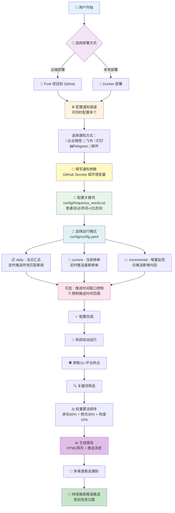

<div align="center" id="trendradar">

<a href="https://github.com/sansan0/TrendRadar" title="TrendRadar">
  
</a>

🚀 가장 빠른 <strong>30초</strong> 배포 핫이슈 도우미 —— 무의미한 스크롤 탈출, 진짜 관심 있는 뉴스만 보기

<a href="https://trendshift.io/repositories/14726" target="_blank"></a>

[](https://github.com/sansan0/TrendRadar/stargazers)
[](https://github.com/sansan0/TrendRadar/network/members)
[](LICENSE)
[](https://github.com/sansan0/TrendRadar)
[](https://github.com/sansan0/TrendRadar)

[](https://work.weixin.qq.com/)
[](https://telegram.org/)
[](#)
[](https://www.feishu.cn/)
[](#)
[](https://github.com/binwiederhier/ntfy)


[](https://github.com/sansan0/TrendRadar)
[](https://sansan0.github.io/TrendRadar)
[](https://hub.docker.com/r/wantcat/trendradar)
[](https://modelcontextprotocol.io/)

</div>


> 본 프로젝트는 경량화와 쉬운 배포를 목표로 합니다

## 📑 빠른 네비게이션

<div align="center">

| [🎯 핵심 기능](#-핵심-기능) | [🚀 빠른 시작](#-빠른-시작) | [🐳 Docker 배포](#-docker-배포) | [🤖 AI 분석 전용](#-ai-지능-분석-배포) |
|:---:|:---:|:---:|:---:|
| [📝 업데이트 로그](#-업데이트-로그) | [🔌 MCP 클라이언트](#-mcp-클라이언트) | [❓ Q&A 및 FAQ](#문제-답변-및-1원-후원) | [⭐ 프로젝트 관련](#프로젝트-관련) |
| [🔧 커스텀 모니터링 플랫폼](#커스텀-모니터링-플랫폼) | [📝 frequency_words.txt 설정](#frequencywordstxt-설정-가이드) | | |

</div>

- **버그를 끈기있게 피드백**해주신 기여자분들께 감사드립니다. 여러분의 모든 피드백이 프로젝트를 더욱 완벽하게 만들어줍니다😉;
- **프로젝트에 star를 주신** 여러분께 감사드립니다. **fork**도 좋고, **star**도 좋고, 둘 다 해주시면😍 오픈소스 정신에 대한 최고의 지지입니다;
- **[공식 계정](#문제-답변-및-1원-후원)을 팔로우**해주신 독자분들께 감사드립니다. 여러분의 댓글, 좋아요, 공유, 추천 등 적극적인 상호작용이 콘텐츠를 더욱 따뜻하게 만들어줍니다😎。  

<details>
<summary>👉 클릭하여 <strong>감사 명단</strong> 보기 (현재 <strong>🔥66🔥</strong> 명)</summary>

### 데이터 지원

본 프로젝트는 [newsnow](https://github.com/ourongxing/newsnow) 프로젝트에서 제공하는 API 인터페이스를 사용하여 다중 플랫폼 데이터를 가져옵니다

### 홍보 지원

> 다음 플랫폼과 개인의 추천에 감사드립니다 (시간순)

- [小众软件](https://mp.weixin.qq.com/s/fvutkJ_NPUelSW9OGK39aA) - 오픈소스 소프트웨어 추천 플랫폼
- [LinuxDo 커뮤니티](https://linux.do/) - 기술 애호가들의 모임
- [루이펑 주간](https://github.com/ruanyf/weekly) - 기술계의 영향력 있는 주간지

### 커뮤니티 지원

> **재정적 지원**을 해주신 분들께 감사드립니다. 여러분의 관대함은 키보드 옆의 간식과 음료로 변신하여 프로젝트의 모든 반복 작업을 함께하고 있습니다

|           후원자            |  금액  |  날짜  |             비고             |
| :-------------------------: | :----: | :----: | :-----------------------: |
|           *海          |  1  | 2025.11.15  |    | 
|           *德          |  1.99  | 2025.11.15  |    | 
|           *疏          |  8.8  | 2025.11.14  |  感谢开源，项目很棒，支持一下   | 
|           M*e          |  10  | 2025.11.14  |  开源不易，大佬辛苦了   | 
|           **柯          |  1  | 2025.11.14  |     | 
|           *云          |  88  | 2025.11.13  |    好项目，感谢开源  | 
|           *W          |  6  | 2025.11.13  |      | 
|           *凯          |  1  | 2025.11.13  |      | 
|           对*.          |  1  | 2025.11.13  |    Thanks for your TrendRadar  | 
|           s*y          |  1  | 2025.11.13  |      | 
|           **翔          |  10  | 2025.11.13  |   好项目，相见恨晚，感谢开源！     | 
|           *韦          |  9.9  | 2025.11.13  |   TrendRadar超赞，请老师喝咖啡~     | 
|           h*p          |  5  | 2025.11.12  |   支持中国开源力量，加油！     | 
|           c*r          |  6  | 2025.11.12  |        | 
|           a*n          |  5  | 2025.11.12  |        | 
|           。*c          |  1  | 2025.11.12  |    感谢开源分享    | 
|           *记          |  1  | 2025.11.11  |        | 
|           *主          |  1  | 2025.11.10  |        | 
|           *了          |  10  | 2025.11.09  |        | 
|           *杰          |  5  | 2025.11.08  |        | 
|           *点          |  8.80  | 2025.11.07  |   开发不易，支持一下。     | 
|           Q*Q          |  6.66  | 2025.11.07  |   感谢开源！     | 
|           C*e          |  1  | 2025.11.05  |        | 
|           Peter Fan          |  20  | 2025.10.29  |        | 
|           M*n          |  1  | 2025.10.27  |      感谢开源  | 
|           *许          |  8.88  | 2025.10.23  |      老师 小白一枚，摸了几天了还没整起来，求教  | 
|           Eason           |  1  | 2025.10.22  |      还没整明白，但你在做好事  | 
|           P*n           |  1  | 2025.10.20  |          |
|           *杰           |  1  | 2025.10.19  |          |
|           *徐           |  1  | 2025.10.18  |          |
|           *志           |  1  | 2025.10.17  |          |
|           *😀           |  10  | 2025.10.16  |     点赞     |
|           **杰           |  10  | 2025.10.16  |          |
|           *啸           |  10  | 2025.10.16  |          |
|           *纪           |  5  | 2025.10.14  | TrendRadar         |
|           J*d           |  1  | 2025.10.14  | 谢谢你的工具，很好玩...          |
|           *H           |  1  | 2025.10.14  |           |
|           那*O           |  10  | 2025.10.13  |           |
|           *圆           |  1  | 2025.10.13  |           |
|           P*g           |  6  | 2025.10.13  |           |
|           Ocean           |  20  | 2025.10.12  |  ...真的太棒了！！！小白级别也能直接用...         |
|           **培           |  5.2  | 2025.10.2  |  github-yzyf1312:开源万岁         |
|           *椿           |  3  | 2025.9.23  |  加油，很不错         |
|           *🍍           |  10  | 2025.9.21  |           |
|           E*f           |  1  | 2025.9.20  |           |
|           *记            |  1  | 2025.9.20  |           |
|           z*u            |  2  | 2025.9.19  |           |
|           **昊            |  5  | 2025.9.17  |           |
|           *号            |  1  | 2025.9.15  |           |
|           T*T            |  2  | 2025.9.15  |  点赞         |
|           *家            |  10  | 2025.9.10  |           |
|           *X            |  1.11  | 2025.9.3  |           |
|           *飙            |  20  | 2025.8.31  |  来自老童谢谢         |
|           *下            |  1  | 2025.8.30  |           |
|           2*D            |  88  | 2025.8.13 下午 |           |
|           2*D            |  1  | 2025.8.13 上午 |           |
|           S*o            |  1  | 2025.8.05 |   支持一下        |
|           *侠            |  10  | 2025.8.04 |           |
|           x*x            |  2  | 2025.8.03 |  trendRadar 好项目 点赞          |
|           *远            |  1  | 2025.8.01 |            |
|           *邪            |  5  | 2025.8.01 |            |
|           *梦            |  0.1  | 2025.7.30 |            |
|           **龙            |  10  | 2025.7.29 |      支持一下      |


</details>


## ✨ 핵심 기능

### **전체 네트워크 핫이슈 집계**

- 知乎 (Zhihu)
- 抖音 (Douyin)
- bilibili 핫 검색
- 华尔街见闻 (Wall Street Journal CN)
- 贴吧 (Tieba)
- 百度热搜 (Baidu Hot Search)
- 财联社热门 (Cailian Hot)
- 澎湃新闻 (The Paper)
- 凤凰网 (iFeng)
- 今日头条 (Toutiao)
- 微博 (Weibo)

기본적으로 11개의 주요 플랫폼을 모니터링하며, 추가 플랫폼도 직접 추가할 수 있습니다

<details id="커스텀-모니터링-플랫폼">
<summary><strong>👉 클릭하여 펼치기: 커스텀 모니터링 플랫폼</strong></summary>
<br>

본 프로젝트의 뉴스 데이터는 [newsnow](https://github.com/ourongxing/newsnow) 프로젝트에서 제공하는 데이터를 사용합니다. [웹사이트](https://newsnow.busiyi.world/)를 클릭하고 [더보기]를 클릭하여 원하는 플랫폼이 있는지 확인할 수 있습니다.

구체적인 추가 방법은 [프로젝트 소스 코드](https://github.com/ourongxing/newsnow/tree/main/server/sources)를 방문하여 파일명을 확인한 후, `config/config.yaml` 파일에서 `platforms` 설정을 수정하세요:

```yaml
platforms:
  - id: "toutiao"
    name: "今日头条"
  - id: "baidu"
    name: "百度热搜"
  - id: "wallstreetcn-hot"
    name: "华尔街见闻"
  # 더 많은 플랫폼 추가...
```
잘 모르겠다면 다른 사용자가 정리한 [플랫폼 설정](https://github.com/sansan0/TrendRadar/issues/95)을 직접 복사하세요

</details>

### **스마트 푸시 전략**

**세 가지 푸시 모드**:

| 모드 | 적용 대상 | 푸시 시기 | 표시 내용 | 적용 시나리오 |
|------|----------|----------|----------|----------|
| **당일 요약**<br/>`daily` | 📋 기업 관리자/일반 사용자 | 정시 푸시(기본 1시간마다) | 당일 모든 매칭 뉴스<br/>+ 신규 뉴스 영역 | 일일 요약<br/>당일 핫이슈 트렌드 전체 파악 |
| **현재 랭킹**<br/>`current` | 📰 미디어인/콘텐츠 크리에이터 | 정시 푸시(기본 1시간마다) | 현재 랭킹 매칭 뉴스<br/>+ 신규 뉴스 영역 | 실시간 핫이슈 추적<br/>현재 가장 인기있는 콘텐츠 파악 |
| **증분 모니터링**<br/>`incremental` | 📈 투자자/트레이더 | 신규 항목만 푸시 | 새로 등장한 매칭 키워드 뉴스 | 중복 정보 간섭 방지<br/>고빈도 모니터링 시나리오 |

**추가 기능 - 푸시 시간 윈도우 제어** (선택사항):

이 기능은 위의 세 가지 푸시 모드와 독립적이며, 모든 모드와 함께 사용할 수 있습니다:

- **시간 윈도우 제한**: 푸시 시간 범위 설정 (예: 09:00-18:00 또는 20:00-22:00), 지정된 시간에만 푸시
- **푸시 빈도 제어**:
  - 윈도우 내 다중 푸시: 시간 윈도우 내에서 매번 실행 시 푸시
  - 하루 한 번만 푸시: 시간 윈도우 내에서 한 번만 푸시 (당일 요약 또는 현재 랭킹 모드에 적합)
- **일반적인 시나리오**:
  - 근무 시간 푸시: 평일 09:00-18:00에만 메시지 수신
  - 저녁 요약 푸시: 저녁 고정 시간 (예: 20:00-22:00)에 요약 수신
  - 방해 방지: 비근무 시간에 푸시 알림 수신 방지

> 팁: 이 기능은 기본적으로 비활성화되어 있으며, `config/config.yaml`에서 수동으로 `push_window.enabled`를 활성화해야 합니다

### **정밀 콘텐츠 필터링**

개인 키워드 설정 (예: AI, BYD, 교육 정책), 관련 핫이슈만 푸시하고 무관한 정보 필터링

- 일반 단어, 필수 단어(+), 필터 단어(!) 세 가지 구문 지원, 【frequency_words.txt 설정 가이드】 참조
- 그룹화 관리, 다양한 주제 핫이슈 독립 통계

> 필터링하지 않고 모든 핫이슈를 완전히 푸시할 수도 있습니다. 자세한 내용은 【업데이트 기록】의 v2.0.1 참조

<details id="frequencywordstxt-설정-가이드">
<summary><strong>👉 클릭하여 펼치기: frequency_words.txt 설정 가이드</strong></summary>
<br>

`frequency_words.txt` 파일에서 모니터링할 키워드를 설정하며, 세 가지 구문과 그룹 기능을 지원합니다.

키워드가 앞에 있을수록 뉴스의 우선순위가 높아지므로, 관심도에 따라 키워드 순서를 조정할 수 있습니다

| 구문 유형 | 기호 | 역할 | 예시 | 매칭 로직 |
|---------|------|------|------|---------|
| **일반 단어** | 없음 | 기본 매칭 | `화웨이` | 하나라도 포함하면 됨 |
| **필수 단어** | `+` | 범위 제한 | `+스마트폰` | 동시에 포함해야 함 |
| **필터 단어** | `!` | 간섭 배제 | `!광고` | 포함시 직접 제외 |

### 📋 기본 구문 설명

#### 1. **일반 키워드** - 기본 매칭
```txt
화웨이
OPPO
애플
```
**역할:** 뉴스 제목에 **하나라도 포함**되면 캡처됨

#### 2. **필수 단어** `+단어` - 범위 제한
```txt
화웨이
OPPO
+스마트폰
```
**역할:** 일반 단어**와** 필수 단어를 **동시에 포함**해야 캡처됨

#### 3. **필터 단어** `!단어` - 간섭 배제
```txt
애플
화웨이
!과일
!가격
```
**역할:** 필터 단어가 포함된 뉴스는 키워드가 포함되어 있어도 **직접 제외**됨

### 🔗 그룹 기능 - 빈 줄 구분의 중요성

**핵심 규칙:** **빈 줄**로 다른 그룹을 구분하며, 각 그룹은 독립적으로 통계 처리됩니다

#### 示例配置：
```txt
iPhone
华为
OPPO
+发布

A股
上证
深证
+涨跌
!预测

世界杯
欧洲杯
亚洲杯
+比赛
```

#### 词组解释及匹配效果：

**第1组 - 手机新品类：**
- 关键词：iPhone、华为、OPPO
- 必须词：发布
- 效果：必须包含手机品牌名，同时包含"发布"

**匹配示例：**
- ✅ "iPhone 15正式发布售价公布" ← 有"iPhone"+"发布"
- ✅ "华为Mate60系列发布会直播" ← 有"华为"+"发布"
- ✅ "OPPO Find X7发布时间确定" ← 有"OPPO"+"发布"
- ❌ "iPhone销量创新高" ← 有"iPhone"但缺少"发布"

**第2组 - 股市行情类：**  
- 关键词：A股、上证、深证
- 必须词：涨跌
- 过滤词：预测
- 效果：包含股市相关词，同时包含"涨跌"，但排除包含"预测"的内容

**匹配示例：**
- ✅ "A股今日大幅涨跌分析" ← 有"A股"+"涨跌"
- ✅ "上证指数涨跌原因解读" ← 有"上证"+"涨跌"
- ❌ "专家预测A股涨跌趋势" ← 有"A股"+"涨跌"但包含"预测"
- ❌ "A股成交量创新高" ← 有"A股"但缺少"涨跌"

**第3组 - 足球赛事类：**
- 关键词：世界杯、欧洲杯、亚洲杯
- 必须词：比赛
- 效果：必须包含杯赛名称，同时包含"比赛"

**匹配示例：**
- ✅ "世界杯小组赛比赛结果" ← 有"世界杯"+"比赛"
- ✅ "欧洲杯决赛比赛时间" ← 有"欧洲杯"+"比赛"
- ❌ "世界杯门票开售" ← 有"世界杯"但缺少"比赛"

### 🎯 配置技巧

#### 1. **从宽到严的配置策略**
```txt
# 第一步：先用宽泛关键词测试
人工智能
AI
ChatGPT

# 第二步：发现误匹配后，加入必须词限定
人工智能  
AI
ChatGPT
+技术

# 第三步：发现干扰内容后，加入过滤词
人工智能
AI  
ChatGPT
+技术
!广告
!培训
```

#### 2. **避免过度复杂**
❌ **不推荐：** 一个词组包含太多词汇
```txt
华为
OPPO
苹果
三星
vivo
一加
魅族
+手机
+发布
+销量
!假货
!维修
!二手
```

✅ **推荐：** 拆分成多个精确的词组
```txt
华为
OPPO
+新品

苹果
三星  
+发布

手机
销量
+市场
```

</details>


### **핫이슈 트렌드 분석**

뉴스 인기도 변화를 실시간으로 추적하여, "무엇이 핫 검색인지"뿐만 아니라 "핫이슈가 어떻게 진화하는지"도 파악할 수 있습니다

- **타임라인 추적**: 각 뉴스가 처음 등장한 시점부터 마지막 등장까지의 완전한 시간 범위 기록
- **인기도 변화**: 다양한 시간대의 순위 변화와 등장 빈도 통계
- **신규 감지**: 새로 등장한 핫이슈 토픽을 실시간으로 식별하여 🆕 마크로 즉시 알림
- **지속성 분석**: 일회성 핫이슈 토픽과 지속적으로 발효되는 심층 뉴스 구분
- **크로스 플랫폼 비교**: 동일한 뉴스의 다양한 플랫폼에서의 순위 성능을 통해 미디어 관심도 차이 파악

> 중요한 뉴스의 완전한 발전 과정을 더 이상 놓치지 마세요. 토픽의 초기 단계부터 정점까지 전체를 파악하세요

<details>
<summary><strong>👉 点击展开：推送格式说明</strong></summary>
<br>

📊 热点词汇统计

🔥 [1/3] AI ChatGPT : 2 条

  1. [百度热搜] 🆕 ChatGPT-5正式发布 [**1**] - 09时15分 (1次)
  
  2. [今日头条] AI芯片概念股暴涨 [**3**] - [08时30分 ~ 10时45分] (3次)
  
━━━━━━━━━━━━━━━━━━━

📈 [2/3] 比亚迪 特斯拉 : 2 条

  1. [微博] 🆕 比亚迪月销量破纪录 [**2**] - 10时20分 (1次)
  
  2. [抖音] 特斯拉降价促销 [**4**] - [07时45分 ~ 09时15分] (2次)

━━━━━━━━━━━━━━━━━━━

📌 [3/3] A股 股市 : 1 条

  1. [华尔街见闻] A股午盘点评分析 [**5**] - [11时30分 ~ 12时00分] (2次)

🆕 本次新增热点新闻 (共 2 条)

**百度热搜** (1 条):
  1. ChatGPT-5正式发布 [**1**]

**微博** (1 条):
  1. 比亚迪月销量破纪录 [**2**]

更新时间：2025-01-15 12:30:15


## **消息格式说明**

| 格式元素      | 示例                        | 含义         | 说明                                    |
| ------------- | --------------------------- | ------------ | --------------------------------------- |
| 🔥📈📌        | 🔥 [1/3] AI ChatGPT        | 热度等级     | 🔥高热度(≥10条) 📈中热度(5-9条) 📌普通热度(<5条) |
| [序号/总数]   | [1/3]                       | 排序位置     | 当前词组在所有匹配词组中的排名          |
| 频率词组      | AI ChatGPT                  | 关键词组     | 配置文件中的词组，标题必须包含其中词汇   |
| : N 条        | : 2 条                      | 匹配数量     | 该词组匹配的新闻总数                    |
| [平台名]      | [百度热搜]                  | 来源平台     | 新闻所属的平台名称                      |
| 🆕            | 🆕 ChatGPT-5正式发布        | 新增标记     | 本轮抓取中首次出现的热点                |
| [**数字**]    | [**1**]                     | 高排名       | 排名≤阈值的热搜，红色加粗显示           |
| [数字]        | [7]                         | 普通排名     | 排名>阈值的热搜，普通显示               |
| - 时间        | - 09时15分                  | 首次时间     | 该新闻首次被发现的时间                  |
| [时间~时间]   | [08时30分 ~ 10时45分]       | 持续时间     | 从首次出现到最后出现的时间范围          |
| (N次)         | (3次)                       | 出现频率     | 在监控期间出现的总次数                  |
| **新增区域**  | 🆕 **本次新增热点新闻**      | 新话题汇总   | 单独展示本轮新出现的热点话题            |

</details>


### **개인화 핫이슈 알고리즘**

더 이상 각 플랫폼의 알고리즘에 끌려다니지 마세요. TrendRadar는 전체 네트워크의 핫 검색을 재정리합니다:

- **높은 순위의 뉴스 중시** (60%): 각 플랫폼의 상위 뉴스를 우선 표시
- **지속적으로 등장하는 토픽 주목** (30%): 반복적으로 등장하는 뉴스가 더 중요
- **순위 품질 고려** (10%): 여러 번 등장할 뿐만 아니라 자주 상위권에 랭크

> 다양한 플랫폼에 분산된 핫 검색을 병합하여 관심도에 따라 재정렬합니다. 이 세 가지 비율은 자신의 시나리오에 맞게 조정할 수 있습니다

<details>
<summary><strong>👉 点击展开：热点权重调整</strong></summary>
<br>

当前默认的配置是平衡性配置

### 两个核心场景

**追实时热点型**：
```yaml
weight:
  rank_weight: 0.8    # 主要看排名
  frequency_weight: 0.1  # 不太在乎持续性
  hotness_weight: 0.1
```
**适用人群**：自媒体博主、营销人员、想快速了解当下最火话题的用户

**追深度话题型**：
```yaml
weight:
  rank_weight: 0.4    # 适度看排名
  frequency_weight: 0.5  # 重视当天内的持续热度
  hotness_weight: 0.1
```
**适用人群**：投资者、研究人员、新闻工作者、需要深度分析趋势的用户

### 调整的方法
1. **三个数字加起来必须等于 1.0**
2. **哪个重要就调大哪个**：在乎排名就调大 rank_weight，在乎持续性就调大 frequency_weight
3. **建议每次只调 0.1-0.2**，观察效果

核心思路：追求速度和时效性的用户提高排名权重，追求深度和稳定性的用户提高频次权重。

</details>

### **多渠道实时推送**

支持**企业微信**(+ 微信推送方案)、**飞书**、**钉钉**、**Telegram**、**邮件**、**ntfy**，消息直达手机和邮箱

### **多端适配**
- **GitHub Pages**：自动生成精美网页报告，PC/移动端适配
- **Docker部署**：支持多架构容器化运行
- **数据持久化**：HTML/TXT多格式历史记录保存


### **AI 智能分析（v3.0.0 新增）**

基于 MCP (Model Context Protocol) 协议的 AI 对话分析系统，让你用自然语言深度挖掘新闻数据

- **对话式查询**：用自然语言提问，如"查询昨天知乎的热点"、"分析比特币最近的热度趋势"
- **13 种分析工具**：涵盖基础查询、智能检索、趋势分析、数据洞察、情感分析等
- **多客户端支持**：Cherry Studio（GUI 配置）、Claude Desktop、Cursor、Cline 等
- **深度分析能力**：
  - 话题趋势追踪（热度变化、生命周期、爆火检测、趋势预测）
  - 跨平台数据对比（活跃度统计、关键词共现）
  - 智能摘要生成、相似新闻查找、历史关联检索

> 告别手动翻阅数据文件，AI 助手帮你秒懂新闻背后的故事

### **零技术门槛部署**

GitHub 一键 Fork 即可使用，无需编程基础。

> 30秒部署： GitHub Pages（网页浏览）支持一键保存成图片，随时分享给他人
>
> 1分钟部署： 企业微信（手机通知）

**💡 提示：** 想要**实时更新**的网页版？fork 后，进入你的仓库 Settings → Pages，启用 GitHub Pages。[效果预览](https://sansan0.github.io/TrendRadar/)。

### **减少 APP 依赖**

从"被算法推荐绑架"变成"主动获取自己想要的信息"

**适合人群：** 投资者、自媒体人、企业公关、关心时事的普通用户

**典型场景：** 股市投资监控、品牌舆情追踪、行业动态关注、生活资讯获取


| Github Pages 效果(手机端适配、邮箱推送效果) | 飞书推送效果 |
|:---:|:---:|
|  |  |


## 📝 업데이트 로그

>**업그레이드 설명**:
- **팁**: **Sync fork**를 통해 본 프로젝트를 업데이트하지 마세요. 【업데이트 기록】을 확인하여 구체적인 【업그레이드 방법】과 【기능 내용】을 명확히 하세요
- **마이너 버전 업데이트**: v2.x에서 v2.y로 업그레이드 시, 본 프로젝트의 `main.py` 코드로 fork 리포지토리의 해당 파일을 교체하세요
- **메이저 버전 업그레이드**: v1.x에서 v2.y로 업그레이드 시, 기존 fork를 삭제한 후 다시 fork하는 것을 권장합니다. 이렇게 하면 더 간편하고 설정 충돌을 피할 수 있습니다


### 2025/11/12 - v3.0.5

- 修复邮件发送 SSL/TLS 端口配置逻辑错误
- 优化邮箱服务商（QQ/163/126）默认使用 465 端口（SSL）
- **新增 Docker 环境变量支持**：核心配置项（`enable_crawler`、`report_mode`、`push_window` 等）支持通过环境变量覆盖，解决 NAS 用户修改配置文件不生效的问题（详见 [🐳 Docker 部署](#-docker-部署) 章节）


### 2025/10/26 - mcp-v1.0.1

  **MCP 模块更新:**
  - 修复日期查询参数传递错误
  - 统一所有工具的时间参数格式


<details>
<summary><strong>👉 点击展开：历史更新</strong></summary>


### 2025/10/31 - v3.0.4

- 解决飞书因推送内容过长而产生的错误，实现了分批推送


### 2025/10/23 - v3.0.3

- 扩大 ntfy 错误信息显示范围


### 2025/10/21 - v3.0.2

- 修复 ntfy 推送编码问题

### 2025/10/20 - v3.0.0

**重大更新 - AI 分析功能上线** 🤖

- **核心功能**：
  - 新增基于 MCP (Model Context Protocol) 的 AI 分析服务器
  - 支持13种智能分析工具：基础查询、智能检索、高级分析、系统管理
  - 自然语言交互：通过对话方式查询和分析新闻数据
  - 多客户端支持：Claude Desktop、Cherry Studio、Cursor、Cline 等

- **分析能力**：
  - 话题趋势分析（热度追踪、生命周期、爆火检测、趋势预测）
  - 数据洞察（平台对比、活跃度统计、关键词共现）
  - 情感分析、相似新闻查找、智能摘要生成
  - 历史相关新闻检索、多模式搜索

- **更新提示**：
  - 这是独立的 AI 分析功能，不影响现有的推送功能
  - 可选择性使用，无需升级现有部署


### 2025/10/15 - v2.4.4

- **更新内容**：
    - 修复 ntfy 推送编码问题 + 1
    - 修复推送时间窗口判断问题

- **更新提示**：
  - 建议【小版本升级】


### 2025/10/10 - v2.4.3

> 感谢 [nidaye996](https://github.com/sansan0/TrendRadar/issues/98) 发现的体验问题

- **更新内容**：
    - 重构"静默推送模式"命名为"推送时间窗口控制"，提升功能理解度
    - 明确推送时间窗口作为可选附加功能，可与三种推送模式搭配使用
    - 改进注释和文档描述，使功能定位更加清晰

- **更新提示**：
  - 这个仅仅是重构，可以不用升级


### 2025/10/8 - v2.4.2

- **更新内容**：
    - 修复 ntfy 推送编码问题
    - 修复配置文件缺失问题
    - 优化 ntfy 推送效果
    - 增加 github page 图片分段导出功能

- **更新提示**：
  - 建议使用【大版本更新】


### 2025/10/2 - v2.4.0

**新增 ntfy 推送通知**

- **核心功能**：
  - 支持 ntfy.sh 公共服务和自托管服务器

- **使用场景**：
  - 适合追求隐私的用户（支持自托管）
  - 跨平台推送（iOS、Android、Desktop、Web）
  - 无需注册账号（公共服务器）
  - 开源免费（MIT 协议）

- **更新提示**：
  - 建议使用【大版本更新】


### 2025/09/26 - v2.3.2

- 修正了邮件通知配置检查被遗漏的问题（[#88](https://github.com/sansan0/TrendRadar/issues/88)）

**修复说明**：
- 解决了即使正确配置邮件通知，系统仍提示"未配置任何webhook"的问题

### 2025/09/22 - v2.3.1

- **新增邮件推送功能**，支持将热点新闻报告发送到邮箱
- **智能 SMTP 识别**：自动识别 Gmail、QQ邮箱、Outlook、网易邮箱等 10+ 种邮箱服务商配置
- **HTML 精美格式**：邮件内容采用与网页版相同的 HTML 格式，排版精美，移动端适配
- **批量发送支持**：支持多个收件人，用逗号分隔即可同时发送给多人
- **自定义 SMTP**：可自定义 SMTP 服务器和端口
- 修复Docker构建网络连接问题

**使用说明**：
- 适用场景：适合需要邮件归档、团队分享、定时报告的用户
- 支持邮箱：Gmail、QQ邮箱、Outlook/Hotmail、163/126邮箱、新浪邮箱、搜狐邮箱等

**更新提示**：
- 此次更新的内容比较多，如果想升级，建议采用【大版本升级】

### 2025/09/17 - v2.2.0

- 新增一键保存新闻图片功能，让你轻松分享关注的热点

**使用说明**：
- 适用场景：当你按照教程开启了网页版功能后(GitHub Pages)
- 使用方法：用手机或电脑打开该网页链接，点击页面顶部的"保存为图片"按钮
- 实际效果：系统会自动将当前的新闻报告制作成一张精美图片，保存到你的手机相册或电脑桌面
- 分享便利：你可以直接把这张图片发给朋友、发到朋友圈，或分享到工作群，让别人也能看到你发现的重要资讯

### 2025/09/13 - v2.1.2

- 解决钉钉的推送容量限制导致的新闻推送失败问题(采用分批推送)

### 2025/09/04 - v2.1.1

- 修复docker在某些架构中无法正常运行的问题
- 正式发布官方 Docker 镜像 wantcat/trendradar，支持多架构
- 优化 Docker 部署流程，无需本地构建即可快速使用

### 2025/08/30 - v2.1.0

**核心改进**：
- **推送逻辑优化**：从"每次执行都推送"改为"时间窗口内可控推送"
- **时间窗口控制**：可设定推送时间范围，避免非工作时间打扰
- **推送频率可选**：时间段内支持单次推送或多次推送

**更新提示**：
- 本功能默认关闭，需手动在 config.yaml 中开启推送时间窗口控制
- 升级需同时更新 main.py 和 config.yaml 两个文件

### 2025/08/27 - v2.0.4

- 本次版本不是功能修复，而是重要提醒
- 请务必妥善保管好 webhooks，不要公开，不要公开，不要公开
- 如果你以 fork 的方式将本项目部署在 GitHub 上，请将 webhooks 填入 GitHub Secret，而非 config.yaml
- 如果你已经暴露了 webhooks 或将其填入了 config.yaml，建议删除后重新生成

### 2025/08/06 - v2.0.3

- 优化 github page 的网页版效果，方便移动端使用

### 2025/07/28 - v2.0.2

- 重构代码
- 解决版本号容易被遗漏修改的问题

### 2025/07/27 - v2.0.1

**修复问题**: 

1. docker 的 shell 脚本的换行符为 CRLF 导致的执行异常问题
2. frequency_words.txt 为空时，导致新闻发送也为空的逻辑问题
  - 修复后，当你选择 frequency_words.txt 为空时，将**推送所有新闻**，但受限于消息推送大小限制，请做如下调整
    - 方案一：关闭手机推送，只选择 Github Pages 布置(这是能获得最完整信息的方案，将把所有平台的热点按照你**自定义的热搜算法**进行重新排序)
    - 方案二：减少推送平台，优先选择**企业微信**或**Telegram**，这两个推送我做了分批推送功能(因为分批推送影响推送体验，且只有这两个平台只给一点点推送容量，所以才不得已做了分批推送功能，但至少能保证获得的信息完整)
    - 方案三：可与方案二结合，模式选择 current 或 incremental 可有效减少一次性推送的内容 

### 2025/07/17 - v2.0.0

**重大重构**：
- 配置管理重构：所有配置现在通过 `config/config.yaml` 文件管理（main.py 我依旧没拆分，方便你们复制升级）
- 运行模式升级：支持三种模式 - `daily`（当日汇总）、`current`（当前榜单）、`incremental`（增量监控）
- Docker 支持：完整的 Docker 部署方案，支持容器化运行

**配置文件说明**：
- `config/config.yaml` - 主配置文件（应用设置、爬虫配置、通知配置、平台配置等）
- `config/frequency_words.txt` - 关键词配置（监控词汇设置）

### 2025/07/09 - v1.4.1

**功能新增**：增加增量推送(在 main.py 头部配置 FOCUS_NEW_ONLY)，该开关只关心新话题而非持续热度，只在有新内容时才发通知。

**修复问题**: 某些情况下，由于新闻本身含有特殊符号导致的偶发性排版异常。

### 2025/06/23 - v1.3.0

企业微信 和 Telegram 的推送消息有长度限制，对此我采用将消息拆分推送的方式。开发文档详见[企业微信](https://developer.work.weixin.qq.com/document/path/91770) 和 [Telegram](https://core.telegram.org/bots/api)

### 2025/06/21 - v1.2.1

在本版本之前的旧版本，不仅 main.py 需要复制替换， crawler.yml 也需要你复制替换
https://github.com/sansan0/TrendRadar/blob/master/.github/workflows/crawler.yml

### 2025/06/19 - v1.2.0

> 感谢 claude research 整理的各平台 api ,让我快速完成各平台适配（虽然代码更多冗余了~

1. 支持 telegram ，企业微信，钉钉推送渠道, 支持多渠道配置和同时推送

### 2025/06/18 - v1.1.0

> **200 star⭐** 了, 继续给大伙儿助兴~近期，在我的"怂恿"下，挺多人在我公众号点赞分享推荐助力了我，我都在后台看见了具体账号的鼓励数据，很多都成了天使轮老粉（我玩公众号才一个多月，虽然注册是七八年前的事了哈哈，属于上车早，发车晚），但因为你们没有留言或私信我，所以我也无法一一回应并感谢支持，在此一并谢谢！

1. 重要的更新，加了权重，你现在看到的新闻都是最热点最有关注度的出现在最上面
2. 更新文档使用，因为近期更新了很多功能，而且之前的使用文档我偷懒写的简单（见下面的 ⚙️ frequency_words.txt 配置完整教程）

### 2025/06/16 - v1.0.0

1. 增加了一个项目新版本更新提示，默认打开，如要关掉，可以在 main.py 中把 "FEISHU_SHOW_VERSION_UPDATE": True 中的 True 改成 False 即可

### 2025/06/13+14

1. 去掉了兼容代码，之前 fork 的同学，直接复制代码会在当天显示异常（第二天会恢复正常）
2. feishu 和 html 底部增加一个新增新闻显示

### 2025/06/09

**100 star⭐** 了，写个小功能给大伙儿助助兴
frequency_words.txt 文件增加了一个【必须词】功能，使用 + 号

1. 必须词语法如下：  
   唐僧或者猪八戒必须在标题里同时出现，才会收录到推送新闻中

```
+唐僧
+猪八戒
```

2. 过滤词的优先级更高：  
   如果标题中过滤词匹配到唐僧念经，那么即使必须词里有唐僧，也不显示

```
+唐僧
!唐僧念经
```

### 2025/06/02

1. **网页**和**飞书消息**支持手机直接跳转详情新闻
2. 优化显示效果 + 1

### 2025/05/26

1. 飞书消息显示效果优化

<table>
<tr>
<td align="center">
优化前<br>

</td>
<td align="center">
优化后<br>

</td>
</tr>
</table>

</details>


## 🚀 빠른 시작

> 설정 완료 후 뉴스 데이터는 1시간 후에 업데이트됩니다. 빠르게 진행하고 싶다면 【4단계】를 참조하여 설정 효과를 수동으로 테스트하세요

1. **Fork 本项目**到你的 GitHub 账户

   - 点击本页面右上角的"Fork"按钮

2. **设置 GitHub Secrets（选择你需要的平台）**:

   在你 Fork 后的仓库中，进入 `Settings` > `Secrets and variables` > `Actions` > `New repository secret`，然后根据需要配置以下任一或多个通知平台：

   可以同时配置多个平台，系统会向所有配置的平台发送通知。

   效果类似下图，一个 name 对应一个 secret，保存完就行，你重新编辑看不到 secret 是正常情况。 

   


   <details>
   <summary> <strong>👉 点击展开：企业微信机器人</strong>（配置最简单最迅速）</summary>
   <br>

   **GitHub Secret 配置：**
   - 名称：`WEWORK_WEBHOOK_URL`
   - 值：你的企业微信机器人 Webhook 地址

   <br>

   **机器人设置步骤：**

   #### 手机端设置：
   1. 打开企业微信 App → 进入目标内部群聊
   2. 点击右上角"…"按钮 → 选择"消息推送"
   3. 点击"添加" → 名称输入"TrendRadar"
   4. 复制 Webhook 地址，点击保存，复制的内容配置到上方的 GitHub Secret 中

   #### PC 端设置流程类似
   </details>

   <details>
   <summary> <strong>👉 点击展开：飞书机器人</strong>（消息显示最友好）</summary>
   <br>

   **GitHub Secret 配置：**
   - 名称：`FEISHU_WEBHOOK_URL`
   - 值：你的飞书机器人 Webhook 地址(该链接开头类似 https://www.feishu.cn/flow/api/trigger-webhook/********)
   <br>

   有两个方案，**方案一**配置简单，**方案二**配置复杂(但是稳定推送)

   其中方案一，由 **ziventian**发现并提供建议，在这里感谢他，默认是个人推送，也可以配置群组推送操作[#97](https://github.com/sansan0/TrendRadar/issues/97) ，

   **方案一：**

   > 对部分人存在额外操作，否则会报"系统错误"。需要手机端搜索下机器人，然后开启飞书机器人应用(该建议来自于网友，可参考)

   1. 电脑浏览器打开 https://botbuilder.feishu.cn/home/my-command

   2. 点击"新建机器人指令" 

   3. 点击"选择触发器"，往下滑动，点击"Webhook 触发"

   4. 此时你会看到"Webhook 地址"，把这个链接先复制到本地记事本暂存，继续接下来的操作

   5. "参数"里面放上下面的内容，然后点击"完成"

   ```json
   {
     "message_type": "text",
     "content": {
       "total_titles": "{{内容}}",
       "timestamp": "{{内容}}",
       "report_type": "{{内容}}",
       "text": "{{内容}}"
     }
   }
   ```

   6. 点击"选择操作" > "通过官方机器人发消息"

   7. 消息标题填写"TrendRadar 热点监控"

   8. 最关键的部分来了，点击 + 按钮，选择"Webhook 触发"，然后按照下面的图片摆放

   

   9. 配置完成后，将第 4 步复制的 Webhook 地址配置到 GitHub Secrets 中的 `FEISHU_WEBHOOK_URL`

   <br>

   **方案二：**

   1. 电脑浏览器打开 https://botbuilder.feishu.cn/home/my-app

   2. 点击"新建机器人应用"

   3. 进入创建的应用后，点击"流程涉及" > "创建流程" > "选择触发器"

   4. 往下滑动，点击"Webhook 触发"

   5. 此时你会看到"Webhook 地址"，把这个链接先复制到本地记事本暂存，继续接下来的操作

   6. "参数"里面放上下面的内容，然后点击"完成"

   ```json
   {
     "message_type": "text",
     "content": {
       "total_titles": "{{内容}}",
       "timestamp": "{{内容}}",
       "report_type": "{{内容}}",
       "text": "{{内容}}"
     }
   }
   ```

   7. 点击"选择操作" > "发送飞书消息"，勾选 "群消息"，然后点击下面的输入框，点击"我管理的群组"（如果没有群组，你可以在飞书 app 上创建群组）

   8. 消息标题填写"TrendRadar 热点监控"

   9. 最关键的部分来了，点击 + 按钮，选择"Webhook 触发"，然后按照下面的图片摆放

   

   10. 配置完成后，将第 5 步复制的 Webhook 地址配置到 GitHub Secrets 中的 `FEISHU_WEBHOOK_URL`

   </details>

   <details>
   <summary> <strong>👉 点击展开：钉钉机器人</strong></summary>
   <br>

   **GitHub Secret 配置：**
   - 名称：`DINGTALK_WEBHOOK_URL`
   - 值：你的钉钉机器人 Webhook 地址

   <br>

   **机器人设置步骤：**

   1. **创建机器人（仅 PC 端支持）**：
      - 打开钉钉 PC 客户端，进入目标群聊
      - 点击群设置图标（⚙️）→ 往下翻找到"机器人"点开
      - 选择"添加机器人" → "自定义"

   2. **配置机器人**：
      - 设置机器人名称
      - **安全设置**：
        - **自定义关键词**：设置 "热点"

   3. **完成设置**：
      - 勾选服务条款协议 → 点击"完成"
      - 复制获得的 Webhook URL
      - 将 URL 配置到 GitHub Secrets 中的 `DINGTALK_WEBHOOK_URL`

   **注意**：移动端只能接收消息，无法创建新机器人。
   </details>

   <details>
   <summary> <strong>👉 点击展开：Telegram Bot</strong></summary>
   <br>

   **GitHub Secret 配置：**
   - 名称：`TELEGRAM_BOT_TOKEN` - 你的 Telegram Bot Token
   - 名称：`TELEGRAM_CHAT_ID` - 你的 Telegram Chat ID

   <br>

   **机器人设置步骤：**

   1. **创建机器人**：
      - 在 Telegram 中搜索 `@BotFather`（大小写注意，有蓝色徽章勾勾，有类似 37849827 monthly users，这个才是官方的，有一些仿官方的账号注意辨别）
      - 发送 `/newbot` 命令创建新机器人
      - 设置机器人名称（必须以"bot"结尾，很容易遇到重复名字，所以你要绞尽脑汁想不同的名字）
      - 获取 Bot Token（格式如：`123456789:AAHfiqksKZ8WmR2zSjiQ7_v4TMAKdiHm9T0`）

   2. **获取 Chat ID**：

      **方法一：通过官方 API 获取**
      - 先向你的机器人发送一条消息
      - 访问：`https://api.telegram.org/bot<你的Bot Token>/getUpdates`
      - 在返回的 JSON 中找到 `"chat":{"id":数字}` 中的数字

      **方法二：使用第三方工具**
      - 搜索 `@userinfobot` 并发送 `/start`
      - 获取你的用户 ID 作为 Chat ID

   3. **配置到 GitHub**：
      - `TELEGRAM_BOT_TOKEN`：填入第 1 步获得的 Bot Token
      - `TELEGRAM_CHAT_ID`：填入第 2 步获得的 Chat ID
   </details>

   <details>
   <summary> <strong>👉 点击展开：邮件推送</strong>（支持所有主流邮箱）</summary>
   <br>

   - 注意事项：为防止邮件群发功能被**滥用**，当前的群发是所有收件人都能看到彼此的邮箱地址。
   - 如果你没有过配置下面这种邮箱发送的经历，不建议尝试 

   <br>

   **GitHub Secret 配置：**
   - 名称：`EMAIL_FROM` - 发件人邮箱地址
   - 名称：`EMAIL_PASSWORD` - 邮箱密码或授权码
   - 名称：`EMAIL_TO` - 收件人邮箱地址（多个收件人用英文逗号分隔）也可以和 EMAIL_FROM 一样，自己发送给自己
   - 名称：`EMAIL_SMTP_SERVER` - SMTP服务器地址（可选，留空则自动识别）
   - 名称：`EMAIL_SMTP_PORT` - SMTP端口（可选，留空则自动识别）

   <br>

   **支持的邮箱服务商**（自动识别 SMTP 配置）：

   | 邮箱服务商 | 域名 | SMTP 服务器 | 端口 | 加密方式 |
   |-----------|------|------------|------|---------|
   | **Gmail** | gmail.com | smtp.gmail.com | 587 | TLS |
   | **QQ邮箱** | qq.com | smtp.qq.com | 465 | SSL |
   | **Outlook** | outlook.com | smtp-mail.outlook.com | 587 | TLS |
   | **Hotmail** | hotmail.com | smtp-mail.outlook.com | 587 | TLS |
   | **Live** | live.com | smtp-mail.outlook.com | 587 | TLS |
   | **163邮箱** | 163.com | smtp.163.com | 465 | SSL |
   | **126邮箱** | 126.com | smtp.126.com | 465 | SSL |
   | **新浪邮箱** | sina.com | smtp.sina.com | 465 | SSL |
   | **搜狐邮箱** | sohu.com | smtp.sohu.com | 465 | SSL |

   > **自动识别**：使用以上邮箱时，无需手动配置 `EMAIL_SMTP_SERVER` 和 `EMAIL_SMTP_PORT`，系统会自动识别。
   >
   > **反馈说明**：
   > - 如果您使用**其他邮箱**测试成功，欢迎开 [Issues](https://github.com/sansan0/TrendRadar/issues) 告知，我会添加到支持列表
   > - 如果上述邮箱配置有误或无法使用，也请开 [Issues](https://github.com/sansan0/TrendRadar/issues) 反馈，帮助改进项目

   **常见邮箱设置：**

   #### QQ邮箱：
   1. 登录 QQ邮箱网页版 → 设置 → 账户
   2. 开启 POP3/SMTP 服务
   3. 生成授权码（16位字母）
   4. `EMAIL_PASSWORD` 填写授权码，而非 QQ 密码

   #### Gmail：
   1. 开启两步验证
   2. 生成应用专用密码
   3. `EMAIL_PASSWORD` 填写应用专用密码

   #### 163/126邮箱：
   1. 登录网页版 → 设置 → POP3/SMTP/IMAP
   2. 开启 SMTP 服务
   3. 设置客户端授权码
   4. `EMAIL_PASSWORD` 填写授权码
   <br>

   **高级配置**：
   如果自动识别失败，可手动配置 SMTP：
   - `EMAIL_SMTP_SERVER`：如 smtp.gmail.com
   - `EMAIL_SMTP_PORT`：如 587（TLS）或 465（SSL）
   <br>

   **如果有多个收件人(注意是英文逗号分隔)**：
   - EMAIL_TO="user1@example.com,user2@example.com,user3@example.com"

   </details>

   <details>
   <summary> <strong>👉 点击展开：ntfy 推送</strong>（开源免费，支持自托管）</summary>
   <br>

   **两种使用方式：**

   ### 方式一：免费使用（推荐新手） 🆓

   **特点**：
   - ✅ 无需注册账号，立即使用
   - ✅ 每天 250 条消息（足够 90% 用户）
   - ✅ Topic 名称即"密码"（需选择不易猜测的名称）
   - ⚠️ 消息未加密，不适合敏感信息, 但适合我们这个项目的不敏感信息

   **快速开始：**

   1. **下载 ntfy 应用**：
      - Android：[Google Play](https://play.google.com/store/apps/details?id=io.heckel.ntfy) / [F-Droid](https://f-droid.org/en/packages/io.heckel.ntfy/)
      - iOS：[App Store](https://apps.apple.com/us/app/ntfy/id1625396347)
      - 桌面：访问 [ntfy.sh](https://ntfy.sh)

   2. **订阅主题**（选择一个难猜的名称）：
      ```
      建议格式：trendradar-{你的名字缩写}-{随机数字}
   
      不能使用中文
      
      ✅ 好例子：trendradar-zs-8492
      ❌ 坏例子：news、alerts（太容易被猜到）
      ```

   3. **配置 GitHub Secret**：
      - `NTFY_TOPIC`：填写你刚才订阅的主题名称
      - `NTFY_SERVER_URL`：留空（默认使用 ntfy.sh）
      - `NTFY_TOKEN`：留空

   4. **测试**：
      ```bash
      curl -d "测试消息" ntfy.sh/你的主题名称
      ```

   ---

   ### 方式二：自托管（完全隐私控制） 🔒

   **适合人群**：有服务器、追求完全隐私、技术能力强

   **优势**：
   - ✅ 完全开源（Apache 2.0 + GPLv2）
   - ✅ 数据完全自主控制
   - ✅ 无任何限制
   - ✅ 零费用

   **Docker 一键部署**：
   ```bash
   docker run -d \
     --name ntfy \
     -p 80:80 \
     -v /var/cache/ntfy:/var/cache/ntfy \
     binwiederhier/ntfy \
     serve --cache-file /var/cache/ntfy/cache.db
   ```

   **配置 TrendRadar**：
   ```yaml
   NTFY_SERVER_URL: https://ntfy.yourdomain.com
   NTFY_TOPIC: trendradar-alerts  # 自托管可用简单名称
   NTFY_TOKEN: tk_your_token  # 可选：启用访问控制
   ```

   **在应用中订阅**：
   - 点击"Use another server"
   - 输入你的服务器地址
   - 输入主题名称
   - （可选）输入登录凭据

   ---

   **常见问题：**

   <details>
   <summary><strong>Q1: 免费版够用吗？</strong></summary>

   每天 250 条消息对大多数用户足够。按 30 分钟抓取一次计算，每天约 48 次推送，完全够用。
   </details>

   <details>
   <summary><strong>Q2: Topic 名称真的安全吗？</strong></summary>

   如果你选择随机的、足够长的名称（如 `trendradar-zs-8492-news`），暴力破解几乎不可能：
   - ntfy 有严格的速率限制（1 秒 1 次请求）
   - 64 个字符选择（A-Z, a-z, 0-9, _, -）
   - 10 位随机字符串有 64^10 种可能性（需要数年才能破解）
   </details>

   ---

   **推荐选择：**

   | 用户类型 | 推荐方案 | 理由 |
   |---------|---------|------|
   | 普通用户 | 方式一（免费） | 简单快速，够用 |
   | 技术用户 | 方式二（自托管） | 完全控制，无限制 |
   | 高频用户 | 方式三（付费） | 这个自己去官网看吧 |

   **相关链接：**
   - [ntfy 官方文档](https://docs.ntfy.sh/)
   - [自托管教程](https://docs.ntfy.sh/install/)
   - [GitHub 仓库](https://github.com/binwiederhier/ntfy)

   </details>

   > **💡 新手快速上手建议**：
   >
   > 第一次部署时，建议先完成 **GitHub Secrets** 配置（选择一个推送平台即可），然后直接跳到【第4步】测试推送是否成功。
   >
   > **暂时不要修改** `config/config.yaml` 和 `frequency_words.txt`，等推送测试成功后再根据需要调整这些配置。


3. **配置说明：**:

    - **推送设置**：在 [config/config.yaml](config/config.yaml) 中配置推送模式和通知选项
    - **关键词设置**：在 [config/frequency_words.txt](config/frequency_words.txt) 中添加你关心的关键词
    - **推送频率调整**：在 [.github/workflows/crawler.yml](.github/workflows/crawler.yml) 请谨慎调整，别贪心

    **注意**：建议只调整文档中明确说明的配置项，其他选项主要供作者开发时测试使用
    
4. **手动测试新闻推送**：

    我这里是拿我的项目举例，你要去你**fork**的项目做测试

    1. **进入 Actions**：https://github.com/sansan0/TrendRadar/actions
    2. 找到 "Hot News Crawler" 的点进去，如果看不到该字样，那么参照[#109](https://github.com/sansan0/TrendRadar/issues/109)解决
    3. 点击 "Run workflow" 按钮运行，等待 1 分钟左右数据到你手机上


## 🐳 Docker 배포

#### 方式一：快速体验（一行命令）

**Linux/macOS 系统：**
```bash
# 创建配置目录并下载配置文件
mkdir -p config output
wget https://raw.githubusercontent.com/sansan0/TrendRadar/master/config/config.yaml -P config/
wget https://raw.githubusercontent.com/sansan0/TrendRadar/master/config/frequency_words.txt -P config/
```
或者**手动创建**：
1. 在当前目录创建 `config` 文件夹
2. 下载配置文件：
   - 访问 https://raw.githubusercontent.com/sansan0/TrendRadar/master/config/config.yaml → 右键"另存为" → 保存到 `config\config.yaml`
   - 访问 https://raw.githubusercontent.com/sansan0/TrendRadar/master/config/frequency_words.txt → 右键"另存为" → 保存到 `config\frequency_words.txt`

完成后的目录结构应该是：
```
当前目录/
└── config/
    ├── config.yaml
    └── frequency_words.txt
```

```bash
docker run -d --name trend-radar \
  -v ./config:/app/config:ro \
  -v ./output:/app/output \
  -e FEISHU_WEBHOOK_URL="你的飞书webhook" \
  -e DINGTALK_WEBHOOK_URL="你的钉钉webhook" \
  -e WEWORK_WEBHOOK_URL="你的企业微信webhook" \
  -e TELEGRAM_BOT_TOKEN="你的telegram_bot_token" \
  -e TELEGRAM_CHAT_ID="你的telegram_chat_id" \
  -e EMAIL_FROM="你的发件邮箱" \
  -e EMAIL_PASSWORD="你的邮箱密码或授权码" \
  -e EMAIL_TO="收件人邮箱" \
  -e CRON_SCHEDULE="*/30 * * * *" \
  -e RUN_MODE="cron" \
  -e IMMEDIATE_RUN="true" \
  wantcat/trendradar:latest
```

#### 方式二：使用 docker-compose（推荐）

1. **创建项目目录和配置**:
   ```bash
   # 创建目录结构
   mkdir -p trendradar/{config,docker}
   cd trendradar
   
   # 下载配置文件模板
   wget https://raw.githubusercontent.com/sansan0/TrendRadar/master/config/config.yaml -P config/
   wget https://raw.githubusercontent.com/sansan0/TrendRadar/master/config/frequency_words.txt -P config/
   
   # 下载 docker-compose 配置
   wget https://raw.githubusercontent.com/sansan0/TrendRadar/master/docker/.env
   wget https://raw.githubusercontent.com/sansan0/TrendRadar/master/docker/docker-compose.yml
   ```

完成后的目录结构应该是：
```
当前目录/
├── config/
│   ├── config.yaml
│   └── frequency_words.txt
└── docker/
    ├── .env
    └── docker-compose.yml
```

2. **配置文件说明**:
   - `config/config.yaml` - 应用主配置（报告模式、推送设置等）
   - `config/frequency_words.txt` - 关键词配置（设置你关心的热点词汇）
   - `.env` - 环境变量配置（webhook URLs 和定时任务）

   **⚙️ 环境变量覆盖机制（v3.0.5+）**

   如果你在 NAS 或其他 Docker 环境中遇到**修改 `config.yaml` 后配置不生效**的问题，可以通过环境变量直接覆盖配置：

   | 环境变量 | 对应配置 | 示例值 | 说明 |
   |---------|---------|-------|------|
   | `ENABLE_CRAWLER` | `crawler.enable_crawler` | `true` / `false` | 是否启用爬虫 |
   | `ENABLE_NOTIFICATION` | `notification.enable_notification` | `true` / `false` | 是否启用通知 |
   | `REPORT_MODE` | `report.mode` | `daily` / `incremental` / `current`| 报告模式 |
   | `PUSH_WINDOW_ENABLED` | `notification.push_window.enabled` | `true` / `false` | 推送时间窗口开关 |
   | `PUSH_WINDOW_START` | `notification.push_window.time_range.start` | `08:00` | 推送开始时间 |
   | `PUSH_WINDOW_END` | `notification.push_window.time_range.end` | `22:00` | 推送结束时间 |
   | `FEISHU_WEBHOOK_URL` | `notification.webhooks.feishu_url` | `https://...` | 飞书 Webhook |

   **配置优先级**：环境变量 > config.yaml

   **使用方法**：
   - 修改 `.env` 文件，取消注释并填写需要的配置
   - 或在 NAS/群晖 Docker 管理界面的"环境变量"中直接添加
   - 重启容器后生效：`docker-compose restart`


3. **启动服务**:
   ```bash
   # 拉取最新镜像并启动
   docker-compose pull
   docker-compose up -d
   ```

4. **查看运行状态**:
   ```bash
   # 查看日志
   docker logs -f trend-radar
   
   # 查看容器状态
   docker ps | grep trend-radar
   ```

#### 方式三：本地构建（开发者选项）

如果需要自定义修改代码或构建自己的镜像：

```bash
# 克隆项目
git clone https://github.com/sansan0/TrendRadar.git
cd TrendRadar

# 修改配置文件
vim config/config.yaml
vim config/frequency_words.txt

# 使用构建版本的 docker-compose
cd docker
cp docker-compose-build.yml docker-compose.yml

# 构建并启动
docker-compose build
docker-compose up -d
```

#### 镜像更新

```bash
# 方式一：手动更新
docker pull wantcat/trendradar:latest
docker-compose down
docker-compose up -d

# 方式二：使用 docker-compose 更新
docker-compose pull
docker-compose up -d
```

#### 服务管理命令

```bash
# 查看运行状态
docker exec -it trend-radar python manage.py status

# 手动执行一次爬虫
docker exec -it trend-radar python manage.py run

# 查看实时日志
docker exec -it trend-radar python manage.py logs

# 显示当前配置
docker exec -it trend-radar python manage.py config

# 显示输出文件
docker exec -it trend-radar python manage.py files

# 查看帮助信息
docker exec -it trend-radar python manage.py help

# 重启容器
docker restart trend-radar

# 停止容器
docker stop trend-radar

# 删除容器（保留数据）
docker rm trend-radar
```

#### 数据持久化

生成的报告和数据默认保存在 `./output` 目录下，即使容器重启或删除，数据也会保留。

#### 故障排查

```bash
# 检查容器状态
docker inspect trend-radar

# 查看容器日志
docker logs --tail 100 trend-radar

# 进入容器调试
docker exec -it trend-radar /bin/bash

# 验证配置文件
docker exec -it trend-radar ls -la /app/config/
```


## 🤖 AI 스마트 분석 배포

TrendRadar v3.0.0 新增了基于 **MCP (Model Context Protocol)** 的 AI 分析功能，让你可以通过自然语言与新闻数据对话，进行深度分析。使用 **AI 功能** 的最佳前提是已使用本项目至少运行一天(积累新闻数据)

### 1. 快速部署

Cherry Studio 提供 GUI 配置界面， 5 分钟快速部署， 复杂的部分是一键安装的。

**图文部署教程**：现已更新到我的[公众号](#问题答疑与1元点赞)，回复 "mcp" 即可

**详细部署教程**：[README-Cherry-Studio.md](README-Cherry-Studio.md)

### 2. 学习与 AI 对话的姿势

**详细对话教程**：[README-MCP-FAQ.md](README-MCP-FAQ.md)

**提问效果**：

> 实际不建议一次性问多个问题。如果你选择的 ai 模型连下图的按顺序调用都无法做到，建议换一个。


## 🔌 MCP 클라이언트

TrendRadar MCP 服务支持标准的 Model Context Protocol (MCP) 协议，可以接入各种支持 MCP 的 AI 客户端进行智能分析。

### 支持的客户端

**注意事项**：
- 将 `/path/to/TrendRadar` 替换为你的项目实际路径
- Windows 路径使用双反斜杠：`C:\\Users\\YourName\\TrendRadar`
- 保存后记得重启

<details>
<summary><b>👉 点击展开：Claude Desktop</b></summary>

#### 配置文件方式

编辑 Claude Desktop 的 MCP 配置文件：

**Windows**：
`%APPDATA%\Claude\claude_desktop_config.json`

**Mac**：
`~/Library/Application Support/Claude/claude_desktop_config.json`

**配置内容**：
```json
{
  "mcpServers": {
    "trendradar": {
      "command": "uv",
      "args": [
        "--directory",
        "/path/to/TrendRadar",
        "run",
        "python",
        "-m",
        "mcp_server.server"
      ],
      "env": {},
      "disabled": false,
      "alwaysAllow": []
    }
  }
}
```

</details>

<details>
<summary><b>👉 点击展开：Cursor</b></summary>

#### 方式一：HTTP 模式

1. **启动 HTTP 服务**：
   ```bash
   # Windows
   start-http.bat
   
   # Mac/Linux
   ./start-http.sh
   ```

2. **配置 Cursor**：

   **项目级配置**（推荐）：
   在项目根目录创建 `.cursor/mcp.json`：
   ```json
   {
     "mcpServers": {
       "trendradar": {
         "url": "http://localhost:3333/mcp",
         "description": "TrendRadar 新闻热点聚合分析"
       }
     }
   }
   ```

   **全局配置**：
   在用户目录创建 `~/.cursor/mcp.json`（同样内容）

3. **使用步骤**：
   - 保存配置文件后重启 Cursor
   - 在聊天界面的 "Available Tools" 中查看已连接的工具
   - 开始使用：`搜索今天的"AI"相关新闻`

#### 方式二：STDIO 模式（推荐）

创建 `.cursor/mcp.json`：
```json
{
  "mcpServers": {
    "trendradar": {
      "command": "uv",
      "args": [
        "--directory",
        "/path/to/TrendRadar",
        "run",
        "python",
        "-m",
        "mcp_server.server"
      ]
    }
  }
}
```

</details>

<details>
<summary><b>👉 点击展开：VSCode (Cline/Continue)</b></summary>

#### Cline 配置

在 Cline 的 MCP 设置中添加：

**HTTP 模式**：
```json
{
  "trendradar": {
    "url": "http://localhost:3333/mcp",
    "type": "streamableHttp",
    "autoApprove": [],
    "disabled": false
  }
}
```

**STDIO 模式**（推荐）：
```json
{
  "trendradar": {
    "command": "uv",
    "args": [
      "--directory",
      "/path/to/TrendRadar",
      "run",
      "python",
      "-m",
      "mcp_server.server"
    ],
    "type": "stdio",
    "disabled": false
  }
}
```

#### Continue 配置

编辑 `~/.continue/config.json`：
```json
{
  "experimental": {
    "modelContextProtocolServers": [
      {
        "transport": {
          "type": "stdio",
          "command": "uv",
          "args": [
            "--directory",
            "/path/to/TrendRadar",
            "run",
            "python",
            "-m",
            "mcp_server.server"
          ]
        }
      }
    ]
  }
}
```

**使用示例**：
```
分析最近7天"特斯拉"的热度变化趋势
生成今天的热点摘要报告
搜索"比特币"相关新闻并分析情感倾向
```

</details>

<details>
<summary><b>👉 点击展开：Claude Code CLI</b></summary>

#### HTTP 模式配置

```bash
# 1. 启动 HTTP 服务
# Windows: start-http.bat
# Mac/Linux: ./start-http.sh

# 2. 添加 MCP 服务器
claude mcp add --transport http trendradar http://localhost:3333/mcp

# 3. 验证连接（确保服务已启动）
claude mcp list
```

#### 使用示例

```bash
# 查询新闻
claude "搜索今天知乎的热点新闻，前10条"

# 趋势分析
claude "分析'人工智能'这个话题最近一周的热度趋势"

# 数据对比
claude "对比知乎和微博平台对'比特币'的关注度"
```

</details>

<details>
<summary><b>👉 点击展开：MCP Inspector</b>（调试工具）</summary>
<br>

MCP Inspector 是官方调试工具，用于测试 MCP 连接：

#### 使用步骤

1. **启动 TrendRadar HTTP 服务**：
   ```bash
   # Windows
   start-http.bat
   
   # Mac/Linux
   ./start-http.sh
   ```

2. **启动 MCP Inspector**：
   ```bash
   npx @modelcontextprotocol/inspector
   ```

3. **在浏览器中连接**：
   - 访问：`http://localhost:3333/mcp`
   - 测试 "Ping Server" 功能验证连接
   - 检查 "List Tools" 是否返回 13 个工具：
     - 基础查询：get_latest_news, get_news_by_date, get_trending_topics
     - 智能检索：search_news, search_related_news_history
     - 高级分析：analyze_topic_trend, analyze_data_insights, analyze_sentiment, find_similar_news, generate_summary_report
     - 系统管理：get_current_config, get_system_status, trigger_crawl

</details>

<details>
<summary><b>👉 点击展开：其他支持 MCP 的客户端</b></summary>
<br>

任何支持 Model Context Protocol 的客户端都可以连接 TrendRadar：

#### HTTP 模式

**服务地址**：`http://localhost:3333/mcp`

**基本配置模板**：
```json
{
  "name": "trendradar",
  "url": "http://localhost:3333/mcp",
  "type": "http",
  "description": "新闻热点聚合分析"
}
```

#### STDIO 模式（推荐）

**基本配置模板**：
```json
{
  "name": "trendradar",
  "command": "uv",
  "args": [
    "--directory",
    "/path/to/TrendRadar",
    "run",
    "python",
    "-m",
    "mcp_server.server"
  ],
  "type": "stdio"
}
```

**注意事项**：
- 替换 `/path/to/TrendRadar` 为实际项目路径
- Windows 路径使用反斜杠转义：`C:\\Users\\...`
- 确保已完成项目依赖安装（运行过 setup 脚本）

</details>


## ☕ 문제 답변 및 1원 후원

> 마음만 받겠습니다. 받은 **후원**은 개발자의 오픈소스 적극성을 높이는데 사용됩니다. **후원**은 **감사 명단**에 수록됩니다

- **GitHub Issues**: 구체적인 답변에 적합합니다. 질문 시 완전한 정보를 제공해주세요 (스크린샷, 오류 로그, 시스템 환경 등)
- **공식 계정 교류**: 빠른 상담에 적합합니다. 관련 글의 공개 댓글 영역에서 교류하는 것을 권장하며, 개인 메시지를 보낼 경우 예의바른 언어를 사용해주세요😉


|公众号关注 |微信点赞 | 支付宝点赞 |
|:---:|:---:|:---:| 
|  |  |  |

### 常见问题

<details>
<summary><b>👉 点击展开：Q1: HTTP 服务无法启动？</b></summary>
<br>

**检查步骤**：
1. 确认端口 3333 未被占用：
   ```bash
   # Windows
   netstat -ano | findstr :3333
   
   # Mac/Linux
   lsof -i :3333
   ```

2. 检查项目依赖是否安装：
   ```bash
   # 重新运行安装脚本
   # Windows: setup-windows.bat 或者 setup-windows-en.bat
   # Mac/Linux: ./setup-mac.sh
   ```

3. 查看详细错误日志：
   ```bash
   uv run python -m mcp_server.server --transport http --port 3333
   ```
4. 尝试自定义端口:
   ```bash
   uv run python -m mcp_server.server --transport http --port 33333
   ```

</details>

<details>
<summary><b>👉 点击展开：Q2: 客户端无法连接到 MCP 服务？</b></summary>
<br>

**解决方案**：

1. **STDIO 模式**：
   - 确认 UV 路径正确（运行 `which uv` 或 `where uv`）
   - 确认项目路径正确且无中文字符
   - 查看客户端错误日志

2. **HTTP 模式**：
   - 确认服务已启动（访问 `http://localhost:3333/mcp`）
   - 检查防火墙设置
   - 尝试使用 127.0.0.1 替代 localhost

3. **通用检查**：
   - 重启客户端应用
   - 查看 MCP 服务日志
   - 使用 MCP Inspector 测试连接

</details>

<details>
<summary><b>👉 点击展开：Q3: 工具调用失败或返回错误？</b></summary>
<br>

**可能原因**：

1. **数据不存在**：
   - 确认已运行过爬虫（有 output 目录数据）
   - 检查查询日期范围是否有数据
   - 查看 output 目录的可用日期

2. **参数错误**：
   - 检查日期格式：`YYYY-MM-DD`
   - 确认平台 ID 正确：`zhihu`, `weibo` 等
   - 查看工具文档中的参数说明

3. **配置问题**：
   - 确认 `config/config.yaml` 存在
   - 确认 `config/frequency_words.txt` 存在
   - 检查配置文件格式是否正确

</details>

### 项目相关

> **4 篇文章**：

- [可在该文章下方留言，方便项目作者用手机答疑](https://mp.weixin.qq.com/s/KYEPfTPVzZNWFclZh4am_g)
- [2个月破 1000 star，我的GitHub项目推广实战经验](https://mp.weixin.qq.com/s/jzn0vLiQFX408opcfpPPxQ)
- [github fork 运行本项目的注意事项 ](https://mp.weixin.qq.com/s/C8evK-U7onG1sTTdwdW2zg)
- [基于本项目，如何开展公众号或者新闻资讯类文章写作](https://mp.weixin.qq.com/s/8ghyfDAtQZjLrnWTQabYOQ)

>**AI 开发**：
- 如果你有小众需求，完全可以基于我的项目自行开发，零编程基础的也可以试试
- 我所有的开源项目或多或少都使用了自己写的**AI辅助软件**来提升开发效率，这款工具已开源
- **核心功能**：迅速筛选项目代码喂给AI，你只需要补充个人需求即可
- **项目地址**：https://github.com/sansan0/ai-code-context-helper

### 其余项目

> 📍 毛主席足迹地图 - 交互式动态展示1893-1976年完整轨迹。欢迎诸位同志贡献数据

- https://github.com/sansan0/mao-map

> 哔哩哔哩(bilibili)评论区数据可视化分析软件

- https://github.com/sansan0/bilibili-comment-analyzer


<details>
<summary><strong>👉 点击展开：微信推送通知方案</strong></summary>
<br>

> 由于该方案是基于企业微信的插件机制，推送样式也十分不同，所以相关实现我暂时不准备纳入当前项目

- fork 这位兄台的项目 https://github.com/jayzqj/TrendRadar
- 完成上方的企业微信推送设置 
- 按照下面图片操作
- 配置好后，手机上的企业微信 app 删除掉也没事


</details>

### 本项目流程图



[](https://www.star-history.com/#sansan0/TrendRadar&Date)


## 📄 라이선스

GPL-3.0 License

---

<div align="center">

[🔝 回到顶部](#trendradar)

</div>
